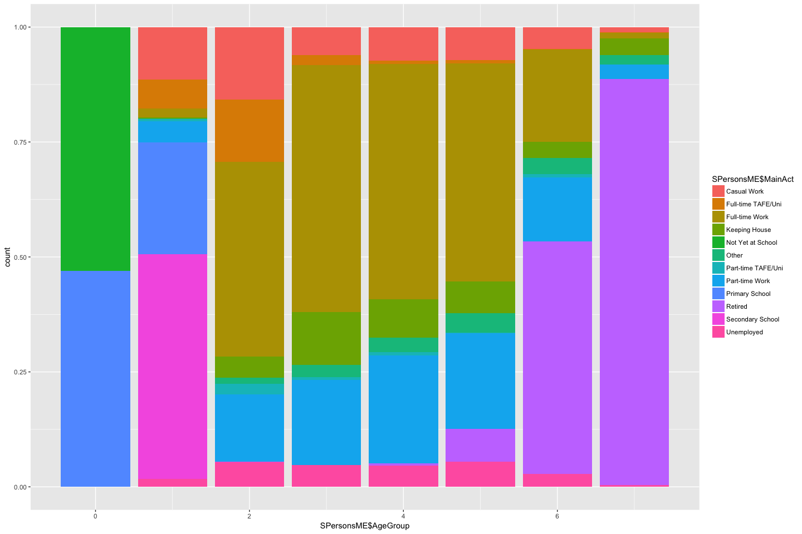
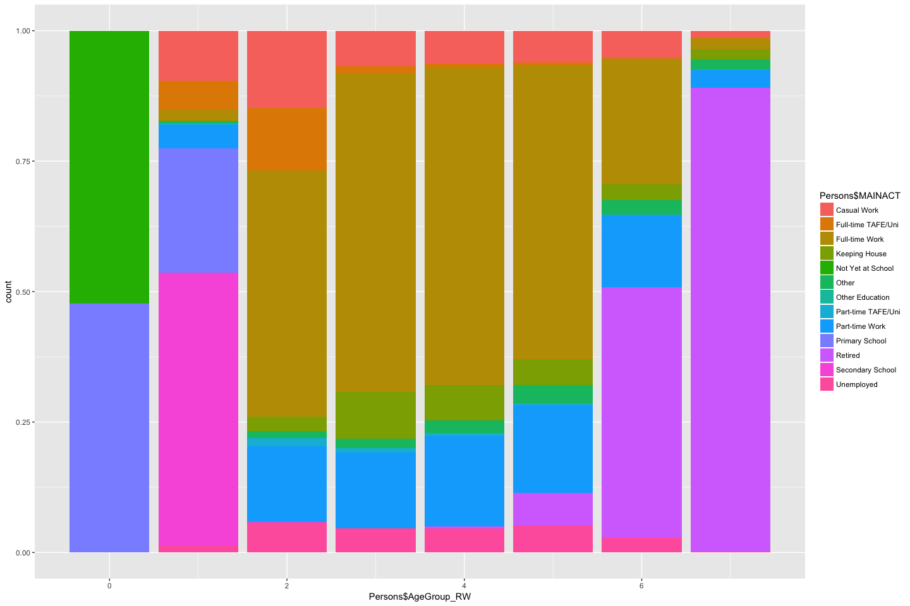
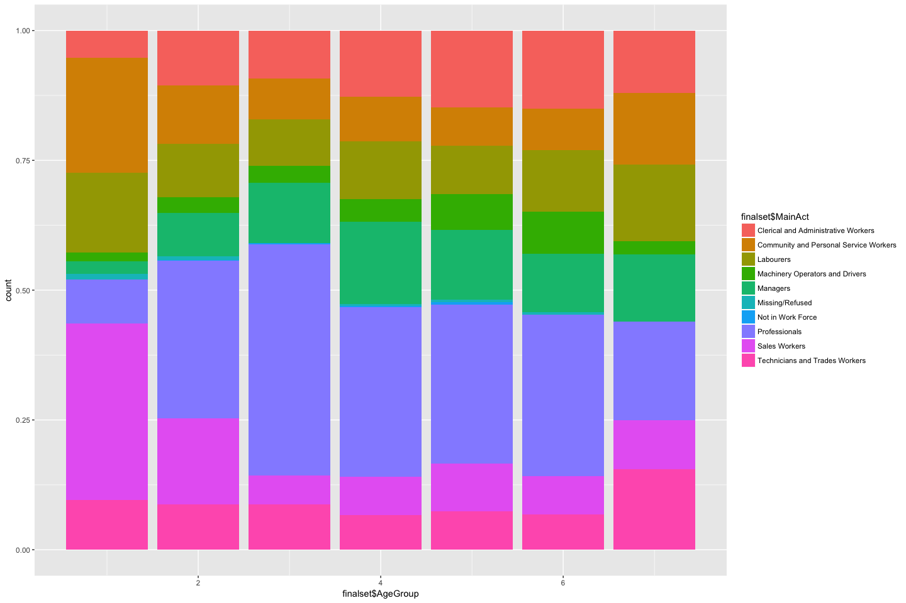
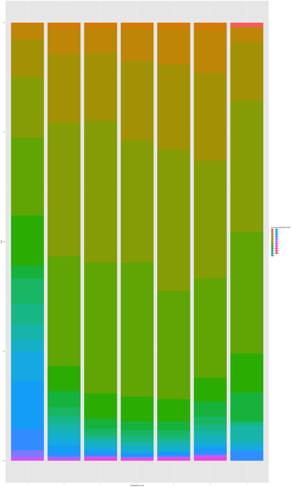
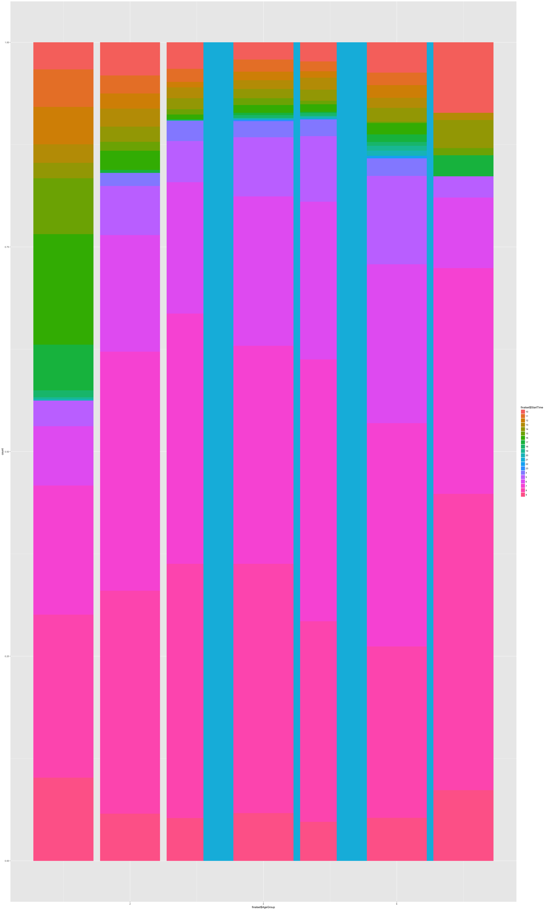

Analysing Mount eliza

```r
library(ggplot2)
library(questionr)

SPersonsME <- read.csv("../../synthetic-population/data/melbourne-2016-population/melbourne/generated/SA2/Mount\ Eliza/population/persons.csv")
HouseME <-  read.csv("../../synthetic-population/data/melbourne-2016-population/melbourne/generated/SA2/Mount\ Eliza/population/households.csv")
SPersonsME$AgeGroup[SPersonsME$Age > 69] <- 7
SPersonsME$AgeGroup[SPersonsME$Age < 70] <- 6
SPersonsME$AgeGroup[SPersonsME$Age < 60] <- 5
SPersonsME$AgeGroup[SPersonsME$Age < 50] <- 4
SPersonsME$AgeGroup[SPersonsME$Age < 40] <- 3
SPersonsME$AgeGroup[SPersonsME$Age < 30] <- 2
SPersonsME$AgeGroup[SPersonsME$Age < 20] <- 1
SPersonsME$AgeGroup[SPersonsME$Age < 10] <- 0
library(questionr)
```

Let us get some basic plots for census data in Mount Eliza


```r
Persons <- read.csv("../data/vista/2018-05-23-vista-2013-16/VISTA_2012_16_v1_SA1_CSV/P_VISTA12_16_SA1_V1.csv")
Persons$MAINACT <- as.factor(as.character(Persons$MAINACT))
Persons$WorkCat <- as.numeric(Persons$MAINACT)
Work <- read.csv("../data/vista/2018-05-23-vista-2013-16/VISTA_2012_16_v1_SA1_CSV/JTW_VISTA12_16_SA1_V1.csv")
```


For Females


```r
test_data<-subset(SPersonsME,SPersonsME$Gender=="Female")
test_data <-test_data[,c(1,12)]
test_data$Rand <- runif(nrow(test_data), 0, 100)
train_data<-subset(Persons,Persons$SEX=="Female")


training_set <- subset(train_data,train_data$AgeGroup_RW==0)
test_set <- subset(test_data,test_data$AgeGroup==0)
test_set <- test_set[order(test_set$Rand),]
WorkCat<-as.data.frame(cumsum(wtd.table(training_set$MAINACT,weights = training_set$CW_ADPERSWGT_LGA))/sum(wtd.table(training_set$MAINACT,weights = training_set$CW_ADPERSWGT_LGA))*100)
WorkCat$Act <- rownames(WorkCat)
rownames(WorkCat)<-c()
WorkCat$Wt <- WorkCat$`cumsum(wtd.table(training_set$MAINACT, weights = training_set$CW_ADPERSWGT_LGA))/sum(wtd.table(training_set$MAINACT, weights = training_set$CW_ADPERSWGT_LGA)) * 100`
WorkCat <- WorkCat[,c(-1)]
j=1
i=1
for (i in 1:13){
 while (test_set$Rand[j]<WorkCat$Wt[i]&&!is.na(test_set$Rand[j])){
    test_set$MainAct[j] <- WorkCat$Act[i] 
    j=j+1
  }
}
finalset <- test_set

a = 1
for (a in 1:7){
training_set <- subset(train_data,train_data$AgeGroup_RW==a)
test_set <- subset(test_data,test_data$AgeGroup==a)
test_set <- test_set[order(test_set$Rand),]
WorkCat<-as.data.frame(cumsum(wtd.table(training_set$MAINACT,weights = training_set$CW_ADPERSWGT_LGA))/sum(wtd.table(training_set$MAINACT,weights = training_set$CW_ADPERSWGT_LGA))*100)
WorkCat$Act <- rownames(WorkCat)
rownames(WorkCat)<-c()
WorkCat$Wt <- WorkCat$`cumsum(wtd.table(training_set$MAINACT, weights = training_set$CW_ADPERSWGT_LGA))/sum(wtd.table(training_set$MAINACT, weights = training_set$CW_ADPERSWGT_LGA)) * 100`
WorkCat <- WorkCat[,c(-1)]
j=1
i=1
for (i in 1:13){
  while (test_set$Rand[j]<WorkCat$Wt[i]&&!is.na(test_set$Rand[j])){
    test_set$MainAct[j] <- WorkCat$Act[i] 
    j=j+1
  }
}

test_set<-test_set[order(test_set$AgentId),]
finalset <- rbind(finalset,test_set)
}
```

For Males

```r
test_data<-subset(SPersonsME,SPersonsME$Gender=="Male")
test_data <-test_data[,c(1,12)]
test_data$Rand <- runif(nrow(test_data), 0, 100)
train_data<-subset(Persons,Persons$SEX=="Male")


a = 0
for (a in 0:7){
training_set <- subset(Persons,Persons$AgeGroup_RW==a)
test_set <- subset(test_data,test_data$AgeGroup==a)
test_set <- test_set[order(test_set$Rand),]
WorkCat<-as.data.frame(cumsum(wtd.table(training_set$MAINACT,weights = training_set$CW_ADPERSWGT_LGA))/sum(wtd.table(training_set$MAINACT,weights = training_set$CW_ADPERSWGT_LGA))*100)
WorkCat$Act <- rownames(WorkCat)
rownames(WorkCat)<-c()
WorkCat$Wt <- WorkCat$`cumsum(wtd.table(training_set$MAINACT, weights = training_set$CW_ADPERSWGT_LGA))/sum(wtd.table(training_set$MAINACT, weights = training_set$CW_ADPERSWGT_LGA)) * 100`
WorkCat <- WorkCat[,c(-1)]
j=1
i=1
for (i in 1:13){
  while (test_set$Rand[j]<WorkCat$Wt[i]&&!is.na(test_set$Rand[j])){
    test_set$MainAct[j] <- WorkCat$Act[i] 
    j=j+1
  }
}

test_set<-test_set[order(test_set$AgentId),]
finalset <- rbind(finalset,test_set)
}

SPersonsME <- SPersonsME[order(SPersonsME$AgentId),]
finalset <- finalset[order(finalset$AgentId),]
SPersonsME <- cbind(SPersonsME,finalset$MainAct)
colnames(SPersonsME)[colnames(SPersonsME)=="finalset$MainAct"] <- "MainAct"
```


```r
par(mfrow=c(2,2))
ggplot(SPersonsME,aes(x=SPersonsME$AgeGroup, fill = SPersonsME$MainAct)) + geom_bar(position = "fill")
```

<!-- -->

```r
ggplot(Persons,aes(x=Persons$AgeGroup_RW,fill=Persons$MAINACT)) + geom_bar(position = "fill")
```

<!-- -->


```r
Person <- Persons[Persons$PERSID %in% Work$PERSID, ]
SingWrkPerson <- subset(as.data.frame(table(Work$PERSID)), as.data.frame(table(Work$PERSID))$Freq == 1)
SingWrk <- Work[Work$PERSID %in% SingWrkPerson$Var1,]
SingWrkPerson <- Person[Person$PERSID %in% SingWrkPerson$Var1,]
SingWrk <- cbind(SingWrk,SingWrkPerson)
Wrk <- subset(SingWrk, SingWrk$MAINACT=="Full-time Work"|SingWrk$MAINACT=="Part-time Work"|SingWrk$MAINACT=="Casual Work")
Wrk$AgeGroup_RW <- as.factor(Wrk$AgeGroup_RW)
Wrk$MAINACT<-as.factor(as.character(Wrk$MAINACT))
```


For females

```r
test_data<-subset(SPersonsME,SPersonsME$Gender=="Female")
test_data<-subset(test_data,test_data$MainAct=="Casual Work"|test_data$MainAct=="Full-time Work"|test_data$MainAct=="Part-time Work")
test_data$MainAct <- as.factor(as.character(test_data$MainAct))
test_data$WorkCat <- as.numeric(test_data$MainAct)
test_data <-test_data[,c(1,3,12,14)]
test_data$Rand <- runif(nrow(test_data), 0, 100)
train_data<-subset(Wrk,Wrk$SEX=="Female")
train_data$WorkCat <- as.numeric(train_data$MAINACT)
```


```r
train_data2 <- subset(train_data,train_data$WorkCat==1)
test_data2 <- subset(test_data,test_data$WorkCat==1)

training_set <- subset(train_data2,train_data2$AgeGroup_RW==1)
test_set <- subset(test_data2,test_data2$AgeGroup==1)
test_set <- test_set[order(test_set$Rand),]
WorkCat<-as.data.frame(cumsum(wtd.table(training_set$ANZSCO1,weights = training_set$CW_ADPERSWGT_LGA))/sum(wtd.table(training_set$ANZSCO1,weights = training_set$CW_ADPERSWGT_LGA))*100)
WorkCat$Act <- rownames(WorkCat)
rownames(WorkCat)<-c()
WorkCat$Wt <- WorkCat$`cumsum(wtd.table(training_set$ANZSCO1, weights = training_set$CW_ADPERSWGT_LGA))/sum(wtd.table(training_set$ANZSCO1, weights = training_set$CW_ADPERSWGT_LGA)) * 100`
WorkCat <- WorkCat[,c(-1)]
j=1
i=1
for (i in 1:13){
 while (test_set$Rand[j]<WorkCat$Wt[i]&&!is.na(test_set$Rand[j])){
    test_set$MainAct[j] <- WorkCat$Act[i] 
    j=j+1
  }
}
finalset <- test_set

a = 2
for (a in 2:7){
training_set <- subset(train_data2,train_data2$AgeGroup_RW==a)
test_set <- subset(test_data2,test_data2$AgeGroup==a)
test_set <- test_set[order(test_set$Rand),]
WorkCat<-as.data.frame(cumsum(wtd.table(training_set$ANZSCO1,weights = training_set$CW_ADPERSWGT_LGA))/sum(wtd.table(training_set$ANZSCO1,weights = training_set$CW_ADPERSWGT_LGA))*100)
WorkCat$Act <- rownames(WorkCat)
rownames(WorkCat)<-c()
WorkCat$Wt <- WorkCat$`cumsum(wtd.table(training_set$ANZSCO1, weights = training_set$CW_ADPERSWGT_LGA))/sum(wtd.table(training_set$ANZSCO1, weights = training_set$CW_ADPERSWGT_LGA)) * 100`
WorkCat <- WorkCat[,c(-1)]
j=1
i=1
for (i in 1:13){
 while (test_set$Rand[j]<WorkCat$Wt[i]&&!is.na(test_set$Rand[j])){
    test_set$MainAct[j] <- WorkCat$Act[i] 
    j=j+1
  }
}
test_set<-test_set[order(test_set$AgentId),]
finalset <- rbind(finalset,test_set)
}

b=2
for (b in 2:3){
train_data2 <- subset(train_data,train_data$WorkCat==b)
test_data2 <- subset(test_data,test_data$WorkCat==b)


a = 0
for (a in 0:7){
training_set <- subset(train_data2,train_data2$AgeGroup_RW==a)
test_set <- subset(test_data2,test_data2$AgeGroup==a)
test_set <- test_set[order(test_set$Rand),]
WorkCat<-as.data.frame(cumsum(wtd.table(training_set$ANZSCO1,weights = training_set$CW_ADPERSWGT_LGA))/sum(wtd.table(training_set$ANZSCO1,weights = training_set$CW_ADPERSWGT_LGA))*100)
WorkCat$Act <- rownames(WorkCat)
rownames(WorkCat)<-c()
WorkCat$Wt <- WorkCat$`cumsum(wtd.table(training_set$ANZSCO1, weights = training_set$CW_ADPERSWGT_LGA))/sum(wtd.table(training_set$ANZSCO1, weights = training_set$CW_ADPERSWGT_LGA)) * 100`
WorkCat <- WorkCat[,c(-1)]
j=1
i=1
for (i in 1:13){
 while (test_set$Rand[j]<WorkCat$Wt[i]&&!is.na(test_set$Rand[j])){
    test_set$MainAct[j] <- WorkCat$Act[i] 
    j=j+1
  }
}
test_set<-test_set[order(test_set$AgentId),]
finalset <- rbind(finalset,test_set)
}
}
```

For males

```r
test_data<-subset(SPersonsME,SPersonsME$Gender=="Male")
test_data<-subset(test_data,test_data$MainAct=="Casual Work"|test_data$MainAct=="Full-time Work"|test_data$MainAct=="Part-time Work")
test_data$MainAct <- as.factor(as.character(test_data$MainAct))
test_data$WorkCat <- as.numeric(test_data$MainAct)
test_data <-test_data[,c(1,3,12,14)]
test_data$Rand <- runif(nrow(test_data), 0, 100)
train_data<-subset(Wrk,Wrk$SEX=="Male")
train_data$WorkCat <- as.numeric(train_data$MAINACT)
```


```r
train_data2 <- subset(train_data,train_data$WorkCat==1)
test_data2 <- subset(test_data,test_data$WorkCat==1)

a = 0
for (a in 0:7){
training_set <- subset(train_data2,train_data2$AgeGroup_RW==a)
test_set <- subset(test_data2,test_data2$AgeGroup==a)
test_set <- test_set[order(test_set$Rand),]
WorkCat<-as.data.frame(cumsum(wtd.table(training_set$ANZSCO1,weights = training_set$CW_ADPERSWGT_LGA))/sum(wtd.table(training_set$ANZSCO1,weights = training_set$CW_ADPERSWGT_LGA))*100)
WorkCat$Act <- rownames(WorkCat)
rownames(WorkCat)<-c()
WorkCat$Wt <- WorkCat$`cumsum(wtd.table(training_set$ANZSCO1, weights = training_set$CW_ADPERSWGT_LGA))/sum(wtd.table(training_set$ANZSCO1, weights = training_set$CW_ADPERSWGT_LGA)) * 100`
WorkCat <- WorkCat[,c(-1)]
j=1
i=1
for (i in 1:13){
 while (test_set$Rand[j]<WorkCat$Wt[i]&&!is.na(test_set$Rand[j])){
    test_set$MainAct[j] <- WorkCat$Act[i] 
    j=j+1
  }
}
test_set<-test_set[order(test_set$AgentId),]
finalset <- rbind(finalset,test_set)
}

b=2
for (b in 2:3){
train_data2 <- subset(train_data,train_data$WorkCat==b)
test_data2 <- subset(test_data,test_data$WorkCat==b)


a = 0
for (a in 0:7){
training_set <- subset(train_data2,train_data2$AgeGroup_RW==a)
test_set <- subset(test_data2,test_data2$AgeGroup==a)
test_set <- test_set[order(test_set$Rand),]
WorkCat<-as.data.frame(cumsum(wtd.table(training_set$ANZSCO1,weights = training_set$CW_ADPERSWGT_LGA))/sum(wtd.table(training_set$ANZSCO1,weights = training_set$CW_ADPERSWGT_LGA))*100)
WorkCat$Act <- rownames(WorkCat)
rownames(WorkCat)<-c()
WorkCat$Wt <- WorkCat$`cumsum(wtd.table(training_set$ANZSCO1, weights = training_set$CW_ADPERSWGT_LGA))/sum(wtd.table(training_set$ANZSCO1, weights = training_set$CW_ADPERSWGT_LGA)) * 100`
WorkCat <- WorkCat[,c(-1)]
j=1
i=1
for (i in 1:13){
 while (test_set$Rand[j]<WorkCat$Wt[i]&&!is.na(test_set$Rand[j])){
    test_set$MainAct[j] <- WorkCat$Act[i] 
    j=j+1
  }
}
test_set<-test_set[order(test_set$AgentId),]
finalset <- rbind(finalset,test_set)
}
}

formalset <- finalset
```


```r
ggplot(Wrk,aes(x=Wrk$AgeGroup_RW, fill = Wrk$ANZSCO1)) + geom_bar(position = "fill")
```

<!-- -->

```r
ggplot(finalset,aes(x=finalset$AgeGroup,fill=finalset$MainAct)) + geom_bar(position = "fill")
```

<!-- -->


```r
test_data<-subset(formalset,formalset$Gender=="Female")
test_data$MainAct <- as.factor(as.character(test_data$MainAct))
test_data$WorkCat <- as.numeric(test_data$MainAct)
test_data <-test_data[,c(1,3,4)]
test_data$Rand <- runif(nrow(test_data), 0, 100)
train_data<-subset(Wrk,Wrk$SEX=="Female")
train_data$WorkCat <- as.numeric(train_data$ANZSCO1)

train_data2 <- subset(train_data,train_data$WorkCat==1)
test_data2 <- subset(test_data,test_data$WorkCat==1)

training_set <- subset(train_data2,train_data2$AgeGroup_RW==1)
test_set <- subset(test_data2,test_data2$AgeGroup==1)
test_set <- test_set[order(test_set$Rand),]
WorkCat<-as.data.frame(cumsum(wtd.table(training_set$STARTHOUR,weights = training_set$CW_ADPERSWGT_LGA))/sum(wtd.table(training_set$STARTHOUR,weights = training_set$CW_ADPERSWGT_LGA))*100)
WorkCat$Act <- rownames(WorkCat)
rownames(WorkCat)<-c()
WorkCat$Wt <- WorkCat$`cumsum(wtd.table(training_set$STARTHOUR, weights = training_set$CW_ADPERSWGT_LGA))/sum(wtd.table(training_set$STARTHOUR, weights = training_set$CW_ADPERSWGT_LGA)) * 100`
WorkCat <- WorkCat[,c(-1)]
j=1
i=1
for (i in 1:13){
 while (test_set$Rand[j]<WorkCat$Wt[i]&&!is.na(test_set$Rand[j])){
    test_set$StartTime[j] <- WorkCat$Act[i] 
    j=j+1
  }
}
finalset <- test_set

a = 2
for (a in 2:7){
training_set <- subset(train_data2,train_data2$AgeGroup_RW==a)
test_set <- subset(test_data2,test_data2$AgeGroup==a)
test_set <- test_set[order(test_set$Rand),]
WorkCat<-as.data.frame(cumsum(wtd.table(training_set$STARTHOUR,weights = training_set$CW_ADPERSWGT_LGA))/sum(wtd.table(training_set$STARTHOUR,weights = training_set$CW_ADPERSWGT_LGA))*100)
WorkCat$Act <- rownames(WorkCat)
rownames(WorkCat)<-c()
WorkCat$Wt <- WorkCat$`cumsum(wtd.table(training_set$STARTHOUR, weights = training_set$CW_ADPERSWGT_LGA))/sum(wtd.table(training_set$STARTHOUR, weights = training_set$CW_ADPERSWGT_LGA)) * 100`
WorkCat <- WorkCat[,c(-1)]
j=1
i=1
for (i in 1:13){
 while (test_set$Rand[j]<WorkCat$Wt[i]&&!is.na(test_set$Rand[j])){
    test_set$StartTime[j] <- WorkCat$Act[i] 
    j=j+1
  }
}
test_set<-test_set[order(test_set$AgentId),]
finalset <- rbind(finalset,test_set)
}

b=2
for (b in 2:10){
train_data2 <- subset(train_data,train_data$WorkCat==b)
test_data2 <- subset(test_data,test_data$WorkCat==b)


a = 0
for (a in 0:7){
training_set <- subset(train_data2,train_data2$AgeGroup_RW==a)
test_set <- subset(test_data2,test_data2$AgeGroup==a)
test_set <- test_set[order(test_set$Rand),]
WorkCat<-as.data.frame(cumsum(wtd.table(training_set$STARTHOUR,weights = training_set$CW_ADPERSWGT_LGA))/sum(wtd.table(training_set$STARTHOUR,weights = training_set$CW_ADPERSWGT_LGA))*100)
WorkCat$Act <- rownames(WorkCat)
rownames(WorkCat)<-c()
WorkCat$Wt <- WorkCat$`cumsum(wtd.table(training_set$STARTHOUR, weights = training_set$CW_ADPERSWGT_LGA))/sum(wtd.table(training_set$STARTHOUR, weights = training_set$CW_ADPERSWGT_LGA)) * 100`
WorkCat <- WorkCat[,c(-1)]
j=1
i=1
for (i in 1:13){
 while (test_set$Rand[j]<WorkCat$Wt[i]&&!is.na(test_set$Rand[j])){
    test_set$StartTime[j] <- WorkCat$Act[i] 
    j=j+1
  }
}
test_set<-test_set[order(test_set$AgentId),]
finalset <- rbind(finalset,test_set)
}
}

test_data<-subset(formalset,formalset$Gender=="Male")
test_data$MainAct <- as.factor(as.character(test_data$MainAct))
test_data$WorkCat <- as.numeric(test_data$MainAct)
test_data <-test_data[,c(1,3,4)]
test_data$Rand <- runif(nrow(test_data), 0, 100)
train_data<-subset(Wrk,Wrk$SEX=="Male")
train_data$WorkCat <- as.numeric(train_data$ANZSCO1)

train_data2 <- subset(train_data,train_data$WorkCat==1)
test_data2 <- subset(test_data,test_data$WorkCat==1)


a = 0
for (a in 0:7){
training_set <- subset(train_data2,train_data2$AgeGroup_RW==a)
test_set <- subset(test_data2,test_data2$AgeGroup==a)
test_set <- test_set[order(test_set$Rand),]
WorkCat<-as.data.frame(cumsum(wtd.table(training_set$STARTHOUR,weights = training_set$CW_ADPERSWGT_LGA))/sum(wtd.table(training_set$STARTHOUR,weights = training_set$CW_ADPERSWGT_LGA))*100)
WorkCat$Act <- rownames(WorkCat)
rownames(WorkCat)<-c()
WorkCat$Wt <- WorkCat$`cumsum(wtd.table(training_set$STARTHOUR, weights = training_set$CW_ADPERSWGT_LGA))/sum(wtd.table(training_set$STARTHOUR, weights = training_set$CW_ADPERSWGT_LGA)) * 100`
WorkCat <- WorkCat[,c(-1)]
j=1
i=1
for (i in 1:13){
 while (test_set$Rand[j]<WorkCat$Wt[i]&&!is.na(test_set$Rand[j])){
    test_set$StartTime[j] <- WorkCat$Act[i] 
    j=j+1
  }
}
test_set<-test_set[order(test_set$AgentId),]
finalset <- rbind(finalset,test_set)
}

b=2
for (b in 2:10){
train_data2 <- subset(train_data,train_data$WorkCat==b)
test_data2 <- subset(test_data,test_data$WorkCat==b)


a = 0
for (a in 0:7){
training_set <- subset(train_data2,train_data2$AgeGroup_RW==a)
test_set <- subset(test_data2,test_data2$AgeGroup==a)
test_set <- test_set[order(test_set$Rand),]
WorkCat<-as.data.frame(cumsum(wtd.table(training_set$STARTHOUR,weights = training_set$CW_ADPERSWGT_LGA))/sum(wtd.table(training_set$STARTHOUR,weights = training_set$CW_ADPERSWGT_LGA))*100)
WorkCat$Act <- rownames(WorkCat)
rownames(WorkCat)<-c()
WorkCat$Wt <- WorkCat$`cumsum(wtd.table(training_set$STARTHOUR, weights = training_set$CW_ADPERSWGT_LGA))/sum(wtd.table(training_set$STARTHOUR, weights = training_set$CW_ADPERSWGT_LGA)) * 100`
WorkCat <- WorkCat[,c(-1)]
j=1
i=1
for (i in 1:13){
 while (test_set$Rand[j]<WorkCat$Wt[i]&&!is.na(test_set$Rand[j])){
    test_set$StartTime[j] <- WorkCat$Act[i] 
    j=j+1
  }
}
test_set<-test_set[order(test_set$AgentId),]
finalset <- rbind(finalset,test_set)
}
}
```


```r
ggplot(Wrk,aes(x=Wrk$AgeGroup_RW, fill = as.factor(Wrk$STARTHOUR))) + geom_bar(position = "fill")
```

<!-- -->

```r
ggplot(finalset,aes(x=finalset$AgeGroup,fill=finalset$StartTime)) + geom_bar(position = "fill")
```

```
## Warning: position_stack requires non-overlapping x intervals
```

<!-- -->
