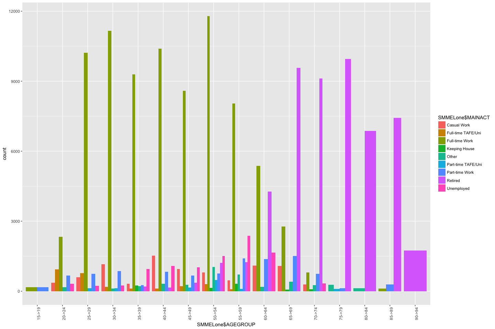
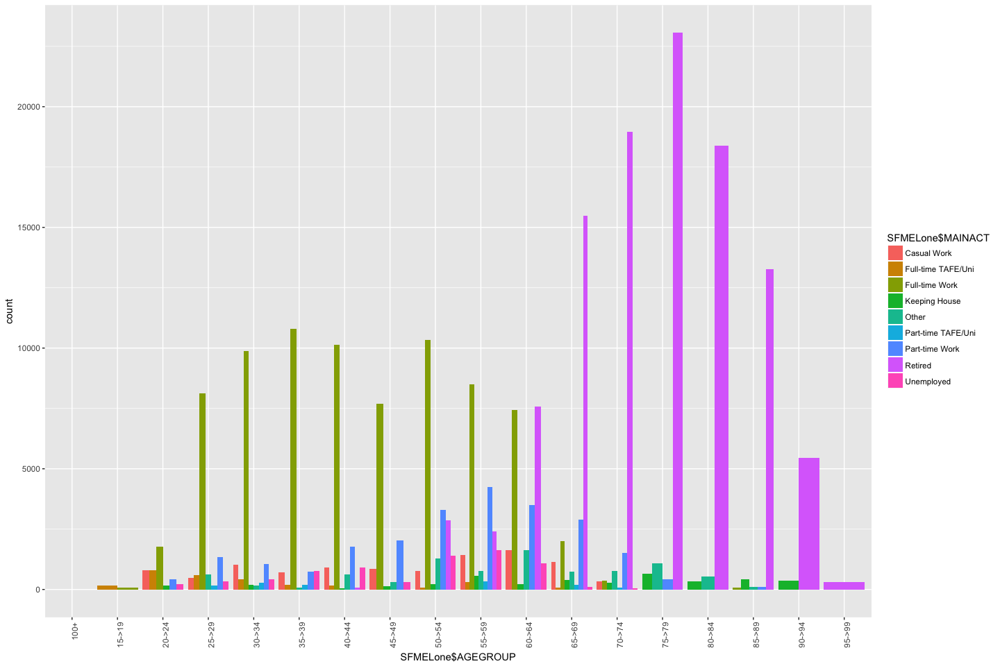
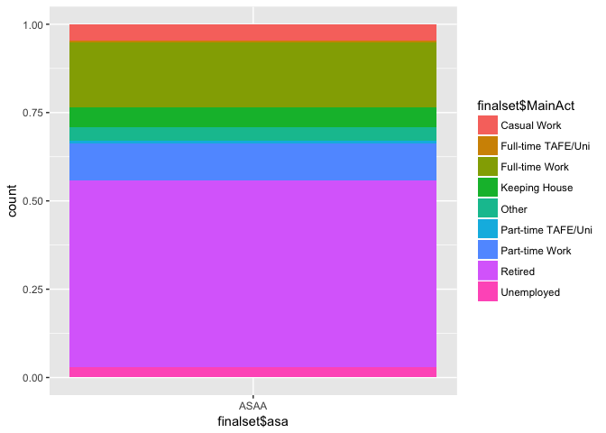
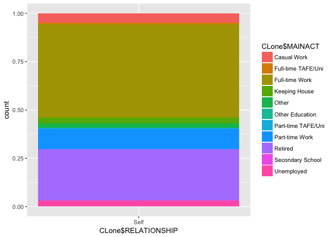
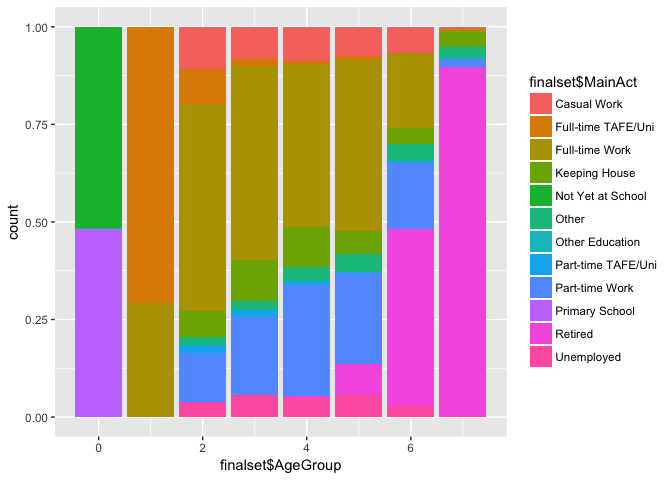
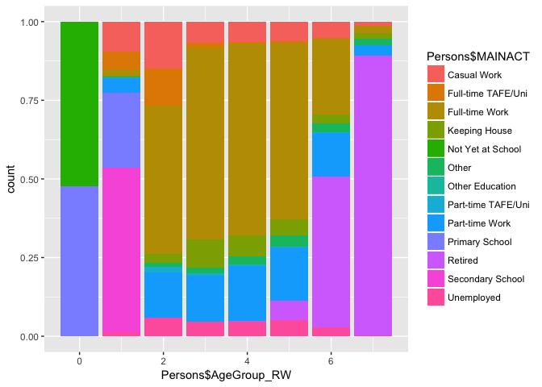

Analysing Mount eliza

```r
SPersonsME <- read.csv("../../synthetic-population/data/melbourne-2016-population/melbourne/generated/SA2/Mount\ Eliza/population/persons.csv")
HouseME <-  read.csv("../../synthetic-population/data/melbourne-2016-population/melbourne/generated/SA2/Mount\ Eliza/population/households.csv")
SPersonsME$AgeGroup[SPersonsME$Age > 69] <- 7
SPersonsME$AgeGroup[SPersonsME$Age < 70] <- 6
SPersonsME$AgeGroup[SPersonsME$Age < 60] <- 5
SPersonsME$AgeGroup[SPersonsME$Age < 50] <- 4
SPersonsME$AgeGroup[SPersonsME$Age < 40] <- 3
SPersonsME$AgeGroup[SPersonsME$Age < 30] <- 2
SPersonsME$AgeGroup[SPersonsME$Age < 20] <- 1
SPersonsME$AgeGroup[SPersonsME$Age < 10] <- 0
```

Let us get some basic plots for census data in Mount Eliza


```r
Trips <- read.csv("../data/vista/2018-05-23-vista-2013-16/VISTA_2012_16_v1_SA1_CSV/T_VISTA12_16_SA1_V1.csv")
Stops <- read.csv("../data/vista/2018-05-23-vista-2013-16/VISTA_2012_16_v1_SA1_CSV/S_VISTA12_16_SA1_V1.csv")
Persons <- read.csv("../data/vista/2018-05-23-vista-2013-16/VISTA_2012_16_v1_SA1_CSV/P_VISTA12_16_SA1_V1.csv")
House <- read.csv("../data/vista/2018-05-23-vista-2013-16/VISTA_2012_16_v1_SA1_CSV/H_VISTA12_16_SA1_V1.csv")
Work <- read.csv("../data/vista/2018-05-23-vista-2013-16/VISTA_2012_16_v1_SA1_CSV/JTW_VISTA12_16_SA1_V1.csv")
Edu <- read.csv("../data/vista/2018-05-23-vista-2013-16/VISTA_2012_16_v1_SA1_CSV/JTE_VISTA12_16_SA1_V1.csv")
CPersonsME <- subset(Persons, Persons$HomeSA2=="Mount Eliza")
SPMELone <- Persons[Persons$HHID %in% subset(House, House$HHSIZE==1)$HHID, ]
CPLone <- subset(Persons, Persons$Relationship == "Lone Person")
# WMELone <- Work[Work$PERSID %in% subset(SPMELone$MAINACT),]
```


```r
library(questionr)
library(ggplot2)
SMMELone <- subset(SPMELone,SPMELone$SEX== "Male")
SFMELone <- subset(SPMELone, SPMELone$SEX == "Female")
AgeActM <- as.data.frame(prop.table(wtd.table(SMMELone$MAINACT, SMMELone$AGEGROUP, weights = SMMELone$CW_ADPERSWGT_LGA),2 ))
AgeActM <- subset(AgeActM, AgeActM$Freq > 0)
ggplot(SMMELone, aes(x=SMMELone$AGEGROUP, fill = SMMELone$MAINACT, weights = SMMELone$CW_ADPERSWGT_LGA))+geom_bar(position = "dodge") +  theme(axis.text.x = element_text(angle = 90, hjust = 1))
```

<!-- -->

```r
AgeActF <- as.data.frame(prop.table(wtd.table(SFMELone$MAINACT, SFMELone$AGEGROUP, weights = SFMELone$CW_ADPERSWGT_LGA),2 ))
AgeActF <- subset(AgeActF, AgeActF$Freq > 0)
ggplot(SFMELone, aes(x=SFMELone$AGEGROUP, fill = SFMELone$MAINACT, weights = SFMELone$CW_ADPERSWGT_LGA))+geom_bar(position = "dodge") +  theme(axis.text.x = element_text(angle = 90, hjust = 1))
```

<!-- -->


```r
training_set <- SMMELone[,c(8,19,69)]
SynthMaleLone <- subset(SPersonsME, SPersonsME$Gender=="Male"&SPersonsME$RelationshipStatus=="LONE_PERSON")
test_set <- as.data.frame((SynthMaleLone[,2]))
test_set$AGE <- test_set$`(SynthMaleLone[, 2])`
test_set<-test_set[2]

training_set$DoesWork[training_set$ANYWORK=="Yes"]<-1
training_set$DoesWork[training_set$ANYWORK=="No"]<-0
training_set<-training_set[,c(1,3,4)]
training_set$DoesWork <- as.factor(training_set$DoesWork)
library(randomForest)
```

```
## randomForest 4.6-12
```

```
## Type rfNews() to see new features/changes/bug fixes.
```

```
## 
## Attaching package: 'randomForest'
```

```
## The following object is masked from 'package:ggplot2':
## 
##     margin
```

```r
set.seed(123)
classifier = randomForest(x = training_set[1],
                          y = training_set$DoesWork,
                          weights = training_set[2],
                          ntree = 500)
y_pred = predict(classifier, newdata = test_set[1])
SynthMaleLone <- cbind(SynthMaleLone,y_pred)
```


```r
training_set <- SMMELone[,c(8,19,69)]
SynthMaleLone <- subset(SPersonsME, SPersonsME$Gender=="Male"&SPersonsME$RelationshipStatus=="LONE_PERSON")
test_set <- as.data.frame((SynthMaleLone[,2]))
test_set$AGE <- test_set$`(SynthMaleLone[, 2])`
test_set<-test_set[2]

training_set$DoesWork[training_set$ANYWORK=="Yes"]<-1
training_set$DoesWork[training_set$ANYWORK=="No"]<-0
training_set<-training_set[,c(1,4)]
training_set$DoesWork <- as.factor(training_set$DoesWork)

library(e1071)
classifier = naiveBayes(x = training_set[1],
                        y = training_set$DoesWork)
                        
y_pred = predict(classifier, newdata = test_set[1])
test_set<-cbind(test_set,y_pred)
```


```r
library(e1071)
classifier = svm(formula = training_set$DoesWork ~ .,
                 data = training_set,
                 type = 'C-classification',
                 kernel = 'radial')
y_pred = predict(classifier, newdata = test_set[1])
test_set<-cbind(test_set,y_pred)
```


```r
# training_set <- Persons[,c(8,19,69)]
# SynthMaleLone <- subset(SPersonsME, SPersonsME$Gender=="Male"&SPersonsME$RelationshipStatus=="LONE_PERSON")
# test_set <- as.data.frame((SPersonsME[,2]))
# test_set$AGE <- test_set$`(SPersonsME[, 2])`
# test_set<-test_set[2]
# 
# training_set$DoesWork[training_set$ANYWORK=="Yes"]<-1
# training_set$DoesWork[training_set$ANYWORK=="No"]<-0
# training_set<-training_set[,c(1,4)]
# training_set$DoesWork <- as.factor(training_set$DoesWork)
# 
# library(e1071)
# classifier = randomForest(x = training_set[1],
#                           y = training_set$DoesWork,
#                           weights = training_set[2],
#                           ntree = 500)
# y_pred = predict(classifier, newdata = test_set[1])
# test_set<-cbind(test_set,y_pred)
```


```r
# training_set <- SFMELone[,c(8,19,69)]
# SynthFemaleLone <- subset(SPersonsME, SPersonsME$Gender=="Female"&SPersonsME$RelationshipStatus=="LONE_PERSON")
# test_set <- as.data.frame((SynthFemaleLone[,2]))
# test_set$AGE <- test_set$`(SynthFemaleLone[, 2])`
# test_set<-test_set[2]
# 
# training_set$DoesWork[training_set$ANYWORK=="Yes"]<-1
# training_set$DoesWork[training_set$ANYWORK=="No"]<-0
# training_set<-training_set[,c(1,3,4)]
# training_set$DoesWork <- as.factor(training_set$DoesWork)
# library(randomForest)
# set.seed(123)
# classifier = randomForest(x = training_set[1],
#                           y = training_set$DoesWork,
#                           weights = training_set[2],
#                           ntree = 5000)
# y_pred = predict(classifier, newdata = test_set[1])
# SynthFemaleLone <- cbind(SynthFemaleLone,y_pred)
# colnames(SynthFemaleLone)[colnames(SynthFemaleLone)=="y_pred"] <- "DoesWork"
# 
# training_set <- SFMELone[,c(8,69,22)]
# training_setW <- subset(training_set, training_set$MAINACT == "Full-time Work"|training_set$MAINACT=="Part-time Work"|training_set$MAINACT=="Casual Work")
# training_setW$WhichWork[training_setW$MAINACT == "Casual Work"] <- 0
# training_setW$WhichWork[training_setW$MAINACT == "Part-time Work"] <- 1
# training_setW$WhichWork[training_setW$MAINACT == "Full-time Work"] <- 2
# training_setW <- training_setW[,c(1,2,4)]
# training_setW$WhichWork <- as.factor(training_setW$WhichWork)
# 
# 
# SynthFemaleLoneW<-subset(SynthFemaleLone, SynthFemaleLone$DoesWork == 1)
# test_set <- as.data.frame((SynthFemaleLoneW[,2]))
# test_set$AGE <- test_set$`(SynthFemaleLoneW[, 2])`
# test_set<-test_set[2]
# 
# classifier = randomForest(x = training_setW[1],
#                           y = training_setW$WhichWork,
#                           ntree = 100)
# SynthFemaleLoneW$WhichWork = predict(classifier, newdata = test_set[1])
```


```r
CLone<-subset(Persons,Persons$RELATIONSHIP=="Self")
CFLone <- subset(Persons,Persons$SEX=="Female"&Persons$RELATIONSHIP=="Self")
CFLone <- CFLone[,c(22,69,63)]
SFLoneME <- subset(SPersonsME, SPersonsME$Gender == "Female"&SPersonsME$RelationshipStatus == "LONE_PERSON")
test_set <-SFLoneME[,c(1,12)]
test_set$Rand <- runif(nrow(test_set), 0, 100)


training_set <- subset(CFLone,CFLone$AgeGroup_RW==2)
work_set <- subset(test_set,test_set$AgeGroup==2)
work_set <- work_set[order(work_set$Rand),]
WorkCat<-as.data.frame(cumsum(wtd.table(training_set$MAINACT,weights = training_set$CW_ADPERSWGT_LGA))/sum(wtd.table(training_set$MAINACT,weights = training_set$CW_ADPERSWGT_LGA))*100)
WorkCat$Act <- rownames(WorkCat)
rownames(WorkCat)<-c()
WorkCat$Wt <- WorkCat$`cumsum(wtd.table(training_set$MAINACT, weights = training_set$CW_ADPERSWGT_LGA))/sum(wtd.table(training_set$MAINACT, weights = training_set$CW_ADPERSWGT_LGA)) * 100`
WorkCat <- WorkCat[,c(-1)]
j=1
i=1
for (i in 1:13){
 while (work_set$Rand[j]<WorkCat$Wt[i]&&!is.na(work_set$Rand[j])){
    work_set$MainAct[j] <- WorkCat$Act[i] 
    j=j+1
  }
}

finalset <- work_set

a = 2
for (a in 2:7){
training_set <- subset(CFLone,CFLone$AgeGroup_RW==a)
work_set <- subset(test_set,test_set$AgeGroup==a)
work_set <- work_set[order(work_set$Rand),]
WorkCat<-as.data.frame(cumsum(wtd.table(training_set$MAINACT,weights = training_set$CW_ADPERSWGT_LGA))/sum(wtd.table(training_set$MAINACT,weights = training_set$CW_ADPERSWGT_LGA))*100)
WorkCat$Act <- rownames(WorkCat)
rownames(WorkCat)<-c()
WorkCat$Wt <- WorkCat$`cumsum(wtd.table(training_set$MAINACT, weights = training_set$CW_ADPERSWGT_LGA))/sum(wtd.table(training_set$MAINACT, weights = training_set$CW_ADPERSWGT_LGA)) * 100`
WorkCat <- WorkCat[,c(-1)]
j=1
i=1
for (i in 1:13){
  while (work_set$Rand[j]<WorkCat$Wt[i]&&!is.na(work_set$Rand[j])){
    work_set$MainAct[j] <- WorkCat$Act[i] 
    j=j+1
  }
}

work_set<-work_set[order(work_set$AgentId),]
finalset <- rbind(finalset,work_set)
}
```


```r
CMLone <- subset(Persons,Persons$SEX=="Male"&Persons$RELATIONSHIP=="Self")
CMLone <- CMLone[,c(22,69,63)]
SMLoneME <- subset(SPersonsME, SPersonsME$Gender == "Male"&SPersonsME$RelationshipStatus == "LONE_PERSON")
test_set <-SMLoneME[,c(1,12)]
test_set$Rand <- runif(nrow(test_set), 0, 100)


a = 1
for (a in 2:7){
training_set <- subset(CFLone,CFLone$AgeGroup_RW==a)
work_set <- subset(test_set,test_set$AgeGroup==a)
work_set <- work_set[order(work_set$Rand),]
WorkCat<-as.data.frame(cumsum(wtd.table(training_set$MAINACT,weights = training_set$CW_ADPERSWGT_LGA))/sum(wtd.table(training_set$MAINACT,weights = training_set$CW_ADPERSWGT_LGA))*100)
WorkCat$Act <- rownames(WorkCat)
rownames(WorkCat)<-c()
WorkCat$Wt <- WorkCat$`cumsum(wtd.table(training_set$MAINACT, weights = training_set$CW_ADPERSWGT_LGA))/sum(wtd.table(training_set$MAINACT, weights = training_set$CW_ADPERSWGT_LGA)) * 100`
WorkCat <- WorkCat[,c(-1)]
j=1
i=1
for (i in 1:13){
  while (work_set$Rand[j]<WorkCat$Wt[i]&&!is.na(work_set$Rand[j])){
    work_set$MainAct[j] <- WorkCat$Act[i] 
    j=j+1
  }
}

work_set<-work_set[order(work_set$AgentId),]
finalset <- rbind(finalset,work_set)
}
```


```r
par(mfrow=c(1,2))
finalset$asa<- "ASAA"
ggplot(finalset,aes(x=finalset$asa, fill = finalset$MainAct)) + geom_bar(position = "fill")
```

<!-- -->

```r
ggplot(CLone,aes(x=CLone$RELATIONSHIP,fill=CLone$MAINACT)) + geom_bar(position = "fill")
```

<!-- -->


```r
CLone<-subset(Persons,Persons$RELATIONSHIP=="Self")
CFLone <- subset(Persons,Persons$SEX=="Female"&Persons$RELATIONSHIP=="Self")
CFLone <- CFLone[,c(22,69,63)]
SFLoneME <- subset(SPersonsME, SPersonsME$Gender == "Female"&SPersonsME$RelationshipStatus == "LONE_PERSON")
test_set <-SPersonsME[,c(1,12)]
test_set$Rand <- runif(nrow(test_set), 0, 100)


training_set <- subset(Persons,Persons$AgeGroup_RW==0)
work_set <- subset(test_set,test_set$AgeGroup==0)
work_set <- work_set[order(work_set$Rand),]
WorkCat<-as.data.frame(cumsum(wtd.table(training_set$MAINACT,weights = training_set$CW_ADPERSWGT_LGA))/sum(wtd.table(training_set$MAINACT,weights = training_set$CW_ADPERSWGT_LGA))*100)
WorkCat$Act <- rownames(WorkCat)
rownames(WorkCat)<-c()
WorkCat$Wt <- WorkCat$`cumsum(wtd.table(training_set$MAINACT, weights = training_set$CW_ADPERSWGT_LGA))/sum(wtd.table(training_set$MAINACT, weights = training_set$CW_ADPERSWGT_LGA)) * 100`
WorkCat <- WorkCat[,c(-1)]
j=1
i=1
for (i in 1:13){
 while (work_set$Rand[j]<WorkCat$Wt[i]&&!is.na(work_set$Rand[j])){
    work_set$MainAct[j] <- WorkCat$Act[i] 
    j=j+1
  }
}

finalset <- work_set

a = 1
for (a in 1:7){
training_set <- subset(CFLone,CFLone$AgeGroup_RW==a)
work_set <- subset(test_set,test_set$AgeGroup==a)
work_set <- work_set[order(work_set$Rand),]
WorkCat<-as.data.frame(cumsum(wtd.table(training_set$MAINACT,weights = training_set$CW_ADPERSWGT_LGA))/sum(wtd.table(training_set$MAINACT,weights = training_set$CW_ADPERSWGT_LGA))*100)
WorkCat$Act <- rownames(WorkCat)
rownames(WorkCat)<-c()
WorkCat$Wt <- WorkCat$`cumsum(wtd.table(training_set$MAINACT, weights = training_set$CW_ADPERSWGT_LGA))/sum(wtd.table(training_set$MAINACT, weights = training_set$CW_ADPERSWGT_LGA)) * 100`
WorkCat <- WorkCat[,c(-1)]
j=1
i=1
for (i in 1:13){
  while (work_set$Rand[j]<WorkCat$Wt[i]&&!is.na(work_set$Rand[j])){
    work_set$MainAct[j] <- WorkCat$Act[i] 
    j=j+1
  }
}

work_set<-work_set[order(work_set$AgentId),]
finalset <- rbind(finalset,work_set)
}
```


```r
par(mfrow=c(1,2))
ggplot(finalset,aes(x=finalset$AgeGroup, fill = finalset$MainAct)) + geom_bar(position = "fill")
```

<!-- -->

```r
ggplot(Persons,aes(x=Persons$AgeGroup_RW,fill=Persons$MAINACT)) + geom_bar(position = "fill")
```

<!-- -->

