Analysing Northcote

```r
library(ggplot2)
library(questionr)
library(smbinning)
```

```
## Warning: package 'smbinning' was built under R version 3.4.3
```

```
## Loading required package: sqldf
```

```
## Loading required package: gsubfn
```

```
## Warning: package 'gsubfn' was built under R version 3.4.4
```

```
## Loading required package: proto
```

```
## Loading required package: RSQLite
```

```
## Warning: package 'RSQLite' was built under R version 3.4.4
```

```
## Loading required package: partykit
```

```
## Loading required package: grid
```

```
## Loading required package: libcoin
```

```
## Warning: package 'libcoin' was built under R version 3.4.3
```

```
## Loading required package: mvtnorm
```

```
## Loading required package: Formula
```

```r
library(varhandle)
library(randomForest)
```

```
## randomForest 4.6-12
```

```
## Type rfNews() to see new features/changes/bug fixes.
```

```
## 
## Attaching package: 'randomForest'
```

```
## The following object is masked from 'package:ggplot2':
## 
##     margin
```

```r
PersonsSuburb <- read.csv("../../synthetic-population/data/melbourne-2016-population/melbourne/generated/SA2/Northcote/population/persons.csv")
HouseholsSuburb <-  read.csv("../../synthetic-population/data/melbourne-2016-population/melbourne/generated/SA2/Northcote/population/households.csv")
PersonsSuburb$AgeGroup[PersonsSuburb$Age > 69] <- 7
PersonsSuburb$AgeGroup[PersonsSuburb$Age < 70] <- 6
PersonsSuburb$AgeGroup[PersonsSuburb$Age < 60] <- 5
PersonsSuburb$AgeGroup[PersonsSuburb$Age < 50] <- 4
PersonsSuburb$AgeGroup[PersonsSuburb$Age < 40] <- 3
PersonsSuburb$AgeGroup[PersonsSuburb$Age < 30] <- 2
PersonsSuburb$AgeGroup[PersonsSuburb$Age < 20] <- 1
PersonsSuburb$AgeGroup[PersonsSuburb$Age < 10] <- 0
library(questionr)
```


```r
Trips <- read.csv("../data/vista/2018-05-23-vista-2013-16/VISTA_2012_16_v1_SA1_CSV/T_VISTA12_16_SA1_V1.csv")
Trips <- subset(Trips, Trips$LINKMODE != "Other")
Stops <- read.csv("../data/vista/2018-05-23-vista-2013-16/VISTA_2012_16_v1_SA1_CSV/S_VISTA12_16_SA1_V1.csv")
```
Let us get some basic plots for census data in Mount Eliza


```r
Persons <- read.csv("../data/vista/2018-05-23-vista-2013-16/VISTA_2012_16_v1_SA1_CSV/P_VISTA12_16_SA1_V1.csv")
Persons <- subset(Persons, Persons$MAINACT!="Other"&Persons$MAINACT!="Other Education")
Persons$MAINACT <- as.factor(as.character(Persons$MAINACT))
Persons$WorkCat <- as.numeric(Persons$MAINACT)
Work <- read.csv("../data/vista/2018-05-23-vista-2013-16/VISTA_2012_16_v1_SA1_CSV/JTW_VISTA12_16_SA1_V1.csv")
Work <- subset(Work, Work$JTWMODE != "Other")
Work$JTWMODE <- as.factor(Work$JTWMODE)
```


Main activity based on age

```r
test_data<-subset(PersonsSuburb,PersonsSuburb$Gender=="Female")
test_data <-test_data[,c(1,12)]
test_data$Rand <- runif(nrow(test_data), 0, 100)
train_data<-subset(Persons,Persons$SEX=="Female")


training_set <- subset(train_data,train_data$AgeGroup_RW==0)
test_set <- subset(test_data,test_data$AgeGroup==0)
test_set <- test_set[order(test_set$Rand),]
WorkCat<-as.data.frame(cumsum(wtd.table(training_set$MAINACT,weights = training_set$CW_ADPERSWGT_LGA))/sum(wtd.table(training_set$MAINACT,weights = training_set$CW_ADPERSWGT_LGA))*100)
WorkCat$Act <- rownames(WorkCat)
rownames(WorkCat)<-c()
WorkCat$Wt <- WorkCat$`cumsum(wtd.table(training_set$MAINACT, weights = training_set$CW_ADPERSWGT_LGA))/sum(wtd.table(training_set$MAINACT, weights = training_set$CW_ADPERSWGT_LGA)) * 100`
WorkCat <- WorkCat[,c(-1)]
j=1
i=1
for (i in 1:13){
 while (test_set$Rand[j]<WorkCat$Wt[i]&&!is.na(test_set$Rand[j])){
    test_set$MainAct[j] <- WorkCat$Act[i] 
    j=j+1
  }
}
finalset <- test_set

a = 1
for (a in 1:7){
training_set <- subset(train_data,train_data$AgeGroup_RW==a)
test_set <- subset(test_data,test_data$AgeGroup==a)
test_set <- test_set[order(test_set$Rand),]
WorkCat<-as.data.frame(cumsum(wtd.table(training_set$MAINACT,weights = training_set$CW_ADPERSWGT_LGA))/sum(wtd.table(training_set$MAINACT,weights = training_set$CW_ADPERSWGT_LGA))*100)
WorkCat$Act <- rownames(WorkCat)
rownames(WorkCat)<-c()
WorkCat$Wt <- WorkCat$`cumsum(wtd.table(training_set$MAINACT, weights = training_set$CW_ADPERSWGT_LGA))/sum(wtd.table(training_set$MAINACT, weights = training_set$CW_ADPERSWGT_LGA)) * 100`
WorkCat <- WorkCat[,c(-1)]
j=1
i=1
for (i in 1:13){
  while (test_set$Rand[j]<WorkCat$Wt[i]&&!is.na(test_set$Rand[j])){
    test_set$MainAct[j] <- WorkCat$Act[i] 
    j=j+1
  }
}

test_set<-test_set[order(test_set$AgentId),]
finalset <- rbind(finalset,test_set)
}

test_data<-subset(PersonsSuburb,PersonsSuburb$Gender=="Male")
test_data <-test_data[,c(1,12)]
test_data$Rand <- runif(nrow(test_data), 0, 100)
train_data<-subset(Persons,Persons$SEX=="Male")


a = 0
for (a in 0:7){
training_set <- subset(train_data,train_data$AgeGroup_RW==a)
test_set <- subset(test_data,test_data$AgeGroup==a)
test_set <- test_set[order(test_set$Rand),]
WorkCat<-as.data.frame(cumsum(wtd.table(training_set$MAINACT,weights = training_set$CW_ADPERSWGT_LGA))/sum(wtd.table(training_set$MAINACT,weights = training_set$CW_ADPERSWGT_LGA))*100)
WorkCat$Act <- rownames(WorkCat)
rownames(WorkCat)<-c()
WorkCat$Wt <- WorkCat$`cumsum(wtd.table(training_set$MAINACT, weights = training_set$CW_ADPERSWGT_LGA))/sum(wtd.table(training_set$MAINACT, weights = training_set$CW_ADPERSWGT_LGA)) * 100`
WorkCat <- WorkCat[,c(-1)]
j=1
i=1
for (i in 1:13){
  while (test_set$Rand[j]<WorkCat$Wt[i]&&!is.na(test_set$Rand[j])){
    test_set$MainAct[j] <- WorkCat$Act[i] 
    j=j+1
  }
}

test_set<-test_set[order(test_set$AgentId),]
finalset <- rbind(finalset,test_set)
}

PersonsSuburb <- PersonsSuburb[order(PersonsSuburb$AgentId),]
finalset <- finalset[order(finalset$AgentId),]
PersonsSuburb <- cbind(PersonsSuburb,finalset$MainAct)
colnames(PersonsSuburb)[colnames(PersonsSuburb)=="finalset$MainAct"] <- "MainAct"
```


```r
par(mfrow=c(2,2))
ggplot(PersonsSuburb,aes(x=PersonsSuburb$AgeGroup, fill = PersonsSuburb$MainAct)) + geom_bar(position = "fill")
```

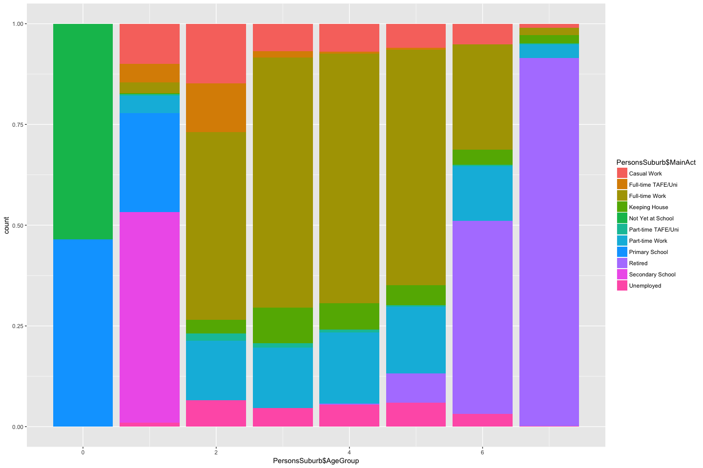<!-- -->

```r
ggplot(Persons,aes(x=Persons$AgeGroup_RW,fill=Persons$MAINACT)) + geom_bar(position = "fill")
```

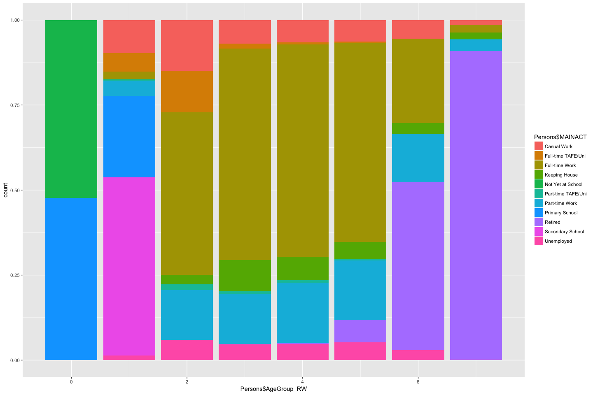<!-- -->


```r
retired <- subset(Persons,Persons$MAINACT=="Retired")
tripRetired <- Trips[Trips$PERSID %in% retired$PERSID,]
formalsetRetired <- subset(PersonsSuburb, PersonsSuburb$MainAct=="Retired")
formalsetRetired$ANSZCO1 <- formalsetRetired$MainAct
```


```r
RetMainAct <- subset(tripRetired, tripRetired$DESTPURP1 == "Buy Something"|tripRetired$DESTPURP1=="Personal Business"|tripRetired$DESTPURP1=="Recreational"|tripRetired$DESTPURP1=="Social")
RetMainAct$LINKMODE <- as.factor(as.character(RetMainAct$LINKMODE))
persRetired <- Persons[Persons$PERSID %in% RetMainAct$PERSID,]
table(tripRetired$DESTPURP1)
```

```
## 
##            Accompany Someone                At or Go Home 
##                          197                         6358 
##                Buy Something                  Change Mode 
##                         3153                           11 
##                    Education                   Not Stated 
##                           31                            0 
##                Other Purpose            Personal Business 
##                           96                         1692 
## Pick-up or Deliver Something  Pick-up or Drop-off Someone 
##                          419                          759 
##                 Recreational                       Social 
##                          933                         2067 
##                 Work Related 
##                           71
```

```r
RetMainAct <- RetMainAct[order(RetMainAct$PERSID),]
persRetired <- persRetired[order(persRetired$PERSID),]
b=1
for (a in 1:nrow(persRetired)){
  while (as.character(RetMainAct$PERSID[b])==as.character(persRetired$PERSID[a])&&!is.na(RetMainAct$PERSID[b])){
    RetMainAct$AGE[b] <- persRetired$AGE[a]
    RetMainAct$SEX[b] <- persRetired$SEX[a]
    RetMainAct$AgeGroup[b] <- persRetired$AgeGroup_RW[a]

    b=b+1
  }
}
ggplot(RetMainAct, aes(x=RetMainAct$DESTPURP2,y=as.numeric(RetMainAct$AGE)))+geom_boxplot() 
```

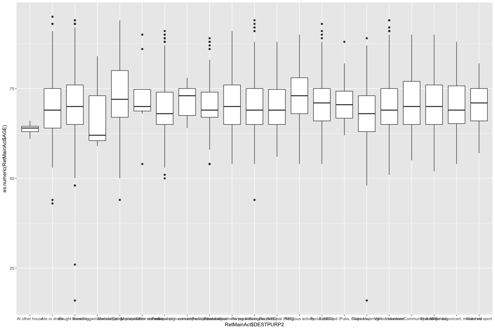<!-- -->

```r
RetMainAct <- subset(RetMainAct, RetMainAct$DESTPURP2=="Ate or drank"|RetMainAct$DESTPURP2=="Bought something"|RetMainAct$DESTPURP2=="Medical/Dental purposes"|RetMainAct$DESTPURP2=="Personal business (eg banking)"|RetMainAct$DESTPURP2=="Personal Business (NEC)"|RetMainAct$DESTPURP2=="Recreational (NEC)"|RetMainAct$DESTPURP2=="Religious activity"|RetMainAct$DESTPURP2=="Social (NEC)"|RetMainAct$DESTPURP2=="Visited someone"|RetMainAct$DESTPURP2=="Volunteer/Community activity"|RetMainAct$DESTPURP2=="Walked the dog"|RetMainAct$DESTPURP2=="Participated in sport"|RetMainAct$DESTPURP2=="Watched concert, movies etc")
RetMainAct$DESTPURP2 <- as.factor(as.character(RetMainAct$DESTPURP2))
RetMainAct$AgeGroup <- as.factor(RetMainAct$AgeGroup)
```
anszco

```r
test_set <-formalsetRetired[,c(1,12)]
test_set$Rand <- runif(nrow(test_set), 0, 100)
test_set <- test_set[order(test_set$Rand),]
WorkCat<-as.data.frame(cumsum(wtd.table(RetMainAct$DESTPURP2,weights=RetMainAct$CW_ADTRIPWGT_LGA))/sum(wtd.table(RetMainAct$DESTPURP2,weights = RetMainAct$CW_ADTRIPWGT_LGA))*100)
WorkCat$Act <- rownames(WorkCat)
rownames(WorkCat)<-c()
WorkCat$Wt <- WorkCat$`cumsum(wtd.table(RetMainAct$DESTPURP2, weights = RetMainAct$CW_ADTRIPWGT_LGA))/sum(wtd.table(RetMainAct$DESTPURP2, weights = RetMainAct$CW_ADTRIPWGT_LGA)) * 100`
WorkCat <- WorkCat[,c(-1)]
j=1
for (i in 1:13){
  while (test_set$Rand[j]<WorkCat$Wt[i]&&!is.na(test_set$Rand[j])){
    test_set$MainAct[j] <- WorkCat$Act[i] 
    j=j+1
  }
}

test_set <- test_set[order(test_set$AgentId),]
formalsetRetired$ANSZCO1 <- test_set$MainAct
```
mode

```r
test_data <-formalsetRetired[,c(1,14)]
test_data$Rand <- runif(nrow(test_data), 0, 100)
test_data$cat <- as.integer(as.factor(test_data$ANSZCO1))
training_data <- RetMainAct
training_data$cat <- as.integer(as.factor(training_data$DESTPURP2))

training_set <- subset(training_data,as.numeric(training_data$DESTPURP2)==1)
test_set<-subset(test_data,as.numeric(as.factor(test_data$ANSZCO1))==1)
test_set <- test_set[order(test_set$Rand),]
WorkCat<-as.data.frame(cumsum(wtd.table(training_set$LINKMODE,weights=training_set$CW_ADTRIPWGT_LGA))/sum(wtd.table(training_set$LINKMODE,weights = training_set$CW_ADTRIPWGT_LGA))*100)
WorkCat$Act <- rownames(WorkCat)
rownames(WorkCat)<-c()
WorkCat$Wt <- WorkCat$`cumsum(wtd.table(training_set$LINKMODE, weights = training_set$CW_ADTRIPWGT_LGA))/sum(wtd.table(training_set$LINKMODE, weights = training_set$CW_ADTRIPWGT_LGA)) * 100`
WorkCat <- WorkCat[,c(-1)]
j=1
for (i in 1:12){
  while (test_set$Rand[j]<WorkCat$Wt[i]&&!is.na(test_set$Rand[j])){
    test_set$LINKMODE[j] <- WorkCat$Act[i] 
    j=j+1
  }
}
finalset <- test_set


for (a in 2:13){
training_set <- subset(training_data,as.numeric(training_data$DESTPURP2)==a)
test_set<-subset(test_data,as.numeric(as.factor(test_data$ANSZCO1))==a)
test_set <- test_set[order(test_set$Rand),]
WorkCat<-as.data.frame(cumsum(wtd.table(training_set$LINKMODE,weights=training_set$CW_ADTRIPWGT_LGA))/sum(wtd.table(training_set$LINKMODE,weights = training_set$CW_ADTRIPWGT_LGA))*100)
WorkCat$Act <- rownames(WorkCat)
rownames(WorkCat)<-c()
WorkCat$Wt <- WorkCat$`cumsum(wtd.table(training_set$LINKMODE, weights = training_set$CW_ADTRIPWGT_LGA))/sum(wtd.table(training_set$LINKMODE, weights = training_set$CW_ADTRIPWGT_LGA)) * 100`
WorkCat <- WorkCat[,c(-1)]
j=1
for (i in 1:12){
  while (test_set$Rand[j]<WorkCat$Wt[i]&&!is.na(test_set$Rand[j])){
    test_set$LINKMODE[j] <- WorkCat$Act[i] 
    j=j+1
  }
}
finalset <- rbind(finalset,test_set)
}
finalset <- finalset[order(finalset$AgentId),]
formalsetRetired$LINKMODE <- finalset$LINKMODE
```
startime

```r
formalsetRetired <- formalsetRetired[order(formalsetRetired$AgentId),]
formalsetRetired$AgeGroup <- as.factor(formalsetRetired$AgeGroup)
RetMainAct$STARTIME <- as.numeric(RetMainAct$STARTIME)
dataset2 <- RetMainAct[,c(91,92,23,8)]
dataset2$DESTPURP2 = factor(dataset2$DESTPURP2,
                       labels = c(1:13))
dataset2$SEX = factor(as.factor(dataset2$SEX),
                       labels = c(1, 2))
test_set <- formalsetRetired[,c(2,3,14)]

test_set$SEX = factor(as.factor(test_set$Gender),
                       labels = c(1, 2))
test_set$DESTPURP2 = factor(test_set$ANSZCO1,
                       labels = c(1:13))
names(test_set)[1]<-"AGE"
test_set <- test_set[,-c(2,3)]
finalerr <- 1000
idealtrees = 0

line_reg = randomForest(x=dataset2[-4],y=dataset2$STARTIME,ntree = 100,weights = RetMainAct$CW_ADTRIPWGT_LGA)
formalsetRetired$STARTIME = predict(line_reg, test_set)
```

duration

```r
RetMainAct$DURATION <- as.numeric(RetMainAct$DURATION)
dataset2 <- RetMainAct[,c(91,92,23,35)]
dataset2$DESTPURP2 = factor(dataset2$DESTPURP2,
                       labels = c(1:13))
dataset2$SEX = factor(as.factor(dataset2$SEX),
                       labels = c(1, 2))
test_set <- formalsetRetired[,c(2,3,14)]

test_set$SEX = factor(as.factor(test_set$Gender),
                       labels = c(1, 2))
test_set$DESTPURP2 = factor(test_set$ANSZCO1,
                       labels = c(1:13))
names(test_set)[1]<-"AGE"
test_set <- test_set[,-c(2,3)]
finalerr <- 1000
idealtrees = 0

line_reg = randomForest(x=dataset2[-4],y=dataset2$DURATION,ntree = 100,weights = RetMainAct$CW_ADTRIPWGT_LGA)
formalsetRetired$DURATION = predict(line_reg, test_set)
```


distance

```r
formalsetRetired <- formalsetRetired[order(formalsetRetired$AgentId),]
formalsetRetired$AgeGroup <- as.factor(formalsetRetired$AgeGroup)
RetMainAct$DURATION <- as.numeric(RetMainAct$DURATION)
dataset2 <- RetMainAct[,c(91,31,23,27)]
dataset2$DESTPURP2 = factor(dataset2$DESTPURP2,
                       labels = c(1:13))
dataset2$LINKMODE = factor(dataset2$LINKMODE, labels = c(1:9))
test_set <- formalsetRetired[,c(2,14,15)]
test_set$DESTPURP2 = factor(test_set$ANSZCO1,
                       labels = c(1:13))
test_set$LINKMODE = factor(test_set$LINKMODE, labels = c(1:9))
names(test_set)[1]<-"AGE"
test_set <- test_set[,-2]
finalerr <- 1000
idealtrees = 0

line_reg = randomForest(x=dataset2[-4],y=dataset2$CUMDIST,ntree = 100,weights = RetMainAct$CW_ADTRIPWGT_LGA)
formalsetRetired$CUMDIST = predict(line_reg, test_set)
```


```r
RetMainAct$SPEED <- RetMainAct$CUMDIST/RetMainAct$TRAVTIME * 60
```

Speed

```r
formalsetRetired <- formalsetRetired[order(formalsetRetired$AgentId),]
dataset2 <- RetMainAct[,c(31,8,94)]

dataset2$LINKMODE = factor(dataset2$LINKMODE, labels = c(1:9))
test_set <- formalsetRetired[,c(15,16)]

test_set$LINKMODE = factor(test_set$LINKMODE, labels = c(1:9))
finalerr <- 1000
idealtrees = 0

line_reg = randomForest(x=dataset2[-3],y=dataset2$SPEED,ntree = 100,weights = RetMainAct$CW_ADTRIPWGT_LGA)
formalsetRetired$JTMSpeed = predict(line_reg, test_set)
```


```r
formalsetRetired$JTMTime <- formalsetRetired$CUMDIST/formalsetRetired$JTMSpeed * 60
formalsetRetired$ReachMainTime <- formalsetRetired$STARTIME + formalsetRetired$JTMTime
formalsetRetired$LeaveMainTime <- formalsetRetired$ReachMainTime+formalsetRetired$DURATION
```

Just using Start time and Vehicle

```r
RetHome <- subset(tripRetired, tripRetired$DESTPURP1 == "At or Go Home")
RetHome$SPEED <- RetHome$CUMDIST/RetHome$TRAVTIME * 60

formalsetRetired <- formalsetRetired[order(formalsetRetired$AgentId),]
dataset2 <- RetHome[,c(31,8,91)]

dataset2$LINKMODE = factor(dataset2$LINKMODE, labels = c(1:9))
test_set <- formalsetRetired[,c(15,16)]

test_set$LINKMODE = factor(test_set$LINKMODE, labels = c(1:9))
finalerr <- 1000
idealtrees = 0

line_reg = randomForest(x=dataset2[-3],y=dataset2$SPEED,ntree = 100,weights = RetMainAct$CW_ADTRIPWGT_LGA)
formalsetRetired$JFMSpeed = predict(line_reg, test_set)
```


```r
formalsetRetired$JFMTime <- formalsetRetired$CUMDIST/formalsetRetired$JFMSpeed * 60
formalsetRetired$ReachHome <- formalsetRetired$LeaveMainTime + formalsetRetired$JFMTime
```


HOMEKEEPERS


```r
HomeKeeper <- subset(Persons,Persons$MAINACT=="Keeping House")
tripHomeKeeper <- Trips[Trips$PERSID %in% HomeKeeper$PERSID,]
formalsetHomeKeeper <- subset(PersonsSuburb, PersonsSuburb$MainAct=="Keeping House")
formalsetHomeKeeper$ANSZCO1 <- formalsetHomeKeeper$MainAct
```


```r
RetMainAct <- subset(tripHomeKeeper, tripHomeKeeper$DESTPURP1 == "Buy Something"|tripHomeKeeper$DESTPURP1=="Personal Business"|tripHomeKeeper$DESTPURP1=="Recreational"|tripHomeKeeper$DESTPURP1=="Social")
RetMainAct$LINKMODE <- as.factor(as.character(RetMainAct$LINKMODE))
persHomeKeeper <- Persons[Persons$PERSID %in% RetMainAct$PERSID,]
table(tripHomeKeeper$DESTPURP1)
```

```
## 
##            Accompany Someone                At or Go Home 
##                          135                         2107 
##                Buy Something                  Change Mode 
##                          806                            5 
##                    Education                   Not Stated 
##                           34                            0 
##                Other Purpose            Personal Business 
##                           20                          307 
## Pick-up or Deliver Something  Pick-up or Drop-off Someone 
##                          101                          896 
##                 Recreational                       Social 
##                          257                          486 
##                 Work Related 
##                           31
```

```r
RetMainAct <- RetMainAct[order(RetMainAct$PERSID),]
persHomeKeeper <- persHomeKeeper[order(persHomeKeeper$PERSID),]
b=1
for (a in 1:nrow(persHomeKeeper)){
  while (as.character(RetMainAct$PERSID[b])==as.character(persHomeKeeper$PERSID[a])&&!is.na(RetMainAct$PERSID[b])){
    RetMainAct$AGE[b] <- persHomeKeeper$AGE[a]
    RetMainAct$SEX[b] <- persHomeKeeper$SEX[a]
    RetMainAct$AgeGroup[b] <- persHomeKeeper$AgeGroup_RW[a]
    b=b+1
  }
}
ggplot(RetMainAct, aes(x=RetMainAct$DESTPURP2,y=as.numeric(RetMainAct$AGE)))+geom_boxplot() 
```

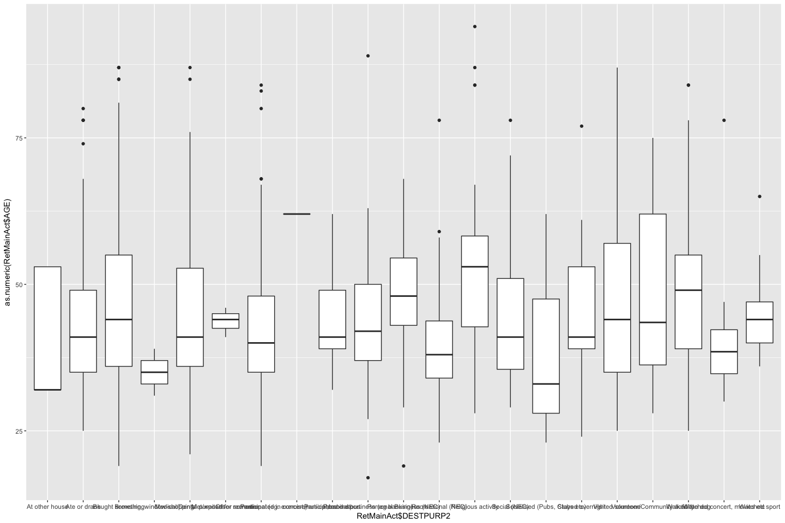<!-- -->

```r
RetMainAct <- subset(RetMainAct, RetMainAct$DESTPURP2=="Ate or drank"|RetMainAct$DESTPURP2=="Bought something"|RetMainAct$DESTPURP2=="Medical/Dental purposes"|RetMainAct$DESTPURP2=="Personal business (eg banking)"|RetMainAct$DESTPURP2=="Personal Business (NEC)"|RetMainAct$DESTPURP2=="Recreational (NEC)"|RetMainAct$DESTPURP2=="Religious activity"|RetMainAct$DESTPURP2=="Social (NEC)"|RetMainAct$DESTPURP2=="Visited someone"|RetMainAct$DESTPURP2=="Walked the dog")
RetMainAct$DESTPURP2 <- as.factor(as.character(RetMainAct$DESTPURP2))
RetMainAct$AgeGroup <- as.factor(RetMainAct$AgeGroup)
```
anszco

```r
test_set <-formalsetHomeKeeper[,c(1,12)]
test_set$Rand <- runif(nrow(test_set), 0, 100)
test_set <- test_set[order(test_set$Rand),]
WorkCat<-as.data.frame(cumsum(wtd.table(RetMainAct$DESTPURP2,weights=RetMainAct$CW_ADTRIPWGT_LGA))/sum(wtd.table(RetMainAct$DESTPURP2,weights = RetMainAct$CW_ADTRIPWGT_LGA))*100)
WorkCat$Act <- rownames(WorkCat)
rownames(WorkCat)<-c()
WorkCat$Wt <- WorkCat$`cumsum(wtd.table(RetMainAct$DESTPURP2, weights = RetMainAct$CW_ADTRIPWGT_LGA))/sum(wtd.table(RetMainAct$DESTPURP2, weights = RetMainAct$CW_ADTRIPWGT_LGA)) * 100`
WorkCat <- WorkCat[,c(-1)]
j=1
for (i in 1:13){
  while (test_set$Rand[j]<WorkCat$Wt[i]&&!is.na(test_set$Rand[j])){
    test_set$MainAct[j] <- WorkCat$Act[i] 
    j=j+1
  }
}

test_set <- test_set[order(test_set$AgentId),]
formalsetHomeKeeper$ANSZCO1 <- test_set$MainAct
```
mode

```r
test_data <-formalsetHomeKeeper[,c(1,14)]
test_data$Rand <- runif(nrow(test_data), 0, 100)
test_data$cat <- as.integer(as.factor(test_data$ANSZCO1))
training_data <- RetMainAct
training_data$cat <- as.integer(as.factor(training_data$DESTPURP2))

training_set <- subset(training_data,as.numeric(training_data$DESTPURP2)==1)
test_set<-subset(test_data,as.numeric(as.factor(test_data$ANSZCO1))==1)
test_set <- test_set[order(test_set$Rand),]
WorkCat<-as.data.frame(cumsum(wtd.table(training_set$LINKMODE,weights=training_set$CW_ADTRIPWGT_LGA))/sum(wtd.table(training_set$LINKMODE,weights = training_set$CW_ADTRIPWGT_LGA))*100)
WorkCat$Act <- rownames(WorkCat)
rownames(WorkCat)<-c()
WorkCat$Wt <- WorkCat$`cumsum(wtd.table(training_set$LINKMODE, weights = training_set$CW_ADTRIPWGT_LGA))/sum(wtd.table(training_set$LINKMODE, weights = training_set$CW_ADTRIPWGT_LGA)) * 100`
WorkCat <- WorkCat[,c(-1)]
j=1
for (i in 1:12){
  while (test_set$Rand[j]<WorkCat$Wt[i]&&!is.na(test_set$Rand[j])){
    test_set$LINKMODE[j] <- WorkCat$Act[i] 
    j=j+1
  }
}
finalset <- test_set


for (a in 2:13){
training_set <- subset(training_data,as.numeric(training_data$DESTPURP2)==a)
test_set<-subset(test_data,as.numeric(as.factor(test_data$ANSZCO1))==a)
test_set <- test_set[order(test_set$Rand),]
WorkCat<-as.data.frame(cumsum(wtd.table(training_set$LINKMODE,weights=training_set$CW_ADTRIPWGT_LGA))/sum(wtd.table(training_set$LINKMODE,weights = training_set$CW_ADTRIPWGT_LGA))*100)
WorkCat$Act <- rownames(WorkCat)
rownames(WorkCat)<-c()
WorkCat$Wt <- WorkCat$`cumsum(wtd.table(training_set$LINKMODE, weights = training_set$CW_ADTRIPWGT_LGA))/sum(wtd.table(training_set$LINKMODE, weights = training_set$CW_ADTRIPWGT_LGA)) * 100`
WorkCat <- WorkCat[,c(-1)]
j=1
for (i in 1:12){
  while (test_set$Rand[j]<WorkCat$Wt[i]&&!is.na(test_set$Rand[j])){
    test_set$LINKMODE[j] <- WorkCat$Act[i] 
    j=j+1
  }
}
finalset <- rbind(finalset,test_set)
}
finalset <- finalset[order(finalset$AgentId),]
formalsetHomeKeeper$LINKMODE <- finalset$LINKMODE
```
startime

```r
formalsetHomeKeeper <- formalsetHomeKeeper[order(formalsetHomeKeeper$AgentId),]
formalsetHomeKeeper$AgeGroup <- as.factor(formalsetHomeKeeper$AgeGroup)
RetMainAct$STARTIME <- as.numeric(RetMainAct$STARTIME)
dataset2 <- RetMainAct[,c(91,92,23,8)]
dataset2$DESTPURP2 = factor(dataset2$DESTPURP2,
                       labels = c(1:10))
dataset2$SEX = factor(as.factor(dataset2$SEX),
                       labels = c(1, 2))
test_set <- formalsetHomeKeeper[,c(2,3,14)]

test_set$SEX = factor(as.factor(test_set$Gender),
                       labels = c(1, 2))
test_set$DESTPURP2 = factor(test_set$ANSZCO1,
                       labels = c(1:10))
names(test_set)[1]<-"AGE"
test_set <- test_set[,-c(2,3)]
finalerr <- 1000
idealtrees = 0

line_reg = randomForest(x=dataset2[-4],y=dataset2$STARTIME,ntree = 100,weights = RetMainAct$CW_ADTRIPWGT_LGA)
formalsetHomeKeeper$STARTIME = predict(line_reg, test_set)
```

duration

```r
RetMainAct$DURATION <- as.numeric(RetMainAct$DURATION)
dataset2 <- RetMainAct[,c(91,92,23,35)]
dataset2$DESTPURP2 = factor(dataset2$DESTPURP2,
                       labels = c(1:10))
dataset2$SEX = factor(as.factor(dataset2$SEX),
                       labels = c(1, 2))
test_set <- formalsetHomeKeeper[,c(2,3,14)]

test_set$SEX = factor(as.factor(test_set$Gender),
                       labels = c(1, 2))
test_set$DESTPURP2 = factor(test_set$ANSZCO1,
                       labels = c(1:10))
names(test_set)[1]<-"AGE"
test_set <- test_set[,-c(2,3)]
finalerr <- 1000
idealtrees = 0

line_reg = randomForest(x=dataset2[-4],y=dataset2$DURATION,ntree = 100,weights = RetMainAct$CW_ADTRIPWGT_LGA)
formalsetHomeKeeper$DURATION = predict(line_reg, test_set)
```


distance

```r
formalsetHomeKeeper <- formalsetHomeKeeper[order(formalsetHomeKeeper$AgentId),]
formalsetHomeKeeper$AgeGroup <- as.factor(formalsetHomeKeeper$AgeGroup)
RetMainAct <- subset(RetMainAct, RetMainAct$LINKMODE != "Motorcycle")
RetMainAct$DURATION <- as.numeric(RetMainAct$DURATION)
dataset2 <- RetMainAct[,c(91,31,23,27)]
dataset2$DESTPURP2 = factor(dataset2$DESTPURP2,
                       labels = c(1:10))
dataset2$LINKMODE = factor(dataset2$LINKMODE, labels = c(1:8))
test_set <- formalsetHomeKeeper[,c(2,14,15)]
test_set$DESTPURP2 = factor(test_set$ANSZCO1,
                       labels = c(1:10))
test_set$LINKMODE = factor(test_set$LINKMODE, labels = c(1:8))
names(test_set)[1]<-"AGE"
test_set <- test_set[,-2]
finalerr <- 1000
idealtrees = 0

line_reg = randomForest(x=dataset2[-4],y=dataset2$CUMDIST,ntree = 100,weights = RetMainAct$CW_ADTRIPWGT_LGA)
formalsetHomeKeeper$CUMDIST = predict(line_reg, test_set)
```


```r
RetMainAct$SPEED <- RetMainAct$CUMDIST/RetMainAct$TRAVTIME * 60
```

Speed

```r
formalsetHomeKeeper <- formalsetHomeKeeper[order(formalsetHomeKeeper$AgentId),]
dataset2 <- RetMainAct[,c(31,8,94)]

dataset2$LINKMODE = factor(dataset2$LINKMODE, labels = c(1:8))
test_set <- formalsetHomeKeeper[,c(15,16)]

test_set$LINKMODE = factor(test_set$LINKMODE, labels = c(1:8))
finalerr <- 1000
idealtrees = 0

line_reg = randomForest(x=dataset2[-3],y=dataset2$SPEED,ntree = 100,weights = RetMainAct$CW_ADTRIPWGT_LGA)
formalsetHomeKeeper$JTMSpeed = predict(line_reg, test_set)
```


```r
formalsetHomeKeeper$JTMTime <- formalsetHomeKeeper$CUMDIST/formalsetHomeKeeper$JTMSpeed * 60
formalsetHomeKeeper$ReachMainTime <- formalsetHomeKeeper$STARTIME + formalsetHomeKeeper$JTMTime
formalsetHomeKeeper$LeaveMainTime <- formalsetHomeKeeper$ReachMainTime+formalsetHomeKeeper$DURATION
```

Just using Start time and Vehicle

```r
RetHome <- subset(tripHomeKeeper, tripHomeKeeper$DESTPURP1 == "At or Go Home")
RetHome <- subset(RetHome, RetHome$LINKMODE!="Bicycle")
RetHome$SPEED <- RetHome$CUMDIST/RetHome$TRAVTIME * 60

formalsetHomeKeeper <- formalsetHomeKeeper[order(formalsetHomeKeeper$AgentId),]
dataset2 <- RetHome[,c(31,8,91)]

dataset2$LINKMODE = factor(dataset2$LINKMODE, labels = c(1:8))
test_set <- formalsetHomeKeeper[,c(15,16)]

test_set$LINKMODE = factor(test_set$LINKMODE, labels = c(1:8))
finalerr <- 1000
idealtrees = 0

line_reg = randomForest(x=dataset2[-3],y=dataset2$SPEED,ntree = 100,weights = RetMainAct$CW_ADTRIPWGT_LGA)
formalsetHomeKeeper$JFMSpeed = predict(line_reg, test_set)
```


```r
formalsetHomeKeeper$JFMTime <- formalsetHomeKeeper$CUMDIST/formalsetHomeKeeper$JFMSpeed * 60
formalsetHomeKeeper$ReachHome <- formalsetHomeKeeper$LeaveMainTime + formalsetHomeKeeper$JFMTime
```


Unemployed


```r
Unemployed <- subset(Persons,Persons$MAINACT=="Unemployed")
tripUnemployed <- Trips[Trips$PERSID %in% Unemployed$PERSID,]
formalsetUnemployed <- subset(PersonsSuburb, PersonsSuburb$MainAct=="Unemployed")
formalsetUnemployed$ANSZCO1 <- formalsetUnemployed$MainAct
```


```r
RetMainAct <- subset(tripUnemployed, tripUnemployed$DESTPURP1 == "Buy Something"|tripUnemployed$DESTPURP1=="Personal Business"|tripUnemployed$DESTPURP1=="Recreational"|tripUnemployed$DESTPURP1=="Social")
RetMainAct$LINKMODE <- as.factor(as.character(RetMainAct$LINKMODE))
persUnemployed <- Persons[Persons$PERSID %in% RetMainAct$PERSID,]
table(tripUnemployed$DESTPURP1)
```

```
## 
##            Accompany Someone                At or Go Home 
##                           66                         1262 
##                Buy Something                  Change Mode 
##                          480                            0 
##                    Education                   Not Stated 
##                           21                            0 
##                Other Purpose            Personal Business 
##                           18                          235 
## Pick-up or Deliver Something  Pick-up or Drop-off Someone 
##                           50                          369 
##                 Recreational                       Social 
##                          140                          382 
##                 Work Related 
##                           58
```

```r
RetMainAct <- RetMainAct[order(RetMainAct$PERSID),]
persUnemployed <- persUnemployed[order(persUnemployed$PERSID),]
b=1
for (a in 1:nrow(persUnemployed)){
  while (as.character(RetMainAct$PERSID[b])==as.character(persUnemployed$PERSID[a])&&!is.na(RetMainAct$PERSID[b])){
    RetMainAct$AGE[b] <- persUnemployed$AGE[a]
    RetMainAct$SEX[b] <- persUnemployed$SEX[a]
    RetMainAct$AgeGroup[b] <- persUnemployed$AgeGroup_RW[a]
    b=b+1
  }
}
ggplot(RetMainAct, aes(x=RetMainAct$DESTPURP2,y=as.numeric(RetMainAct$AGE)))+geom_boxplot() 
```

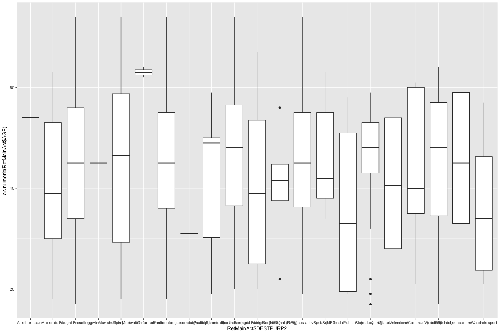<!-- -->

```r
RetMainAct <- subset(RetMainAct, RetMainAct$DESTPURP2=="Ate or drank"|RetMainAct$DESTPURP2=="Bought something"|RetMainAct$DESTPURP2=="Medical/Dental purposes"|RetMainAct$DESTPURP2=="Personal business (eg banking)"|RetMainAct$DESTPURP2=="Personal Business (NEC)"|RetMainAct$DESTPURP2=="Other recreational (eg. exercise)"|RetMainAct$DESTPURP2=="Religious activity"|RetMainAct$DESTPURP2=="Social (NEC)"|RetMainAct$DESTPURP2=="Visited someone"|RetMainAct$DESTPURP2=="Walked the dog")
RetMainAct$DESTPURP2 <- as.factor(as.character(RetMainAct$DESTPURP2))
RetMainAct$AgeGroup <- as.factor(RetMainAct$AgeGroup)
```
anszco

```r
test_set <-formalsetUnemployed[,c(1,12)]
test_set$Rand <- runif(nrow(test_set), 0, 100)
test_set <- test_set[order(test_set$Rand),]
WorkCat<-as.data.frame(cumsum(wtd.table(RetMainAct$DESTPURP2,weights=RetMainAct$CW_ADTRIPWGT_LGA))/sum(wtd.table(RetMainAct$DESTPURP2,weights = RetMainAct$CW_ADTRIPWGT_LGA))*100)
WorkCat$Act <- rownames(WorkCat)
rownames(WorkCat)<-c()
WorkCat$Wt <- WorkCat$`cumsum(wtd.table(RetMainAct$DESTPURP2, weights = RetMainAct$CW_ADTRIPWGT_LGA))/sum(wtd.table(RetMainAct$DESTPURP2, weights = RetMainAct$CW_ADTRIPWGT_LGA)) * 100`
WorkCat <- WorkCat[,c(-1)]
j=1
for (i in 1:13){
  while (test_set$Rand[j]<WorkCat$Wt[i]&&!is.na(test_set$Rand[j])){
    test_set$MainAct[j] <- WorkCat$Act[i] 
    j=j+1
  }
}

test_set <- test_set[order(test_set$AgentId),]
formalsetUnemployed$ANSZCO1 <- test_set$MainAct
```
mode

```r
test_data <-formalsetUnemployed[,c(1,14)]
test_data$Rand <- runif(nrow(test_data), 0, 100)
test_data$cat <- as.integer(as.factor(test_data$ANSZCO1))
training_data <- RetMainAct
training_data$cat <- as.integer(as.factor(training_data$DESTPURP2))

training_set <- subset(training_data,as.numeric(training_data$DESTPURP2)==1)
test_set<-subset(test_data,as.numeric(as.factor(test_data$ANSZCO1))==1)
test_set <- test_set[order(test_set$Rand),]
WorkCat<-as.data.frame(cumsum(wtd.table(training_set$LINKMODE,weights=training_set$CW_ADTRIPWGT_LGA))/sum(wtd.table(training_set$LINKMODE,weights = training_set$CW_ADTRIPWGT_LGA))*100)
WorkCat$Act <- rownames(WorkCat)
rownames(WorkCat)<-c()
WorkCat$Wt <- WorkCat$`cumsum(wtd.table(training_set$LINKMODE, weights = training_set$CW_ADTRIPWGT_LGA))/sum(wtd.table(training_set$LINKMODE, weights = training_set$CW_ADTRIPWGT_LGA)) * 100`
WorkCat <- WorkCat[,c(-1)]
j=1
for (i in 1:12){
  while (test_set$Rand[j]<WorkCat$Wt[i]&&!is.na(test_set$Rand[j])){
    test_set$LINKMODE[j] <- WorkCat$Act[i] 
    j=j+1
  }
}
finalset <- test_set


for (a in 2:13){
training_set <- subset(training_data,as.numeric(training_data$DESTPURP2)==a)
test_set<-subset(test_data,as.numeric(as.factor(test_data$ANSZCO1))==a)
test_set <- test_set[order(test_set$Rand),]
WorkCat<-as.data.frame(cumsum(wtd.table(training_set$LINKMODE,weights=training_set$CW_ADTRIPWGT_LGA))/sum(wtd.table(training_set$LINKMODE,weights = training_set$CW_ADTRIPWGT_LGA))*100)
WorkCat$Act <- rownames(WorkCat)
rownames(WorkCat)<-c()
WorkCat$Wt <- WorkCat$`cumsum(wtd.table(training_set$LINKMODE, weights = training_set$CW_ADTRIPWGT_LGA))/sum(wtd.table(training_set$LINKMODE, weights = training_set$CW_ADTRIPWGT_LGA)) * 100`
WorkCat <- WorkCat[,c(-1)]
j=1
for (i in 1:12){
  while (test_set$Rand[j]<WorkCat$Wt[i]&&!is.na(test_set$Rand[j])){
    test_set$LINKMODE[j] <- WorkCat$Act[i] 
    j=j+1
  }
}
finalset <- rbind(finalset,test_set)
}
finalset <- finalset[order(finalset$AgentId),]
formalsetUnemployed$LINKMODE <- finalset$LINKMODE
```
startime

```r
formalsetUnemployed <- formalsetUnemployed[order(formalsetUnemployed$AgentId),]
formalsetUnemployed$AgeGroup <- as.factor(formalsetUnemployed$AgeGroup)
RetMainAct$STARTIME <- as.numeric(RetMainAct$STARTIME)
dataset2 <- RetMainAct[,c(91,92,23,8)]
dataset2$DESTPURP2 = factor(dataset2$DESTPURP2,
                       labels = c(1:10))
dataset2$SEX = factor(as.factor(dataset2$SEX),
                       labels = c(1, 2))
test_set <- formalsetUnemployed[,c(2,3,14)]

test_set$SEX = factor(as.factor(test_set$Gender),
                       labels = c(1, 2))
test_set$DESTPURP2 = factor(test_set$ANSZCO1,
                       labels = c(1:10))
names(test_set)[1]<-"AGE"
test_set <- test_set[,-c(2,3)]
finalerr <- 1000
idealtrees = 0

line_reg = randomForest(x=dataset2[-4],y=dataset2$STARTIME,ntree = 100,weights = RetMainAct$CW_ADTRIPWGT_LGA)
formalsetUnemployed$STARTIME = predict(line_reg, test_set)
```

duration

```r
RetMainAct$DURATION <- as.numeric(RetMainAct$DURATION)
dataset2 <- RetMainAct[,c(91,92,23,35)]
dataset2$DESTPURP2 = factor(dataset2$DESTPURP2,
                       labels = c(1:10))
dataset2$SEX = factor(as.factor(dataset2$SEX),
                       labels = c(1, 2))
test_set <- formalsetUnemployed[,c(2,3,14)]

test_set$SEX = factor(as.factor(test_set$Gender),
                       labels = c(1, 2))
test_set$DESTPURP2 = factor(test_set$ANSZCO1,
                       labels = c(1:10))
names(test_set)[1]<-"AGE"
test_set <- test_set[,-c(2,3)]
finalerr <- 1000
idealtrees = 0

line_reg = randomForest(x=dataset2[-4],y=dataset2$DURATION,ntree = 100,weights = RetMainAct$CW_ADTRIPWGT_LGA)
formalsetUnemployed$DURATION = predict(line_reg, test_set)
```


distance

```r
formalsetUnemployed <- formalsetUnemployed[order(formalsetUnemployed$AgentId),]
formalsetUnemployed$AgeGroup <- as.factor(formalsetUnemployed$AgeGroup)
RetMainAct$DURATION <- as.numeric(RetMainAct$DURATION)
dataset2 <- RetMainAct[,c(91,31,23,27)]
dataset2$DESTPURP2 = factor(dataset2$DESTPURP2,
                       labels = c(1:10))
dataset2$LINKMODE = factor(dataset2$LINKMODE, labels = c(1:9))
test_set <- formalsetUnemployed[,c(2,14,15)]
test_set$DESTPURP2 = factor(test_set$ANSZCO1,
                       labels = c(1:10))
test_set$LINKMODE = factor(test_set$LINKMODE, labels = c(1:9))
names(test_set)[1]<-"AGE"
test_set <- test_set[,-2]
finalerr <- 1000
idealtrees = 0

line_reg = randomForest(x=dataset2[-4],y=dataset2$CUMDIST,ntree = 100,weights = RetMainAct$CW_ADTRIPWGT_LGA)
formalsetUnemployed$CUMDIST = predict(line_reg, test_set)
```


```r
RetMainAct$SPEED <- RetMainAct$CUMDIST/RetMainAct$TRAVTIME * 60
```

Speed

```r
formalsetUnemployed <- formalsetUnemployed[order(formalsetUnemployed$AgentId),]
dataset2 <- RetMainAct[,c(31,8,94)]

dataset2$LINKMODE = factor(dataset2$LINKMODE, labels = c(1:9))
test_set <- formalsetUnemployed[,c(15,16)]

test_set$LINKMODE = factor(test_set$LINKMODE, labels = c(1:9))
finalerr <- 1000
idealtrees = 0

line_reg = randomForest(x=dataset2[-3],y=dataset2$SPEED,ntree = 100,weights = RetMainAct$CW_ADTRIPWGT_LGA)
formalsetUnemployed$JTMSpeed = predict(line_reg, test_set)
```


```r
formalsetUnemployed$JTMTime <- formalsetUnemployed$CUMDIST/formalsetUnemployed$JTMSpeed * 60
formalsetUnemployed$ReachMainTime <- formalsetUnemployed$STARTIME + formalsetUnemployed$JTMTime
formalsetUnemployed$LeaveMainTime <- formalsetUnemployed$ReachMainTime+formalsetUnemployed$DURATION
```

Just using Start time and Vehicle

```r
RetHome <- subset(tripUnemployed, tripUnemployed$DESTPURP1 == "At or Go Home")
RetHome$SPEED <- RetHome$CUMDIST/RetHome$TRAVTIME * 60

formalsetUnemployed <- formalsetUnemployed[order(formalsetUnemployed$AgentId),]
dataset2 <- RetHome[,c(31,8,91)]

dataset2$LINKMODE = factor(dataset2$LINKMODE, labels = c(1:9))
test_set <- formalsetUnemployed[,c(15,16)]

test_set$LINKMODE = factor(test_set$LINKMODE, labels = c(1:9))
finalerr <- 1000
idealtrees = 0

line_reg = randomForest(x=dataset2[-3],y=dataset2$SPEED,ntree = 100,weights = RetMainAct$CW_ADTRIPWGT_LGA)
formalsetUnemployed$JFMSpeed = predict(line_reg, test_set)
```


```r
formalsetUnemployed$JFMTime <- formalsetUnemployed$CUMDIST/formalsetUnemployed$JFMSpeed * 60
formalsetUnemployed$ReachHome <- formalsetUnemployed$LeaveMainTime + formalsetUnemployed$JFMTime
```


Infants


```r
Infants <- subset(Persons,Persons$MAINACT=="Not Yet at School")
tripInfants <- Trips[Trips$PERSID %in% Infants$PERSID,]
formalsetInfants <- subset(PersonsSuburb, PersonsSuburb$MainAct=="Not Yet at School")
formalsetInfants$ANSZCO1 <- formalsetInfants$MainAct
```


```r
RetMainAct <- subset(tripInfants, tripInfants$DESTPURP1 == "Buy Something"|tripInfants$DESTPURP1=="Personal Business"|tripInfants$DESTPURP1=="Recreational"|tripInfants$DESTPURP1=="Social")
RetMainAct$LINKMODE <- as.factor(as.character(RetMainAct$LINKMODE))
persInfants <- Persons[Persons$PERSID %in% RetMainAct$PERSID,]
table(tripInfants$DESTPURP1)
```

```
## 
##            Accompany Someone                At or Go Home 
##                         2598                         2767 
##                Buy Something                  Change Mode 
##                           31                            5 
##                    Education                   Not Stated 
##                          123                            0 
##                Other Purpose            Personal Business 
##                           22                           63 
## Pick-up or Deliver Something  Pick-up or Drop-off Someone 
##                            7                           46 
##                 Recreational                       Social 
##                          423                          762 
##                 Work Related 
##                            0
```

```r
RetMainAct <- RetMainAct[order(RetMainAct$PERSID),]
persInfants <- persInfants[order(persInfants$PERSID),]
b=1
for (a in 1:nrow(persInfants)){
  while (as.character(RetMainAct$PERSID[b])==as.character(persInfants$PERSID[a])&&!is.na(RetMainAct$PERSID[b])){
    RetMainAct$AGE[b] <- persInfants$AGE[a]
    RetMainAct$SEX[b] <- persInfants$SEX[a]
    RetMainAct$AgeGroup[b] <- persInfants$AgeGroup_RW[a]
    b=b+1
  }
}
ggplot(RetMainAct, aes(x=RetMainAct$DESTPURP2,y=as.numeric(RetMainAct$AGE)))+geom_boxplot() 
```

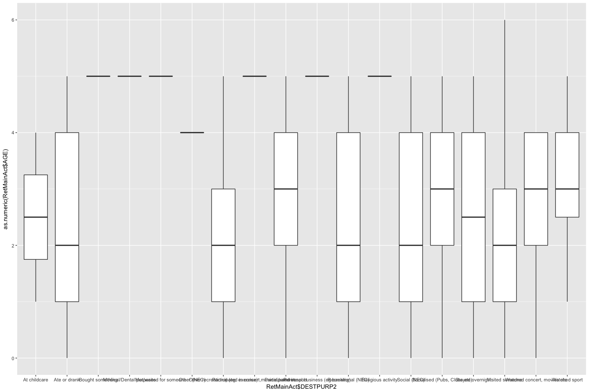<!-- -->

```r
RetMainAct <- subset(RetMainAct, RetMainAct$DESTPURP2=="Ate or drank"|RetMainAct$DESTPURP2=="Bought something"|RetMainAct$DESTPURP2=="Other recreational (eg. exercise)"|RetMainAct$DESTPURP2=="Participated in sport"|RetMainAct$DESTPURP2=="Recreational (NEC)"|RetMainAct$DESTPURP2=="Visited someone"|RetMainAct$DESTPURP2=="Social (NEC)")
RetMainAct$DESTPURP2 <- as.factor(as.character(RetMainAct$DESTPURP2))
RetMainAct$AgeGroup <- as.factor(RetMainAct$AgeGroup)
```
anszco

```r
test_set <-formalsetInfants[,c(1,12)]
test_set$Rand <- runif(nrow(test_set), 0, 100)
test_set <- test_set[order(test_set$Rand),]
WorkCat<-as.data.frame(cumsum(wtd.table(RetMainAct$DESTPURP2,weights=RetMainAct$CW_ADTRIPWGT_LGA))/sum(wtd.table(RetMainAct$DESTPURP2,weights = RetMainAct$CW_ADTRIPWGT_LGA))*100)
WorkCat$Act <- rownames(WorkCat)
rownames(WorkCat)<-c()
WorkCat$Wt <- WorkCat$`cumsum(wtd.table(RetMainAct$DESTPURP2, weights = RetMainAct$CW_ADTRIPWGT_LGA))/sum(wtd.table(RetMainAct$DESTPURP2, weights = RetMainAct$CW_ADTRIPWGT_LGA)) * 100`
WorkCat <- WorkCat[,c(-1)]
j=1
for (i in 1:13){
  while (test_set$Rand[j]<WorkCat$Wt[i]&&!is.na(test_set$Rand[j])){
    test_set$MainAct[j] <- WorkCat$Act[i] 
    j=j+1
  }
}

test_set <- test_set[order(test_set$AgentId),]
formalsetInfants$ANSZCO1 <- test_set$MainAct
```
mode

```r
test_data <-formalsetInfants[,c(1,14)]
test_data$Rand <- runif(nrow(test_data), 0, 100)
test_data$cat <- as.integer(as.factor(test_data$ANSZCO1))
training_data <- RetMainAct
training_data$cat <- as.integer(as.factor(training_data$DESTPURP2))

training_set <- subset(training_data,as.numeric(training_data$DESTPURP2)==1)
test_set<-subset(test_data,as.numeric(as.factor(test_data$ANSZCO1))==1)
test_set <- test_set[order(test_set$Rand),]
WorkCat<-as.data.frame(cumsum(wtd.table(training_set$LINKMODE,weights=training_set$CW_ADTRIPWGT_LGA))/sum(wtd.table(training_set$LINKMODE,weights = training_set$CW_ADTRIPWGT_LGA))*100)
WorkCat$Act <- rownames(WorkCat)
rownames(WorkCat)<-c()
WorkCat$Wt <- WorkCat$`cumsum(wtd.table(training_set$LINKMODE, weights = training_set$CW_ADTRIPWGT_LGA))/sum(wtd.table(training_set$LINKMODE, weights = training_set$CW_ADTRIPWGT_LGA)) * 100`
WorkCat <- WorkCat[,c(-1)]
j=1
for (i in 1:12){
  while (test_set$Rand[j]<WorkCat$Wt[i]&&!is.na(test_set$Rand[j])){
    test_set$LINKMODE[j] <- WorkCat$Act[i] 
    j=j+1
  }
}
finalset <- test_set


for (a in 2:13){
training_set <- subset(training_data,as.numeric(training_data$DESTPURP2)==a)
test_set<-subset(test_data,as.numeric(as.factor(test_data$ANSZCO1))==a)
test_set <- test_set[order(test_set$Rand),]
WorkCat<-as.data.frame(cumsum(wtd.table(training_set$LINKMODE,weights=training_set$CW_ADTRIPWGT_LGA))/sum(wtd.table(training_set$LINKMODE,weights = training_set$CW_ADTRIPWGT_LGA))*100)
WorkCat$Act <- rownames(WorkCat)
rownames(WorkCat)<-c()
WorkCat$Wt <- WorkCat$`cumsum(wtd.table(training_set$LINKMODE, weights = training_set$CW_ADTRIPWGT_LGA))/sum(wtd.table(training_set$LINKMODE, weights = training_set$CW_ADTRIPWGT_LGA)) * 100`
WorkCat <- WorkCat[,c(-1)]
j=1
for (i in 1:12){
  while (test_set$Rand[j]<WorkCat$Wt[i]&&!is.na(test_set$Rand[j])){
    test_set$LINKMODE[j] <- WorkCat$Act[i] 
    j=j+1
  }
}
finalset <- rbind(finalset,test_set)
}
finalset <- finalset[order(finalset$AgentId),]
formalsetInfants$LINKMODE <- finalset$LINKMODE
```
startime

```r
formalsetInfants <- formalsetInfants[order(formalsetInfants$AgentId),]
formalsetInfants$AgeGroup <- as.factor(formalsetInfants$AgeGroup)
RetMainAct$STARTIME <- as.numeric(RetMainAct$STARTIME)
dataset2 <- RetMainAct[,c(91,92,23,8)]
dataset2$DESTPURP2 = factor(dataset2$DESTPURP2,
                       labels = c(1:7))
dataset2$SEX = factor(as.factor(dataset2$SEX),
                       labels = c(1, 2))
test_set <- formalsetInfants[,c(2,3,14)]

test_set$SEX = factor(as.factor(test_set$Gender),
                       labels = c(1, 2))
test_set$DESTPURP2 = factor(test_set$ANSZCO1,
                       labels = c(1:7))
names(test_set)[1]<-"AGE"
test_set <- test_set[,-c(2,3)]
finalerr <- 1000
idealtrees = 0

line_reg = randomForest(x=dataset2[-4],y=dataset2$STARTIME,ntree = 100,weights = RetMainAct$CW_ADTRIPWGT_LGA)
formalsetInfants$STARTIME = predict(line_reg, test_set)
```

duration

```r
RetMainAct$DURATION <- as.numeric(RetMainAct$DURATION)
dataset2 <- RetMainAct[,c(91,92,23,35)]
dataset2$DESTPURP2 = factor(dataset2$DESTPURP2,
                       labels = c(1:7))
dataset2$SEX = factor(as.factor(dataset2$SEX),
                       labels = c(1, 2))
test_set <- formalsetInfants[,c(2,3,14)]

test_set$SEX = factor(as.factor(test_set$Gender),
                       labels = c(1, 2))
test_set$DESTPURP2 = factor(test_set$ANSZCO1,
                       labels = c(1:7))
names(test_set)[1]<-"AGE"
test_set <- test_set[,-c(2,3)]
finalerr <- 1000
idealtrees = 0

line_reg = randomForest(x=dataset2[-4],y=dataset2$DURATION,ntree = 100,weights = RetMainAct$CW_ADTRIPWGT_LGA)
formalsetInfants$DURATION = predict(line_reg, test_set)
```


distance

```r
formalsetInfants <- formalsetInfants[order(formalsetInfants$AgentId),]
formalsetInfants$AgeGroup <- as.factor(formalsetInfants$AgeGroup)
RetMainAct$DURATION <- as.numeric(RetMainAct$DURATION)
dataset2 <- RetMainAct[,c(91,31,23,27)]
dataset2$DESTPURP2 = factor(dataset2$DESTPURP2,
                       labels = c(1:7))
dataset2$LINKMODE = factor(dataset2$LINKMODE, labels = c(1:6))
test_set <- formalsetInfants[,c(2,14,15)]
test_set$DESTPURP2 = factor(test_set$ANSZCO1,
                       labels = c(1:7))
test_set$LINKMODE = factor(test_set$LINKMODE, labels = c(1:6))
names(test_set)[1]<-"AGE"
test_set <- test_set[,-2]
finalerr <- 1000
idealtrees = 0

line_reg = randomForest(x=dataset2[-4],y=dataset2$CUMDIST,ntree = 100,weights = RetMainAct$CW_ADTRIPWGT_LGA)
formalsetInfants$CUMDIST = predict(line_reg, test_set)
```


```r
RetMainAct$SPEED <- RetMainAct$CUMDIST/RetMainAct$TRAVTIME * 60
```

Speed

```r
formalsetInfants <- formalsetInfants[order(formalsetInfants$AgentId),]
dataset2 <- RetMainAct[,c(31,8,94)]

dataset2$LINKMODE = factor(dataset2$LINKMODE, labels = c(1:6))
test_set <- formalsetInfants[,c(15,16)]

test_set$LINKMODE = factor(test_set$LINKMODE, labels = c(1:6))
finalerr <- 1000
idealtrees = 0

line_reg = randomForest(x=dataset2[-3],y=dataset2$SPEED,ntree = 100,weights = RetMainAct$CW_ADTRIPWGT_LGA)
formalsetInfants$JTMSpeed = predict(line_reg, test_set)
```


```r
formalsetInfants$JTMTime <- formalsetInfants$CUMDIST/formalsetInfants$JTMSpeed * 60
formalsetInfants$ReachMainTime <- formalsetInfants$STARTIME + formalsetInfants$JTMTime
formalsetInfants$LeaveMainTime <- formalsetInfants$ReachMainTime+formalsetInfants$DURATION
```

Just using Start time and Vehicle

```r
RetHome <- subset(tripInfants, tripInfants$DESTPURP1 == "At or Go Home")
RetHome$SPEED <- RetHome$CUMDIST/RetHome$TRAVTIME * 60

formalsetInfants <- formalsetInfants[order(formalsetInfants$AgentId),]
dataset2 <- RetHome[,c(31,8,91)]

dataset2$LINKMODE = factor(dataset2$LINKMODE, labels = c(1:6))
test_set <- formalsetInfants[,c(15,16)]

test_set$LINKMODE = factor(test_set$LINKMODE, labels = c(1:6))
finalerr <- 1000
idealtrees = 0

line_reg = randomForest(x=dataset2[-3],y=dataset2$SPEED,ntree = 100,weights = RetMainAct$CW_ADTRIPWGT_LGA)
formalsetInfants$JFMSpeed = predict(line_reg, test_set)
```


```r
formalsetInfants$JFMTime <- formalsetInfants$CUMDIST/formalsetInfants$JFMSpeed * 60
formalsetInfants$ReachHome <- formalsetInfants$LeaveMainTime + formalsetInfants$JFMTime
```


```r
formalsetNonWork <- formalsetHomeKeeper
formalsetNonWork <- rbind(formalsetNonWork,formalsetInfants)
formalsetNonWork <- rbind(formalsetNonWork,formalsetRetired)
formalsetNonWork <- rbind(formalsetNonWork,formalsetUnemployed)
```


Profession based on main activity and age

```r
Person <- Persons[Persons$PERSID %in% Work$PERSID, ]
Work <- Work[Work$PERSID %in% Persons$PERSID,]
SingWrkPerson <- subset(as.data.frame(table(Work$PERSID)), as.data.frame(table(Work$PERSID))$Freq == 1)
SingWrk <- Work[Work$PERSID %in% SingWrkPerson$Var1,]
SingWrkPerson <- Person[Person$PERSID %in% SingWrkPerson$Var1,]
SingWrk <- SingWrk[order(SingWrk$PERSID),]
SingWrkPerson <- SingWrkPerson[order(SingWrkPerson$PERSID),]
SingWrk <- cbind(SingWrk,SingWrkPerson)
Wrk <- subset(SingWrk, SingWrk$MAINACT=="Full-time Work"|SingWrk$MAINACT=="Part-time Work"|SingWrk$MAINACT=="Casual Work")
Wrk$AgeGroup_RW <- as.factor(Wrk$AgeGroup_RW)
Wrk$MAINACT<-as.factor(as.character(Wrk$MAINACT))

test_data<-subset(PersonsSuburb,PersonsSuburb$Gender=="Female")
test_data<-subset(test_data,test_data$MainAct=="Casual Work"|test_data$MainAct=="Full-time Work"|test_data$MainAct=="Part-time Work")
formalsetWork<-subset(PersonsSuburb,PersonsSuburb$MainAct=="Casual Work"|PersonsSuburb$MainAct=="Full-time Work"|PersonsSuburb$MainAct=="Part-time Work")
test_data$MainAct <- as.factor(as.character(test_data$MainAct))
test_data$WorkCat <- as.numeric(test_data$MainAct)
test_data <-test_data[,c(1,2,3,12,14)]
test_data$Rand <- runif(nrow(test_data), 0, 100)
train_data<-subset(Wrk,Wrk$SEX=="Female")
train_data$WorkCat <- as.numeric(train_data$MAINACT)


train_data2 <- subset(train_data,train_data$WorkCat==1)
test_data2 <- subset(test_data,test_data$WorkCat==1)

training_set <- subset(train_data2,train_data2$AgeGroup_RW==1)
test_set <- subset(test_data2,test_data2$AgeGroup==1)
test_set <- test_set[order(test_set$Rand),]
WorkCat<-as.data.frame(cumsum(wtd.table(training_set$ANZSCO1,weights = training_set$CW_ADPERSWGT_LGA))/sum(wtd.table(training_set$ANZSCO1,weights = training_set$CW_ADPERSWGT_LGA))*100)
WorkCat$Act <- rownames(WorkCat)
rownames(WorkCat)<-c()
WorkCat$Wt <- WorkCat$`cumsum(wtd.table(training_set$ANZSCO1, weights = training_set$CW_ADPERSWGT_LGA))/sum(wtd.table(training_set$ANZSCO1, weights = training_set$CW_ADPERSWGT_LGA)) * 100`
WorkCat <- WorkCat[,c(-1)]
j=1
i=1
for (i in 1:13){
 while (test_set$Rand[j]<WorkCat$Wt[i]&&!is.na(test_set$Rand[j])){
    test_set$MainAct[j] <- WorkCat$Act[i] 
    j=j+1
  }
}
finalset <- test_set

a = 2
for (a in 2:7){
training_set <- subset(train_data2,train_data2$AgeGroup_RW==a)
test_set <- subset(test_data2,test_data2$AgeGroup==a)
test_set <- test_set[order(test_set$Rand),]
WorkCat<-as.data.frame(cumsum(wtd.table(training_set$ANZSCO1,weights = training_set$CW_ADPERSWGT_LGA))/sum(wtd.table(training_set$ANZSCO1,weights = training_set$CW_ADPERSWGT_LGA))*100)
WorkCat$Act <- rownames(WorkCat)
rownames(WorkCat)<-c()
WorkCat$Wt <- WorkCat$`cumsum(wtd.table(training_set$ANZSCO1, weights = training_set$CW_ADPERSWGT_LGA))/sum(wtd.table(training_set$ANZSCO1, weights = training_set$CW_ADPERSWGT_LGA)) * 100`
WorkCat <- WorkCat[,c(-1)]
j=1
i=1
for (i in 1:13){
 while (test_set$Rand[j]<WorkCat$Wt[i]&&!is.na(test_set$Rand[j])){
    test_set$MainAct[j] <- WorkCat$Act[i] 
    j=j+1
  }
}
test_set<-test_set[order(test_set$AgentId),]
finalset <- rbind(finalset,test_set)
}

b=2
for (b in 2:3){
train_data2 <- subset(train_data,train_data$WorkCat==b)
test_data2 <- subset(test_data,test_data$WorkCat==b)


a = 0
for (a in 0:7){
training_set <- subset(train_data2,train_data2$AgeGroup_RW==a)
test_set <- subset(test_data2,test_data2$AgeGroup==a)
test_set <- test_set[order(test_set$Rand),]
WorkCat<-as.data.frame(cumsum(wtd.table(training_set$ANZSCO1,weights = training_set$CW_ADPERSWGT_LGA))/sum(wtd.table(training_set$ANZSCO1,weights = training_set$CW_ADPERSWGT_LGA))*100)
WorkCat$Act <- rownames(WorkCat)
rownames(WorkCat)<-c()
WorkCat$Wt <- WorkCat$`cumsum(wtd.table(training_set$ANZSCO1, weights = training_set$CW_ADPERSWGT_LGA))/sum(wtd.table(training_set$ANZSCO1, weights = training_set$CW_ADPERSWGT_LGA)) * 100`
WorkCat <- WorkCat[,c(-1)]
j=1
i=1
for (i in 1:13){
 while (test_set$Rand[j]<WorkCat$Wt[i]&&!is.na(test_set$Rand[j])){
    test_set$MainAct[j] <- WorkCat$Act[i] 
    j=j+1
  }
}
test_set<-test_set[order(test_set$AgentId),]
finalset <- rbind(finalset,test_set)
}
}


test_data<-subset(PersonsSuburb,PersonsSuburb$Gender=="Male")
test_data<-subset(test_data,test_data$MainAct=="Casual Work"|test_data$MainAct=="Full-time Work"|test_data$MainAct=="Part-time Work")
test_data$MainAct <- as.factor(as.character(test_data$MainAct))
test_data$WorkCat <- as.numeric(test_data$MainAct)
test_data <-test_data[,c(1,2,3,12,14)]
test_data$Rand <- runif(nrow(test_data), 0, 100)
train_data<-subset(Wrk,Wrk$SEX=="Male")
train_data$WorkCat <- as.numeric(train_data$MAINACT)

train_data2 <- subset(train_data,train_data$WorkCat==1)
test_data2 <- subset(test_data,test_data$WorkCat==1)

a = 0
for (a in 0:7){
training_set <- subset(train_data2,train_data2$AgeGroup_RW==a)
test_set <- subset(test_data2,test_data2$AgeGroup==a)
test_set <- test_set[order(test_set$Rand),]
WorkCat<-as.data.frame(cumsum(wtd.table(training_set$ANZSCO1,weights = training_set$CW_ADPERSWGT_LGA))/sum(wtd.table(training_set$ANZSCO1,weights = training_set$CW_ADPERSWGT_LGA))*100)
WorkCat$Act <- rownames(WorkCat)
rownames(WorkCat)<-c()
WorkCat$Wt <- WorkCat$`cumsum(wtd.table(training_set$ANZSCO1, weights = training_set$CW_ADPERSWGT_LGA))/sum(wtd.table(training_set$ANZSCO1, weights = training_set$CW_ADPERSWGT_LGA)) * 100`
WorkCat <- WorkCat[,c(-1)]
j=1
i=1
for (i in 1:13){
 while (test_set$Rand[j]<WorkCat$Wt[i]&&!is.na(test_set$Rand[j])){
    test_set$MainAct[j] <- WorkCat$Act[i] 
    j=j+1
  }
}
test_set<-test_set[order(test_set$AgentId),]
finalset <- rbind(finalset,test_set)
}

b=2
for (b in 2:3){
train_data2 <- subset(train_data,train_data$WorkCat==b)
test_data2 <- subset(test_data,test_data$WorkCat==b)


a = 0
for (a in 0:7){
training_set <- subset(train_data2,train_data2$AgeGroup_RW==a)
test_set <- subset(test_data2,test_data2$AgeGroup==a)
test_set <- test_set[order(test_set$Rand),]
WorkCat<-as.data.frame(cumsum(wtd.table(training_set$ANZSCO1,weights = training_set$CW_ADPERSWGT_LGA))/sum(wtd.table(training_set$ANZSCO1,weights = training_set$CW_ADPERSWGT_LGA))*100)
WorkCat$Act <- rownames(WorkCat)
rownames(WorkCat)<-c()
WorkCat$Wt <- WorkCat$`cumsum(wtd.table(training_set$ANZSCO1, weights = training_set$CW_ADPERSWGT_LGA))/sum(wtd.table(training_set$ANZSCO1, weights = training_set$CW_ADPERSWGT_LGA)) * 100`
WorkCat <- WorkCat[,c(-1)]
j=1
i=1
for (i in 1:13){
 while (test_set$Rand[j]<WorkCat$Wt[i]&&!is.na(test_set$Rand[j])){
    test_set$MainAct[j] <- WorkCat$Act[i] 
    j=j+1
  }
}
test_set<-test_set[order(test_set$AgentId),]
finalset <- rbind(finalset,test_set)
}
}
names(formalsetWork)[2] <- "AGE"
names(formalsetWork)[3] <- "SEX"
formalsetWork$ANZSCO1 <- finalset$MainAct
```


```r
ggplot(Wrk,aes(x=Wrk$AgeGroup_RW, fill = Wrk$ANZSCO1)) + geom_bar(position = "fill")
```

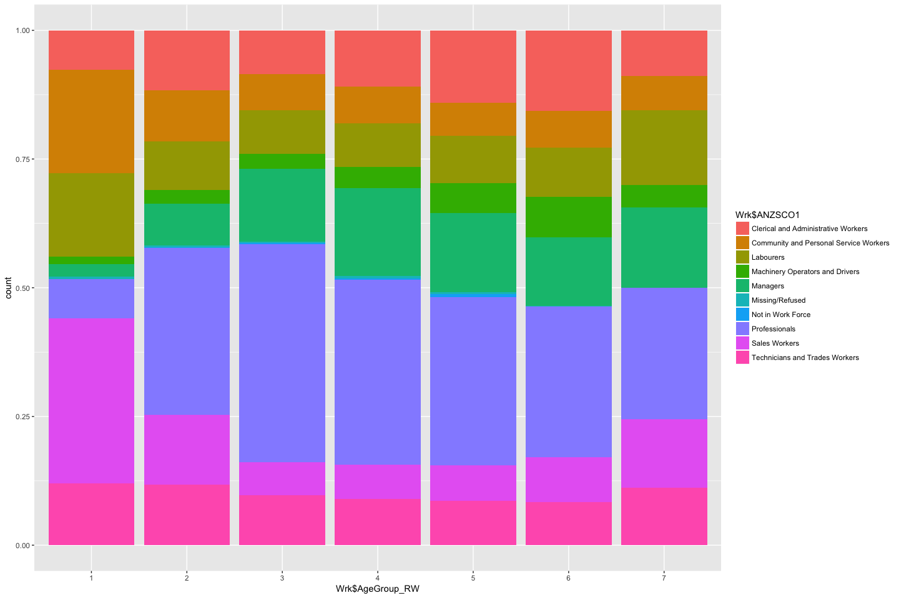<!-- -->

```r
ggplot(finalset,aes(x=finalset$AgeGroup,fill=finalset$MainAct)) + geom_bar(position = "fill")
```

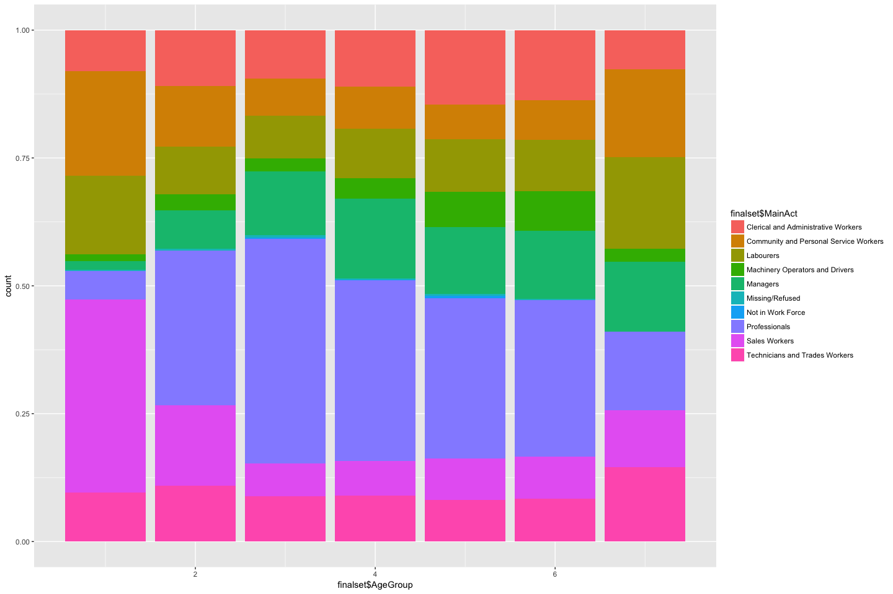<!-- -->


Start Time

```r
formalsetWork <- formalsetWork[order(formalsetWork$AgentId),]
formalsetWork$AgeGroup <- as.factor(formalsetWork$AgeGroup)
Wrk$workDuration <- as.numeric(Wrk$workDuration)
dataset2 <- Wrk[,c(114,116,11)]
dataset2$SEX = factor(dataset2$SEX,
                       labels = c(1, 2))

test_set <- formalsetWork[,c(2,3)]

test_set$SEX = factor(test_set$SEX,
                       labels = c(1, 2))
finalerr <- 1000
idealtrees = 0
for (a in 1:2){
line_reg = randomForest(x=dataset2[-3],y=dataset2$STARTIME,ntree = 10*a,weights = Wrk$CW_ADJTWWGT_LGA)
formalsetWork$STARTIME = predict(line_reg, test_set)
err <- sum(abs((aggregate(Wrk$STARTIME~Wrk$AgeGroup_RW+Wrk$SEX,FUN=mean)[3]-aggregate(formalsetWork$STARTIME~formalsetWork$AgeGroup+formalsetWork$SEX, FUN=mean)[3])/(aggregate(Wrk$STARTIME~Wrk$AgeGroup_RW+Wrk$SEX,FUN=mean)[3])*100))
if (err<finalerr){
  finalerr=err
  idealtrees = 10*a
}
}
line_reg = randomForest(x=dataset2[-3],y=dataset2$STARTIME,ntree = 100,weights = Wrk$CW_ADJTWWGT_LGA)
formalsetWork$STARTIME = predict(line_reg, test_set)
```


Duration

```r
Wrk$workDuration <- as.numeric(Wrk$workDuration)
dataset2 <- Wrk[,c(114,131,77)]

dataset2$ANZSCO1 = factor(dataset2$ANZSCO1,labels = c(1:10))
test_set <- formalsetWork[,c(2,14)]

test_set$ANZSCO1 = factor(test_set$ANZSCO1,
                       labels = c(1: 10))


finalerr <- 100
idealtrees = 0
for (a in 1:2){
line_reg = randomForest(x=dataset2[-3],y=dataset2$workDuration,ntree = 10*a,weights = Wrk$CW_ADJTWWGT_LGA)
formalsetWork$workDuration = predict(line_reg, test_set)
err <- sum(abs((aggregate(Wrk$workDuration~Wrk$AgeGroup_RW,FUN=mean)[2]-aggregate(formalsetWork$workDuration~formalsetWork$AgeGroup, FUN=mean)[2])/(aggregate(Wrk$workDuration~Wrk$AgeGroup_RW,FUN=mean)[2])*100))
if (err<finalerr){
  finalerr=err
  idealtrees = 10*a
}
}
line_reg = randomForest(x=dataset2[-3],y=dataset2$workDuration,ntree = idealtrees,weights = Wrk$CW_ADJTWWGT_LGA)
formalsetWork$workDuration = predict(line_reg, test_set)
```


Mode based on Age

```r
test_data<-subset(formalsetWork,formalsetWork$SEX=="Female")
test_data <-test_data[,c(1,12)]
test_data$Rand <- runif(nrow(test_data), 0, 100)
train_data<-subset(Wrk,Wrk$SEX=="Female")


training_set <- subset(train_data,train_data$AgeGroup_RW==1)
test_set <- subset(test_data,test_data$AgeGroup==1)
test_set <- test_set[order(test_set$Rand),]
WorkCat<-as.data.frame(cumsum(wtd.table(training_set$JTWMODE,weights = training_set$CW_ADPERSWGT_LGA))/sum(wtd.table(training_set$JTWMODE,weights = training_set$CW_ADPERSWGT_LGA))*100)
WorkCat$Mode <- rownames(WorkCat)
rownames(WorkCat)<-c()
WorkCat$Wt <- WorkCat$`cumsum(wtd.table(training_set$JTWMODE, weights = training_set$CW_ADPERSWGT_LGA))/sum(wtd.table(training_set$JTWMODE, weights = training_set$CW_ADPERSWGT_LGA)) * 100`
WorkCat <- WorkCat[,c(-1)]
j=1
i=1
for (i in 1:10){
 while (test_set$Rand[j]<WorkCat$Wt[i]&&!is.na(test_set$Rand[j])){
    test_set$JTWMODE[j] <- WorkCat$Mode[i] 
    j=j+1
  }
}
finalset <- test_set

a = 2
for (a in 2:7){
training_set <- subset(train_data,train_data$AgeGroup_RW==a)
test_set <- subset(test_data,test_data$AgeGroup==a)
test_set <- test_set[order(test_set$Rand),]
WorkCat<-as.data.frame(cumsum(wtd.table(training_set$JTWMODE,weights = training_set$CW_ADPERSWGT_LGA))/sum(wtd.table(training_set$JTWMODE,weights = training_set$CW_ADPERSWGT_LGA))*100)
WorkCat$Mode <- rownames(WorkCat)
rownames(WorkCat)<-c()
WorkCat$Wt <- WorkCat$`cumsum(wtd.table(training_set$JTWMODE, weights = training_set$CW_ADPERSWGT_LGA))/sum(wtd.table(training_set$JTWMODE, weights = training_set$CW_ADPERSWGT_LGA)) * 100`
WorkCat <- WorkCat[,c(-1)]
j=1
i=1
for (i in 1:13){
  while (test_set$Rand[j]<WorkCat$Wt[i]&&!is.na(test_set$Rand[j])){
    test_set$JTWMODE[j] <- WorkCat$Mode[i] 
    j=j+1
  }
}

test_set<-test_set[order(test_set$AgentId),]
finalset <- rbind(finalset,test_set)
}

test_data<-subset(formalsetWork,formalsetWork$SEX=="Male")
test_data <-test_data[,c(1,12)]
test_data$Rand <- runif(nrow(test_data), 0, 100)
train_data<-subset(Persons,Persons$SEX=="Male")


a = 1
for (a in 1:7){
training_set <- subset(Wrk,Wrk$AgeGroup_RW==a)
test_set <- subset(test_data,test_data$AgeGroup==a)
test_set <- test_set[order(test_set$Rand),]
WorkCat<-as.data.frame(cumsum(wtd.table(training_set$JTWMODE,weights = training_set$CW_ADPERSWGT_LGA))/sum(wtd.table(training_set$JTWMODE,weights = training_set$CW_ADPERSWGT_LGA))*100)
WorkCat$Mode <- rownames(WorkCat)
rownames(WorkCat)<-c()
WorkCat$Wt <- WorkCat$`cumsum(wtd.table(training_set$JTWMODE, weights = training_set$CW_ADPERSWGT_LGA))/sum(wtd.table(training_set$JTWMODE, weights = training_set$CW_ADPERSWGT_LGA)) * 100`
WorkCat <- WorkCat[,c(-1)]
j=1
i=1
for (i in 1:13){
  while (test_set$Rand[j]<WorkCat$Wt[i]&&!is.na(test_set$Rand[j])){
    test_set$JTWMODE[j] <- WorkCat$Mode[i] 
    j=j+1
  }
}

test_set<-test_set[order(test_set$AgentId),]
finalset <- rbind(finalset,test_set)
}

finalset <- finalset[order(finalset$AgentId),]
formalsetWork <- formalsetWork[order(finalset$AgentId),]
formalsetWork <- cbind(formalsetWork,finalset$JTWMODE)

names(formalsetWork)[17] <- "JTWMODE"
```


```r
Wrk$WorkCat <- as.factor(Wrk$WorkCat)
reg <- lm(Wrk$JTWDIST~Wrk$STARTIME+Wrk$SEX+Wrk$JTWMODE)
summary(reg)
```

```
## 
## Call:
## lm(formula = Wrk$JTWDIST ~ Wrk$STARTIME + Wrk$SEX + Wrk$JTWMODE)
## 
## Residuals:
##    Min     1Q Median     3Q    Max 
## -21.49  -9.38  -3.15   4.79 384.16 
## 
## Coefficients:
##                               Estimate Std. Error t value Pr(>|t|)    
## (Intercept)                  12.423616   1.127287  11.021  < 2e-16 ***
## Wrk$STARTIME                 -0.015074   0.001025 -14.712  < 2e-16 ***
## Wrk$SEXMale                   3.177228   0.307828  10.321  < 2e-16 ***
## Wrk$JTWMODEMotorcycle        10.193618   2.312514   4.408 1.05e-05 ***
## Wrk$JTWMODEPublic Bus         6.212917   1.725651   3.600 0.000319 ***
## Wrk$JTWMODETaxi               2.141955   3.855381   0.556 0.578513    
## Wrk$JTWMODETrain             16.740294   1.061915  15.764  < 2e-16 ***
## Wrk$JTWMODETram               2.166633   1.405712   1.541 0.123271    
## Wrk$JTWMODEVehicle Driver    11.115044   0.993902  11.183  < 2e-16 ***
## Wrk$JTWMODEVehicle Passenger  8.283897   1.223572   6.770 1.35e-11 ***
## Wrk$JTWMODEWalking           -3.673312   1.442573  -2.546 0.010899 *  
## ---
## Signif. codes:  0 '***' 0.001 '**' 0.01 '*' 0.05 '.' 0.1 ' ' 1
## 
## Residual standard error: 15.82 on 10897 degrees of freedom
## Multiple R-squared:  0.08847,	Adjusted R-squared:  0.08763 
## F-statistic: 105.8 on 10 and 10897 DF,  p-value: < 2.2e-16
```

Distance to work

```r
dataset2 <- Wrk[,c(11,83,79)]

dataset2$JTWMODE = factor(dataset2$JTWMODE,
                       labels = c(1:9))
test_set <- formalsetWork[,c(15,17)]
test_set$JTWMODE = factor(test_set$JTWMODE,
                       labels = c(1:9))
finalerr <- 1000
idealtrees = 0
for (a in 1:2){
line_reg = randomForest(x=dataset2[-3],y=dataset2$JTWDIST,ntree = 10*a,weights = Wrk$CW_ADJTWWGT_LGA)
formalsetWork$JTWDIST = predict(line_reg, test_set)
err <- sum(abs((aggregate(Wrk$JTWDIST~Wrk$JTWMODE,FUN=mean)[2]-aggregate(formalsetWork$JTWDIST~formalsetWork$JTWMODE, FUN=mean)[2])/(aggregate(Wrk$JTWDIST~Wrk$JTWMODE,FUN=mean)[2])*100))
if (err<finalerr){
  finalerr=err
  idealtrees = 10*a
}
}
line_reg = randomForest(x=dataset2[-3],y=dataset2$JTWDIST,ntree = idealtrees,weights = Wrk$CW_ADJTWWGT_LGA)
formalsetWork$JTWDIST = predict(line_reg, test_set)
```


Average Speed


```r
Wrk$JTWSPEED <- (Wrk$JTWDIST/Wrk$JTWTravelTime)*60
reg <- lm(Wrk$JTWSPEED~Wrk$STARTIME+Wrk$SEX+Wrk$JTWMODE+Wrk$AGE)
summary(reg)
```

```
## 
## Call:
## lm(formula = Wrk$JTWSPEED ~ Wrk$STARTIME + Wrk$SEX + Wrk$JTWMODE + 
##     Wrk$AGE)
## 
## Residuals:
##     Min      1Q  Median      3Q     Max 
## -31.349  -8.970  -1.759   6.699  81.245 
## 
## Coefficients:
##                               Estimate Std. Error t value Pr(>|t|)    
## (Intercept)                  15.257927   1.054663  14.467  < 2e-16 ***
## Wrk$STARTIME                 -0.009725   0.000874 -11.128  < 2e-16 ***
## Wrk$SEXMale                   3.455805   0.261606  13.210  < 2e-16 ***
## Wrk$JTWMODEMotorcycle        18.533453   1.964677   9.433  < 2e-16 ***
## Wrk$JTWMODEPublic Bus         1.743212   1.466105   1.189  0.23446    
## Wrk$JTWMODETaxi               8.863860   3.275627   2.706  0.00682 ** 
## Wrk$JTWMODETrain              8.171196   0.902197   9.057  < 2e-16 ***
## Wrk$JTWMODETram              -2.112328   1.194256  -1.769  0.07697 .  
## Wrk$JTWMODEVehicle Driver    18.743014   0.845119  22.178  < 2e-16 ***
## Wrk$JTWMODEVehicle Passenger 16.063392   1.039670  15.450  < 2e-16 ***
## Wrk$JTWMODEWalking           -6.612741   1.225757  -5.395    7e-08 ***
## Wrk$AGE                       0.009007   0.010231   0.880  0.37867    
## ---
## Signif. codes:  0 '***' 0.001 '**' 0.01 '*' 0.05 '.' 0.1 ' ' 1
## 
## Residual standard error: 13.44 on 10896 degrees of freedom
## Multiple R-squared:  0.2047,	Adjusted R-squared:  0.2039 
## F-statistic:   255 on 11 and 10896 DF,  p-value: < 2.2e-16
```


```r
dataset2 <- Wrk[,c(11,83,186)]
dataset2$JTWMODE = factor(dataset2$JTWMODE,
                       labels = c(1:9))
test_set <- formalsetWork[,c(15,17)]
test_set$JTWMODE = factor(test_set$JTWMODE,
                       labels = c(1:9))
finalerr <- 100
idealtrees = 0
for (a in 1:2){
line_reg = randomForest(x=dataset2[-3],y=dataset2$JTWSPEED,ntree = 10*a,weights = Wrk$CW_ADJTWWGT_LGA)
formalsetWork$JTWSPEED = predict(line_reg, test_set)
err <- sum(abs((aggregate(Wrk$JTWSPEED~Wrk$JTWMODE,FUN=mean)[2]-aggregate(formalsetWork$JTWSPEED~formalsetWork$JTWMODE, FUN=mean)[2])/(aggregate(Wrk$JTWSPEED~Wrk$JTWMODE,FUN=mean)[2])*100))
if (err<finalerr){
  finalerr=err
  idealtrees = 10*a
}
}
line_reg = randomForest(x=dataset2[-3],y=dataset2$JTWSPEED,ntree = idealtrees,weights = Wrk$CW_ADJTWWGT_LGA)
formalsetWork$JTWSPEED = predict(line_reg, test_set)
```


```r
ggplot(Wrk,aes(x=Wrk$AgeGroup_RW,y=Wrk$STARTIME))+geom_boxplot()  + coord_cartesian(ylim=c(400,700))
```

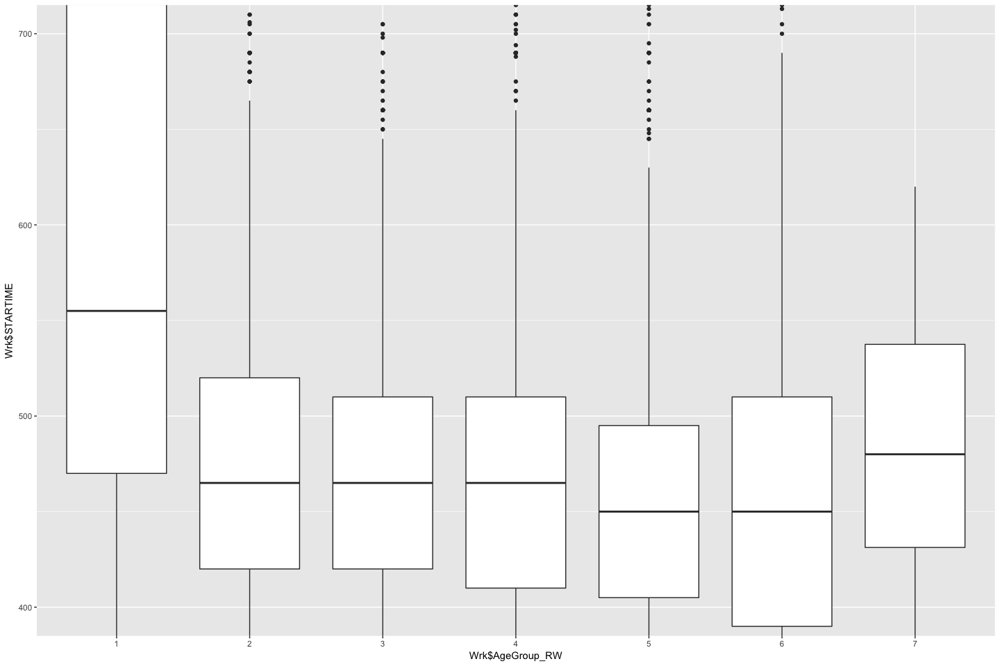<!-- -->

```r
ggplot(formalsetWork,aes(x=formalsetWork$AgeGroup,y=formalsetWork$STARTIME))+geom_boxplot()
```

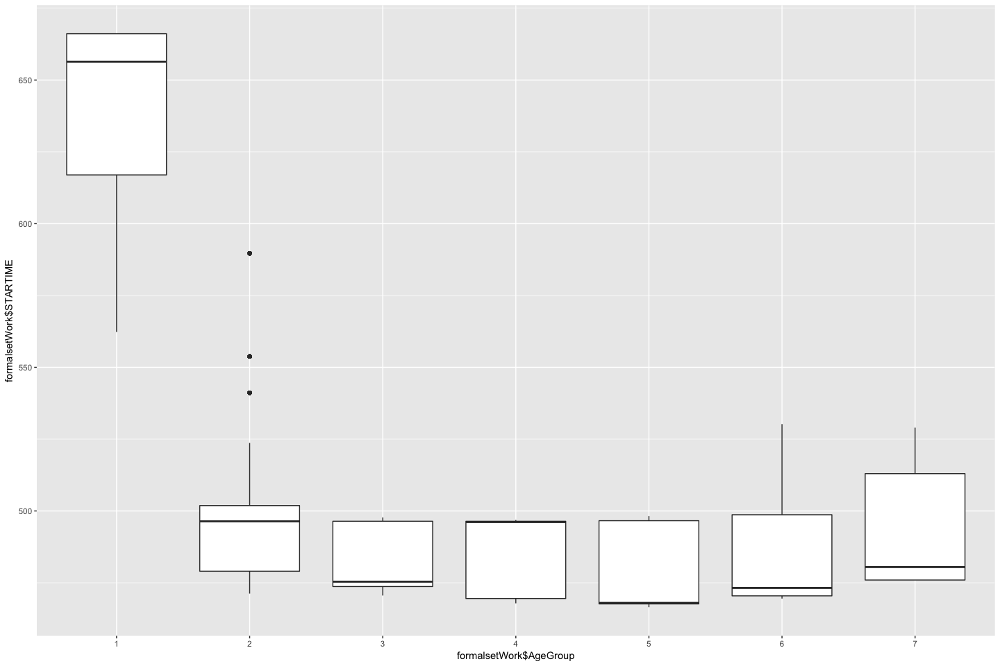<!-- -->

```r
ggplot(Wrk,aes(x=Wrk$JTWMODE,y=Wrk$JTWSPEED))+geom_boxplot() + coord_cartesian(ylim=c(0,30))
```

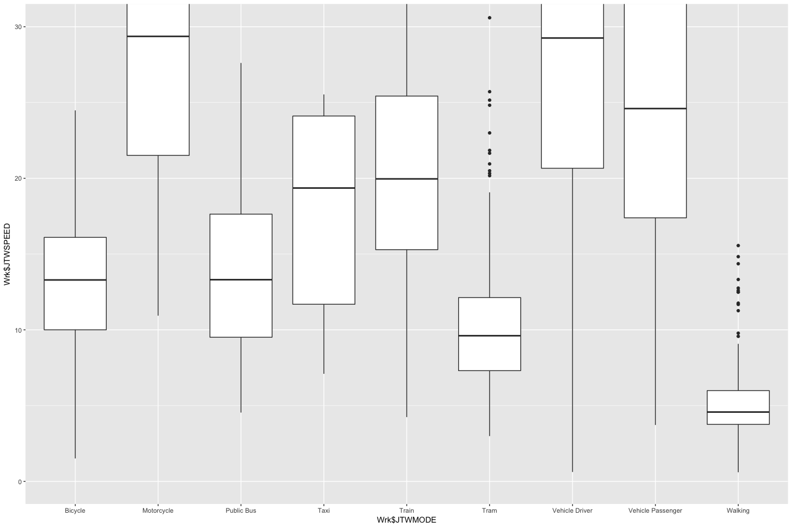<!-- -->

```r
ggplot(formalsetWork,aes(x=formalsetWork$JTWMODE,y=formalsetWork$JTWSPEED))+geom_boxplot()
```

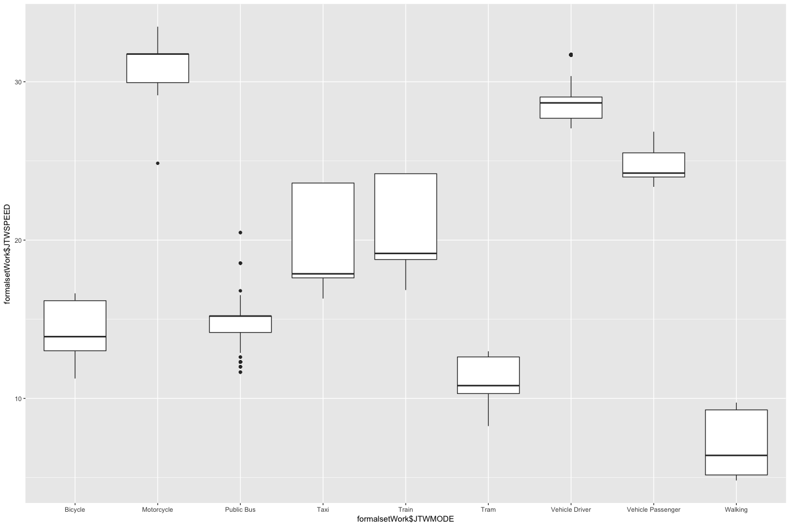<!-- -->

```r
ggplot(Wrk,aes(x=Wrk$AgeGroup_RW,y=Wrk$workDuration))+geom_boxplot() + coord_cartesian(ylim=c(100,400))
```

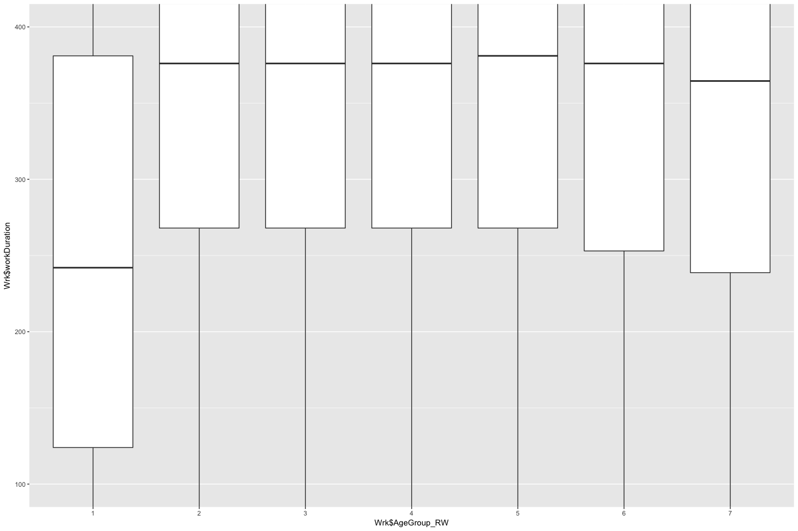<!-- -->

```r
ggplot(formalsetWork,aes(x=formalsetWork$AgeGroup,y=formalsetWork$workDuration))+geom_boxplot()
```

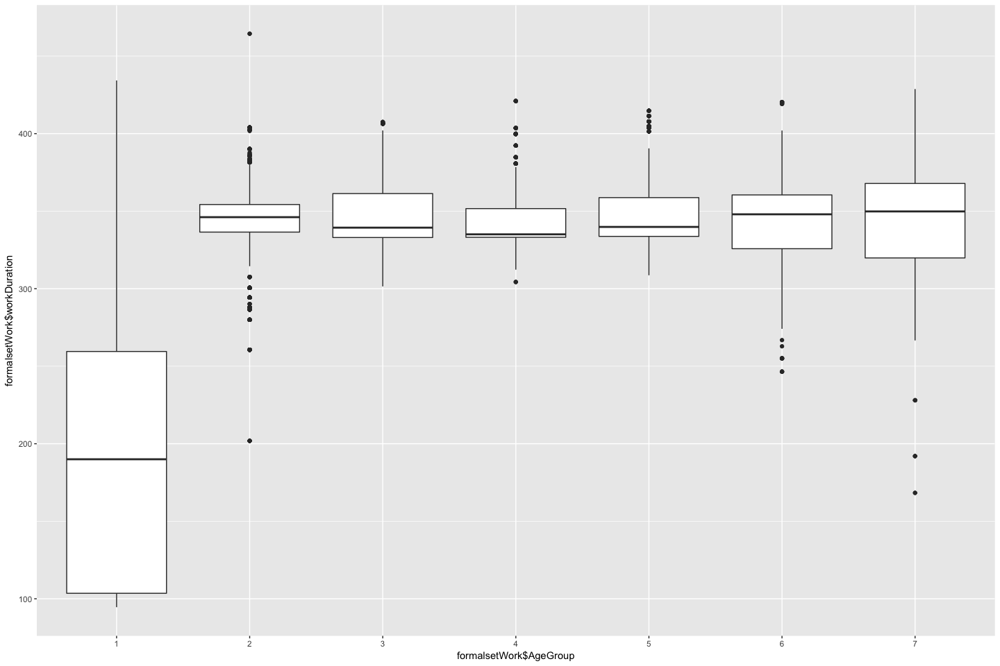<!-- -->


Time taken to reach work in hours

```r
formalsetWork$JTWTIME <- formalsetWork$JTWDIST/formalsetWork$JTWSPEED * 60
formalsetWork$ReachWorkTme <- formalsetWork$STARTIME + formalsetWork$JTWTIME
formalsetWork$LeaveWorkTime <- formalsetWork$ReachWorkTme+formalsetWork$workDuration
```


```r
Edu <- read.csv("../data/vista/2018-05-23-vista-2013-16/VISTA_2012_16_v1_SA1_CSV/JTE_VISTA12_16_SA1_V1.csv")
Edu <- subset(Edu, Edu$JTEMODE!="Motorcycle"&Edu$JTEMODE!="Other"&Edu$JTEMODE!="Taxi")
```


Profession based on main activity and age
``{r}

```r
Person <- Persons[Persons$PERSID %in% Edu$PERSID, ]
Edu <- Edu[Edu$PERSID %in% Persons$PERSID,]
SingEduPerson <- subset(as.data.frame(table(Edu$PERSID)), as.data.frame(table(Edu$PERSID))$Freq == 1)
SingEdu <- Edu[Edu$PERSID %in% SingEduPerson$Var1,]
SingEduPerson <- Person[Person$PERSID %in% SingEduPerson$Var1,]
SingEdu <- SingEdu[order(SingEdu$PERSID),]
SingEduPerson <- SingEduPerson[order(SingEduPerson$PERSID),]
SingEdu <- cbind(SingEdu,SingEduPerson)
Edu <- subset(SingEdu, SingEdu$MAINACT=="Primary School"|SingEdu$MAINACT=="Secondary School"|SingEdu$MAINACT=="Full-time TAFE/Uni"|SingEdu$MAINACT=="Part-time TAFE/Uni")
Edu$AgeGroup_RW <- as.factor(Edu$AgeGroup_RW)
Edu$MAINACT<-as.factor(as.character(Edu$MAINACT))
formalsetEdu <- subset(PersonsSuburb,PersonsSuburb$MainAct=="Primary School"|PersonsSuburb$MainAct=="Secondary School"|PersonsSuburb$MainAct=="Full-time TAFE/Uni"|PersonsSuburb$MainAct=="Part-time TAFE/Uni")
names(formalsetEdu)[2] <- "AGE"
names(formalsetEdu)[3] <- "SEX"
names(formalsetEdu)[13] <- "MAINACT"
formalsetEdu$ANZSCO1 <- formalsetEdu$MAINACT
```

Start Time

```r
formalsetEdu <- formalsetEdu[order(formalsetEdu$AgentId),]
formalsetEdu$AgeGroup <- as.factor(formalsetEdu$AgeGroup)
dataset2 <- Edu[,c(114,128,11)]
dataset2$MAINACT = factor(dataset2$MAINACT,
                       labels = c(1:4))

test_set <- formalsetEdu[,c(2,13)]

test_set$MAINACT = factor(test_set$MAINACT,
                       labels = c(1:4))
finalerr <- 1000
idealtrees = 0
for (a in 1:2){
line_reg = randomForest(x=dataset2[-3],y=dataset2$STARTIME,ntree = 10*a,weights = Edu$CW_ADJTEWGT_LGA)
formalsetEdu$STARTIME = predict(line_reg, test_set)
err <- sum(abs((aggregate(Edu$STARTIME~Edu$AgeGroup_RW,FUN=mean)[2]-aggregate(formalsetEdu$STARTIME~formalsetEdu$AgeGroup, FUN=mean)[2])/(aggregate(Edu$STARTIME~Edu$AgeGroup_RW,FUN=mean)[2])*100))
if (err<finalerr){
  finalerr=err
  idealtrees = 10*a
}
}
line_reg = randomForest(x=dataset2[-3],y=dataset2$STARTIME,ntree = idealtrees,weights = Edu$CW_ADJTEWGT_LGA)
formalsetEdu$STARTIME = predict(line_reg, test_set)

ggplot(Edu,aes(x=Edu$MAINACT,y=Edu$STARTIME,fill=Edu$AgeGroup_RW))+geom_boxplot() +coord_cartesian(ylim=c(400,700))
```

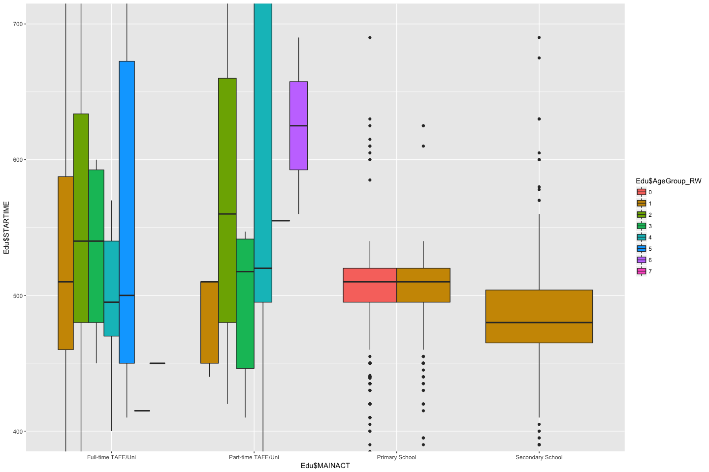<!-- -->

```r
ggplot(formalsetEdu,aes(x=formalsetEdu$MAINACT,y=formalsetEdu$STARTIME,fill=formalsetEdu$AgeGroup))+geom_boxplot()
```

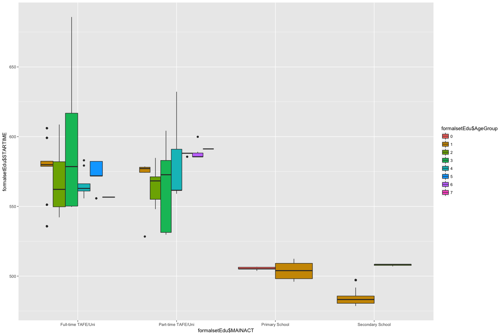<!-- -->

Mode based on Age

```r
test_data<-subset(formalsetEdu,formalsetEdu$SEX=="Female")
test_data <-test_data[,c(1,12)]
test_data$Rand <- runif(nrow(test_data), 0, 100)
train_data<-subset(Edu,Edu$SEX=="Female")


training_set <- subset(train_data,train_data$AgeGroup_RW==0)
test_set <- subset(test_data,test_data$AgeGroup==0)
test_set <- test_set[order(test_set$Rand),]
EduCat<-as.data.frame(cumsum(wtd.table(training_set$JTEMODE,weights = training_set$CW_ADPERSWGT_LGA))/sum(wtd.table(training_set$JTEMODE,weights = training_set$CW_ADPERSWGT_LGA))*100)
EduCat$Mode <- rownames(EduCat)
rownames(EduCat)<-c()
EduCat$Wt <- EduCat$`cumsum(wtd.table(training_set$JTEMODE, weights = training_set$CW_ADPERSWGT_LGA))/sum(wtd.table(training_set$JTEMODE, weights = training_set$CW_ADPERSWGT_LGA)) * 100`
EduCat <- EduCat[,c(-1)]
j=1
i=1
for (i in 1:13){
 while (test_set$Rand[j]<EduCat$Wt[i]&&!is.na(test_set$Rand[j])){
    test_set$JTEMODE[j] <- EduCat$Mode[i] 
    j=j+1
  }
}
finalset <- test_set

a = 1
for (a in 1:7){
training_set <- subset(train_data,train_data$AgeGroup_RW==a)
test_set <- subset(test_data,test_data$AgeGroup==a)
test_set <- test_set[order(test_set$Rand),]
EduCat<-as.data.frame(cumsum(wtd.table(training_set$JTEMODE,weights = training_set$CW_ADPERSWGT_LGA))/sum(wtd.table(training_set$JTEMODE,weights = training_set$CW_ADPERSWGT_LGA))*100)
EduCat$Mode <- rownames(EduCat)
rownames(EduCat)<-c()
EduCat$Wt <- EduCat$`cumsum(wtd.table(training_set$JTEMODE, weights = training_set$CW_ADPERSWGT_LGA))/sum(wtd.table(training_set$JTEMODE, weights = training_set$CW_ADPERSWGT_LGA)) * 100`
EduCat <- EduCat[,c(-1)]
j=1
i=1
for (i in 1:13){
  while (test_set$Rand[j]<EduCat$Wt[i]&&!is.na(test_set$Rand[j])){
    test_set$JTEMODE[j] <- EduCat$Mode[i] 
    j=j+1
  }
}

test_set<-test_set[order(test_set$AgentId),]
finalset <- rbind(finalset,test_set)
}

test_data<-subset(formalsetEdu,formalsetEdu$SEX=="Male")
test_data <-test_data[,c(1,12)]
test_data$Rand <- runif(nrow(test_data), 0, 100)
train_data<-subset(Persons,Persons$SEX=="Male")


a = 1
for (a in 0:7){
training_set <- subset(Edu,Edu$AgeGroup_RW==a)
test_set <- subset(test_data,test_data$AgeGroup==a)
test_set <- test_set[order(test_set$Rand),]
EduCat<-as.data.frame(cumsum(wtd.table(training_set$JTEMODE,weights = training_set$CW_ADPERSWGT_LGA))/sum(wtd.table(training_set$JTEMODE,weights = training_set$CW_ADPERSWGT_LGA))*100)
EduCat$Mode <- rownames(EduCat)
rownames(EduCat)<-c()
EduCat$Wt <- EduCat$`cumsum(wtd.table(training_set$JTEMODE, weights = training_set$CW_ADPERSWGT_LGA))/sum(wtd.table(training_set$JTEMODE, weights = training_set$CW_ADPERSWGT_LGA)) * 100`
EduCat <- EduCat[,c(-1)]
j=1
i=1
for (i in 1:13){
  while (test_set$Rand[j]<EduCat$Wt[i]&&!is.na(test_set$Rand[j])){
    test_set$JTEMODE[j] <- EduCat$Mode[i] 
    j=j+1
  }
}

test_set<-test_set[order(test_set$AgentId),]
finalset <- rbind(finalset,test_set)
}

finalset <- finalset[order(finalset$AgentId),]
formalsetEdu <- formalsetEdu[order(finalset$AgentId),]
formalsetEdu <- cbind(formalsetEdu,finalset$JTEMODE)
names(formalsetEdu)[16]<-"JTEMODE"
```


```r
reg <- lm(Edu$JTEDIST~Edu$STARTIME+Edu$SEX+Edu$JTEMODE)
summary(reg)
```

```
## 
## Call:
## lm(formula = Edu$JTEDIST ~ Edu$STARTIME + Edu$SEX + Edu$JTEMODE)
## 
## Residuals:
##     Min      1Q  Median      3Q     Max 
## -16.336  -3.299  -1.006   0.837  76.883 
## 
## Coefficients:
##                               Estimate Std. Error t value Pr(>|t|)    
## (Intercept)                  10.111069   1.200867   8.420  < 2e-16 ***
## Edu$STARTIME                 -0.014972   0.001961  -7.635 2.85e-14 ***
## Edu$SEXMale                  -0.311042   0.217891  -1.428    0.154    
## Edu$JTEMODEPublic Bus         5.727517   0.897784   6.380 2.00e-10 ***
## Edu$JTEMODESchool Bus         9.694434   0.801016  12.103  < 2e-16 ***
## Edu$JTEMODETrain             16.898412   0.783589  21.565  < 2e-16 ***
## Edu$JTEMODETram               7.052316   1.059758   6.655 3.26e-11 ***
## Edu$JTEMODEVehicle Driver    12.550002   0.934861  13.424  < 2e-16 ***
## Edu$JTEMODEVehicle Passenger  2.730491   0.669734   4.077 4.66e-05 ***
## Edu$JTEMODEWalking           -1.259129   0.709305  -1.775    0.076 .  
## ---
## Signif. codes:  0 '***' 0.001 '**' 0.01 '*' 0.05 '.' 0.1 ' ' 1
## 
## Residual standard error: 6.603 on 3684 degrees of freedom
## Multiple R-squared:  0.3321,	Adjusted R-squared:  0.3304 
## F-statistic: 203.5 on 9 and 3684 DF,  p-value: < 2.2e-16
```

Distance to work

```r
dataset2 <- Edu[,c(11,128,82,78)]
dataset2$JTEMODE = factor(dataset2$JTEMODE,
                       labels = c(1:8))
dataset2$MAINACT = factor(dataset2$MAINACT,
                       labels = c(1:4))
test_set <- formalsetEdu[,c(15,13,16)]
test_set$JTEMODE = factor(test_set$JTEMODE,
                       labels = c(1:8))
test_set$MAINACT = factor(test_set$MAINACT,
                       labels = c(1:4))
finalerr <- 1000
idealtrees = 0
for (a in 1:2){
line_reg = randomForest(x=dataset2[-4],y=dataset2$JTEDIST,ntree = 10*a,weights = Edu$CW_ADJTEWGT_LGA)
formalsetEdu$JTEDIST = predict(line_reg, test_set)
err <- sum(abs((aggregate(dataset2$JTEDIST~dataset2$JTEMODE,FUN=mean)[2]-aggregate(formalsetEdu$JTEDIST~formalsetEdu$JTEMODE, FUN=mean)[2])/(aggregate(dataset2$JTEDIST~dataset2$JTEMODE,FUN=mean)[2])*100))
if (err<finalerr){
  finalerr=err
  idealtrees = 10*a
}
}
line_reg = randomForest(x=dataset2[-4],y=dataset2$JTEDIST,ntree = idealtrees,weights = Edu$CW_ADJTEWGT_LGA)
formalsetEdu$JTEDIST = predict(line_reg, test_set)

ggplot(Edu,aes(x=Edu$MAINACT,y=Edu$JTEDIST,fill=Edu$AgeGroup_RW))+geom_boxplot() +coord_cartesian(ylim=c(0,25))
```

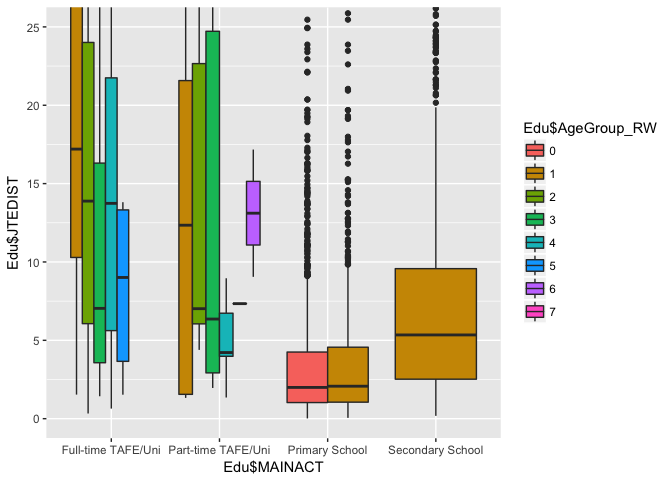<!-- -->

```r
ggplot(formalsetEdu,aes(x=formalsetEdu$MAINACT,y=formalsetEdu$JTEDIST,fill=formalsetEdu$AgeGroup))+geom_boxplot()
```

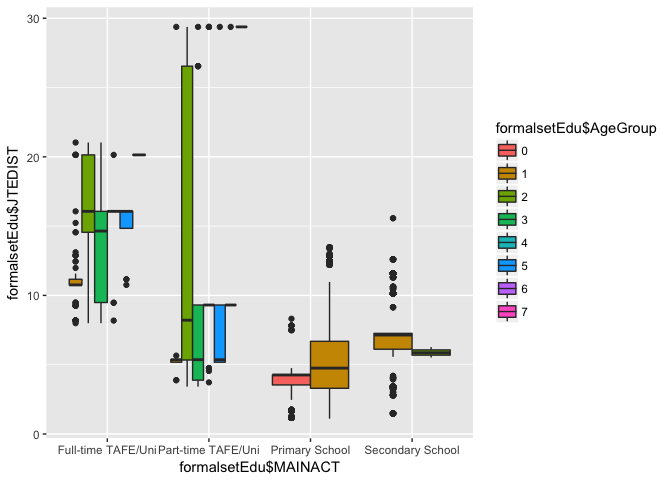<!-- -->


Average Speed


```r
Edu$JTESPEED <- (Edu$JTEDIST/Edu$JTE_TravelTime)*60
reg <- lm(Edu$JTESPEED~Edu$STARTIME+Edu$SEX+Edu$JTEMODE+Edu$AGE)
summary(reg)
```

```
## 
## Call:
## lm(formula = Edu$JTESPEED ~ Edu$STARTIME + Edu$SEX + Edu$JTEMODE + 
##     Edu$AGE)
## 
## Residuals:
##     Min      1Q  Median      3Q     Max 
## -23.610  -6.599  -1.372   3.706  89.377 
## 
## Coefficients:
##                               Estimate Std. Error t value Pr(>|t|)    
## (Intercept)                  11.317060   1.922382   5.887 4.28e-09 ***
## Edu$STARTIME                 -0.008717   0.003114  -2.799  0.00515 ** 
## Edu$SEXMale                  -0.075543   0.344589  -0.219  0.82649    
## Edu$JTEMODEPublic Bus         2.647702   1.424751   1.858  0.06320 .  
## Edu$JTEMODESchool Bus         8.722932   1.265881   6.891 6.50e-12 ***
## Edu$JTEMODETrain              7.931255   1.256622   6.312 3.09e-10 ***
## Edu$JTEMODETram               0.619263   1.684678   0.368  0.71320    
## Edu$JTEMODEVehicle Driver    15.502954   1.548726  10.010  < 2e-16 ***
## Edu$JTEMODEVehicle Passenger 12.275821   1.061987  11.559  < 2e-16 ***
## Edu$JTEMODEWalking           -3.473937   1.122393  -3.095  0.00198 ** 
## Edu$AGE                       0.163029   0.036315   4.489 7.36e-06 ***
## ---
## Signif. codes:  0 '***' 0.001 '**' 0.01 '*' 0.05 '.' 0.1 ' ' 1
## 
## Residual standard error: 10.43 on 3683 degrees of freedom
## Multiple R-squared:  0.2579,	Adjusted R-squared:  0.2559 
## F-statistic:   128 on 10 and 3683 DF,  p-value: < 2.2e-16
```


```r
dataset2 <- Edu[,c(11,82,186)]
dataset2$JTEMODE = factor(dataset2$JTEMODE,
                       labels = c(1:8))
test_set <- formalsetEdu[,c(15,16)]
test_set$JTEMODE = factor(test_set$JTEMODE,
                       labels = c(1:8))
finalerr <- 1000
idealtrees = 0
for (a in 1:2){
line_reg = randomForest(x=dataset2[-3],y=dataset2$JTESPEED,ntree = 10*a,weights = Edu$CW_ADJTEWGT_LGA)
formalsetEdu$JTESPEED = predict(line_reg, test_set)
err <- sum(abs((aggregate(dataset2$JTESPEED~dataset2$JTEMODE,FUN=mean)[2]-aggregate(formalsetEdu$JTESPEED~formalsetEdu$JTEMODE, FUN=mean)[2])/(aggregate(dataset2$JTESPEED~dataset2$JTEMODE,FUN=mean)[2])*100))
if (err<finalerr){
  finalerr=err
  idealtrees = 10*a
}
}
line_reg = randomForest(x=dataset2[-3],y=dataset2$JTESPEED,ntree = idealtrees,weights = Edu$CW_ADJTEWGT_LGA)
formalsetEdu$JTESPEED = predict(line_reg, test_set)
```


```r
ggplot(Edu,aes(x=Edu$AgeGroup_RW,y=Edu$STARTIME))+geom_boxplot()  + coord_cartesian(ylim=c(400,700))
```

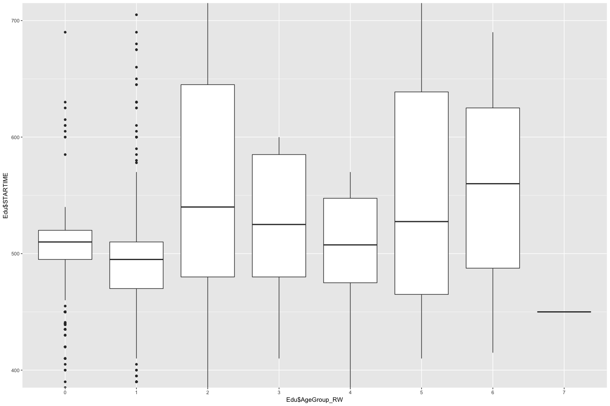<!-- -->

```r
ggplot(formalsetEdu,aes(x=formalsetEdu$AgeGroup,y=formalsetEdu$STARTIME))+geom_boxplot()
```

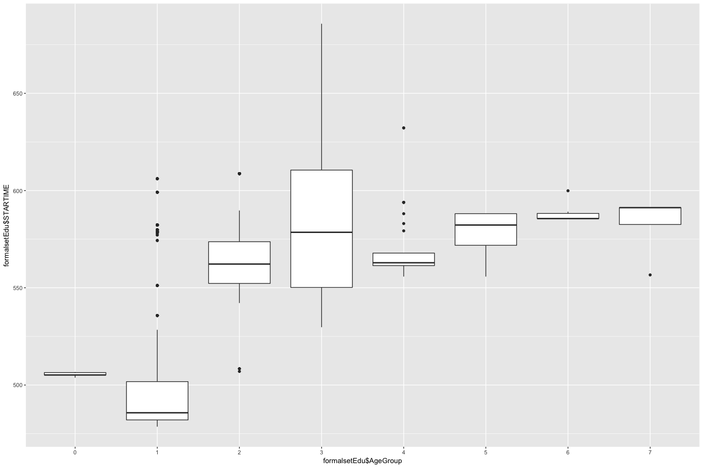<!-- -->

```r
ggplot(Edu,aes(x=Edu$JTEMODE,y=Edu$JTESPEED))+geom_boxplot() + coord_cartesian(ylim=c(0,30))
```

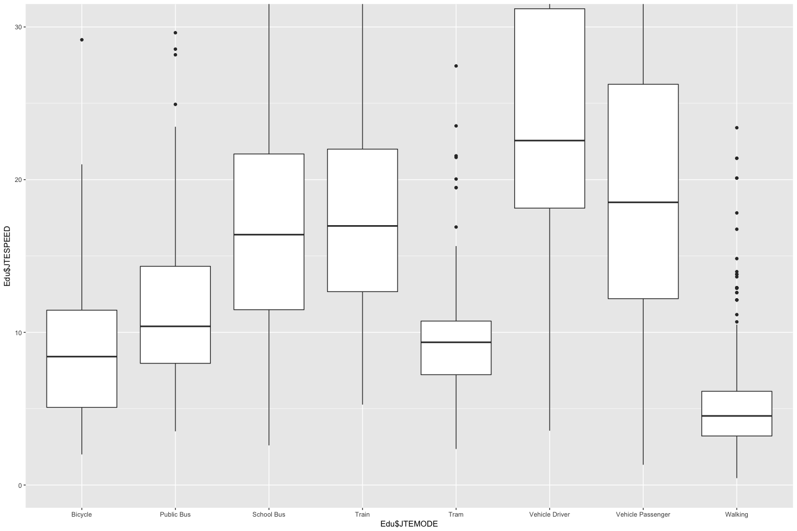<!-- -->

```r
ggplot(formalsetEdu,aes(x=formalsetEdu$JTEMODE,y=formalsetEdu$JTESPEED))+geom_boxplot()
```

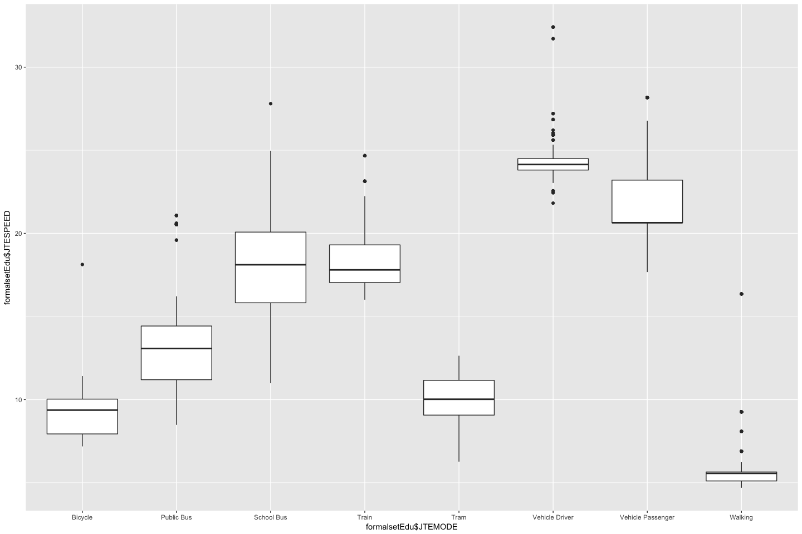<!-- -->


Time taken to reach work in hours

```r
formalsetEdu$JTETIME <- formalsetEdu$JTEDIST/formalsetEdu$JTESPEED * 60
formalsetEdu$ReachEduTme <- formalsetEdu$STARTIME + formalsetEdu$JTETIME
```


```r
JTE <- subset(Stops, Stops$DESTPURP1=="Education")
JFE <- subset(Stops, Stops$ORIGPURP1=="Education")
JTEperson <- subset(as.data.frame(table(JTE$PERSID)), as.data.frame(table(JTE$PERSID))$Freq == 1)
JFEperson <- subset(as.data.frame(table(JFE$PERSID)), as.data.frame(table(JFE$PERSID))$Freq == 1)
JTE <- JTE[JTE$PERSID %in% JTEperson$Var1,]
JFE <- JFE[JFE$PERSID %in% JFEperson$Var1,]
JTE$PERSID <- as.factor(as.character(JTE$PERSID))
JFE$PERSID <- as.factor(as.character(JFE$PERSID))
total <- merge(JTE,JFE,by.x = "PERSID", by.y = "PERSID")
total$eduDuration <- total$STARTIME.y-total$ARRTIME.x
EduPersons <- Persons[Persons$PERSID %in% total$PERSID,]
total <- merge(total,EduPersons,by.x = "PERSID", by.y = "PERSID")
```


```r
dataset2total <- subset(total,total$MAINACT == "Primary School"|total$MAINACT=="Secondary School"|total$MAINACT == "Part-time TAFE/Uni"|total$MAINACT == "Full-time TAFE/Uni")
dataset2total$MAINACT <- as.factor(as.character(dataset2total$MAINACT))
dataset2 <- dataset2total[,c(195,209,188)]
test_set <- formalsetEdu[,c(2,13)]
dataset2$MAINACT = factor(dataset2$MAINACT,labels = c(1:4))
test_set$MAINACT = factor(test_set$MAINACT,labels = c(1:4))

finalerr <- 1000
idealtrees = 0
for (a in 1:2){
line_reg = randomForest(x=dataset2[-3],y=dataset2total$eduDuration,ntree = 10*a,weights = dataset2total$CW_ADSTOPWGT_LGA.x)
formalsetEdu$eduDuration = predict(line_reg, test_set)
err <- sum(abs((aggregate(dataset2total$eduDuration~dataset2total$MAINACT,FUN=mean)[2]-aggregate(formalsetEdu$eduDuration~formalsetEdu$MAINACT, FUN=mean)[2])/(aggregate(dataset2total$eduDuration~dataset2total$MAINACT,FUN=mean)[2])*100))
if (err<finalerr){
  finalerr=err
  idealtrees = 10*a
}
}
line_reg = randomForest(x=dataset2[-3],y=dataset2total$eduDuration,ntree = idealtrees,weights = dataset2total$CW_ADJTEWGT_LGA)
formalsetEdu$eduDuration = predict(line_reg, test_set)

formalsetEdu$LeaveEduTime <- formalsetEdu$ReachEduTme+formalsetEdu$eduDuration
formalsetEdu <- formalsetEdu[c(1:15,21,16:20,22)]
```


```r
formalset <- formalsetWork
names(formalset)[16]<-"MainActDuration"
names(formalset)[17]<-"JTMMODE" 
names(formalset)[18]<-"JTMDIST"
names(formalset)[19]<-"JTMSPEED"
names(formalset)[20]<-"JTMTIME"
names(formalset)[21]<-"ReachMainAct"
names(formalset)[22]<-"LeaveMainAct"
temp <- formalsetEdu
names(temp)[16]<-"MainActDuration"
names(temp)[17]<-"JTMMODE" 
names(temp)[18]<-"JTMDIST"
names(temp)[19]<-"JTMSPEED"
names(temp)[20]<-"JTMTIME"
names(temp)[21]<-"ReachMainAct"
names(temp)[22]<-"LeaveMainAct"
names(temp)[13]<-"MainAct"
formalset <- rbind(formalset,temp)
```


We need maps. Trips of Northcote are too less to get any sort of data. But if we used maps, we could only count SA3 or SA4 which involved Northcote


```r
formalset$JTMMODE <- as.factor(as.character(formalset$JTMMODE))
Trips$Speed <- Trips$CUMDIST/Trips$TRAVTIME*60
traindata <- subset(Trips, (Trips$ORIGPURP1=="Work Related"|Trips$ORIGPURP1=="Education")&Trips$DESTPURP1=="At or Go Home")
dataset2 <- traindata[,c(8,31,91)]
dataset2$LINKMODE = factor(dataset2$LINKMODE,
                       labels = c(1:10))
test_set <- formalset[,c(15,17)]
test_set$LINKMODE = factor(test_set$JTMMODE,
                       labels = c(1:10))
test_set <- test_set[,-2]
finalerr <- 1000
idealtrees = 0
dataset2$Speed[dataset2$Speed=="NaN"]<-0
line_reg = randomForest(x=dataset2[-3],y=dataset2$Speed,ntree = 20,weights = traindata$CW_ADJTEWGT_LGA)
formalset$JFMSpeed = predict(line_reg, test_set)


formalset$JFMTime <- formalset$JTMDIST/formalset$JFMSpeed * 60
formalset$ArrTime <- formalset$LeaveMainAct + formalset$JFMTime
```


```r
ggplot(traindata,aes(x=traindata$LINKMODE,y=traindata$Speed))+geom_boxplot() + coord_cartesian(ylim = c(0,40))
```

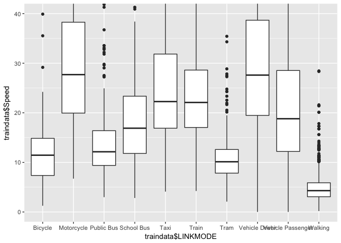<!-- -->

```r
ggplot(formalset,aes(x=formalset$JTMMODE,y=formalset$JFMSpeed))+geom_boxplot()
```

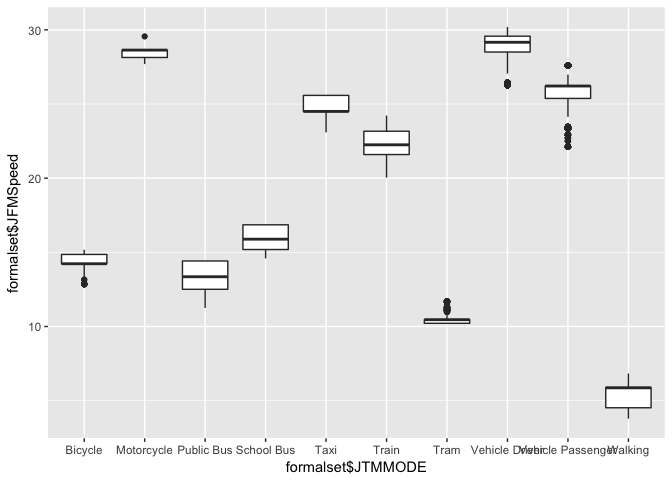<!-- -->

