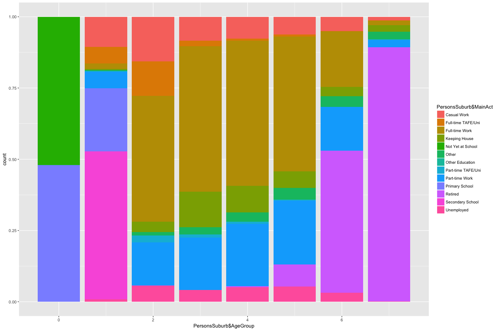
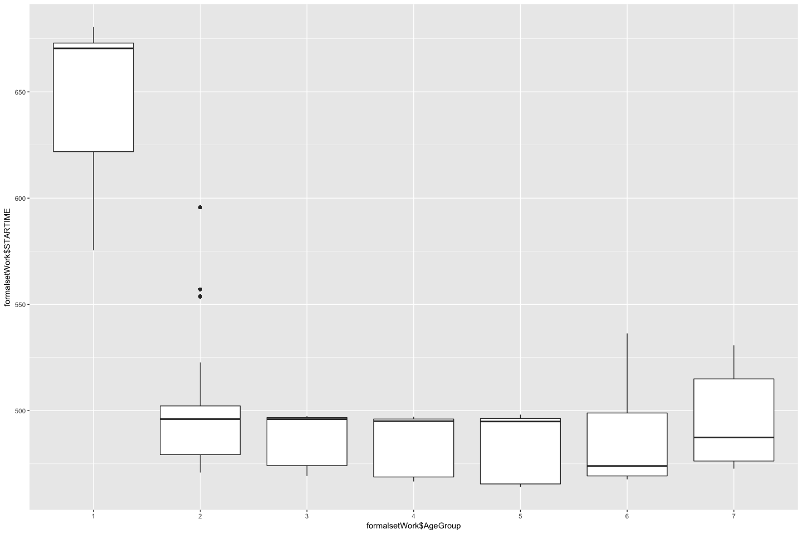
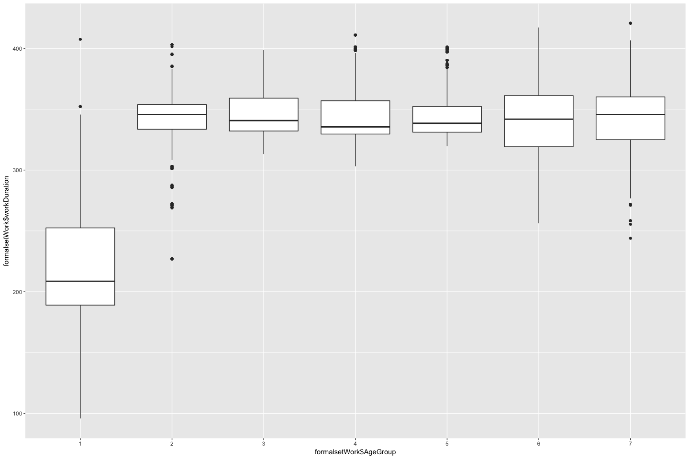

Analysing Northcote

```r
library(ggplot2)
library(questionr)
library(smbinning)
```

```
## Warning: package 'smbinning' was built under R version 3.4.3
```

```
## Loading required package: sqldf
```

```
## Loading required package: gsubfn
```

```
## Warning: package 'gsubfn' was built under R version 3.4.4
```

```
## Loading required package: proto
```

```
## Loading required package: RSQLite
```

```
## Warning: package 'RSQLite' was built under R version 3.4.4
```

```
## Loading required package: partykit
```

```
## Loading required package: grid
```

```
## Loading required package: libcoin
```

```
## Warning: package 'libcoin' was built under R version 3.4.3
```

```
## Loading required package: mvtnorm
```

```
## Loading required package: Formula
```

```r
library(varhandle)
library(randomForest)
```

```
## randomForest 4.6-12
```

```
## Type rfNews() to see new features/changes/bug fixes.
```

```
## 
## Attaching package: 'randomForest'
```

```
## The following object is masked from 'package:ggplot2':
## 
##     margin
```

```r
PersonsSuburb <- read.csv("../../synthetic-population/data/melbourne-2016-population/melbourne/generated/SA2/Northcote/population/persons.csv")
HouseholsSuburb <-  read.csv("../../synthetic-population/data/melbourne-2016-population/melbourne/generated/SA2/Northcote/population/households.csv")
PersonsSuburb$AgeGroup[PersonsSuburb$Age > 69] <- 7
PersonsSuburb$AgeGroup[PersonsSuburb$Age < 70] <- 6
PersonsSuburb$AgeGroup[PersonsSuburb$Age < 60] <- 5
PersonsSuburb$AgeGroup[PersonsSuburb$Age < 50] <- 4
PersonsSuburb$AgeGroup[PersonsSuburb$Age < 40] <- 3
PersonsSuburb$AgeGroup[PersonsSuburb$Age < 30] <- 2
PersonsSuburb$AgeGroup[PersonsSuburb$Age < 20] <- 1
PersonsSuburb$AgeGroup[PersonsSuburb$Age < 10] <- 0
library(questionr)
```

Let us get some basic plots for census data in Mount Eliza


```r
Persons <- read.csv("../data/vista/2018-05-23-vista-2013-16/VISTA_2012_16_v1_SA1_CSV/P_VISTA12_16_SA1_V1.csv")
Persons$MAINACT <- as.factor(as.character(Persons$MAINACT))
Persons$WorkCat <- as.numeric(Persons$MAINACT)
Work <- read.csv("../data/vista/2018-05-23-vista-2013-16/VISTA_2012_16_v1_SA1_CSV/JTW_VISTA12_16_SA1_V1.csv")
```


Main activity based on age

```r
test_data<-subset(PersonsSuburb,PersonsSuburb$Gender=="Female")
test_data <-test_data[,c(1,12)]
test_data$Rand <- runif(nrow(test_data), 0, 100)
train_data<-subset(Persons,Persons$SEX=="Female")


training_set <- subset(train_data,train_data$AgeGroup_RW==0)
test_set <- subset(test_data,test_data$AgeGroup==0)
test_set <- test_set[order(test_set$Rand),]
WorkCat<-as.data.frame(cumsum(wtd.table(training_set$MAINACT,weights = training_set$CW_ADPERSWGT_LGA))/sum(wtd.table(training_set$MAINACT,weights = training_set$CW_ADPERSWGT_LGA))*100)
WorkCat$Act <- rownames(WorkCat)
rownames(WorkCat)<-c()
WorkCat$Wt <- WorkCat$`cumsum(wtd.table(training_set$MAINACT, weights = training_set$CW_ADPERSWGT_LGA))/sum(wtd.table(training_set$MAINACT, weights = training_set$CW_ADPERSWGT_LGA)) * 100`
WorkCat <- WorkCat[,c(-1)]
j=1
i=1
for (i in 1:13){
 while (test_set$Rand[j]<WorkCat$Wt[i]&&!is.na(test_set$Rand[j])){
    test_set$MainAct[j] <- WorkCat$Act[i] 
    j=j+1
  }
}
finalset <- test_set

a = 1
for (a in 1:7){
training_set <- subset(train_data,train_data$AgeGroup_RW==a)
test_set <- subset(test_data,test_data$AgeGroup==a)
test_set <- test_set[order(test_set$Rand),]
WorkCat<-as.data.frame(cumsum(wtd.table(training_set$MAINACT,weights = training_set$CW_ADPERSWGT_LGA))/sum(wtd.table(training_set$MAINACT,weights = training_set$CW_ADPERSWGT_LGA))*100)
WorkCat$Act <- rownames(WorkCat)
rownames(WorkCat)<-c()
WorkCat$Wt <- WorkCat$`cumsum(wtd.table(training_set$MAINACT, weights = training_set$CW_ADPERSWGT_LGA))/sum(wtd.table(training_set$MAINACT, weights = training_set$CW_ADPERSWGT_LGA)) * 100`
WorkCat <- WorkCat[,c(-1)]
j=1
i=1
for (i in 1:13){
  while (test_set$Rand[j]<WorkCat$Wt[i]&&!is.na(test_set$Rand[j])){
    test_set$MainAct[j] <- WorkCat$Act[i] 
    j=j+1
  }
}

test_set<-test_set[order(test_set$AgentId),]
finalset <- rbind(finalset,test_set)
}

test_data<-subset(PersonsSuburb,PersonsSuburb$Gender=="Male")
test_data <-test_data[,c(1,12)]
test_data$Rand <- runif(nrow(test_data), 0, 100)
train_data<-subset(Persons,Persons$SEX=="Male")


a = 0
for (a in 0:7){
training_set <- subset(Persons,Persons$AgeGroup_RW==a)
test_set <- subset(test_data,test_data$AgeGroup==a)
test_set <- test_set[order(test_set$Rand),]
WorkCat<-as.data.frame(cumsum(wtd.table(training_set$MAINACT,weights = training_set$CW_ADPERSWGT_LGA))/sum(wtd.table(training_set$MAINACT,weights = training_set$CW_ADPERSWGT_LGA))*100)
WorkCat$Act <- rownames(WorkCat)
rownames(WorkCat)<-c()
WorkCat$Wt <- WorkCat$`cumsum(wtd.table(training_set$MAINACT, weights = training_set$CW_ADPERSWGT_LGA))/sum(wtd.table(training_set$MAINACT, weights = training_set$CW_ADPERSWGT_LGA)) * 100`
WorkCat <- WorkCat[,c(-1)]
j=1
i=1
for (i in 1:13){
  while (test_set$Rand[j]<WorkCat$Wt[i]&&!is.na(test_set$Rand[j])){
    test_set$MainAct[j] <- WorkCat$Act[i] 
    j=j+1
  }
}

test_set<-test_set[order(test_set$AgentId),]
finalset <- rbind(finalset,test_set)
}

PersonsSuburb <- PersonsSuburb[order(PersonsSuburb$AgentId),]
finalset <- finalset[order(finalset$AgentId),]
PersonsSuburb <- cbind(PersonsSuburb,finalset$MainAct)
colnames(PersonsSuburb)[colnames(PersonsSuburb)=="finalset$MainAct"] <- "MainAct"
```


```r
par(mfrow=c(2,2))
ggplot(PersonsSuburb,aes(x=PersonsSuburb$AgeGroup, fill = PersonsSuburb$MainAct)) + geom_bar(position = "fill")
```

<!-- -->

```r
ggplot(Persons,aes(x=Persons$AgeGroup_RW,fill=Persons$MAINACT)) + geom_bar(position = "fill")
```

<!-- -->

Profession based on main activity and age

```r
Person <- Persons[Persons$PERSID %in% Work$PERSID, ]
SingWrkPerson <- subset(as.data.frame(table(Work$PERSID)), as.data.frame(table(Work$PERSID))$Freq == 1)
SingWrk <- Work[Work$PERSID %in% SingWrkPerson$Var1,]
SingWrkPerson <- Person[Person$PERSID %in% SingWrkPerson$Var1,]
SingWrk <- SingWrk[order(SingWrk$PERSID),]
SingWrkPerson <- SingWrkPerson[order(SingWrkPerson$PERSID),]
SingWrk <- cbind(SingWrk,SingWrkPerson)
Wrk <- subset(SingWrk, SingWrk$MAINACT=="Full-time Work"|SingWrk$MAINACT=="Part-time Work"|SingWrk$MAINACT=="Casual Work")
Wrk$AgeGroup_RW <- as.factor(Wrk$AgeGroup_RW)
Wrk$MAINACT<-as.factor(as.character(Wrk$MAINACT))


test_data<-subset(PersonsSuburb,PersonsSuburb$Gender=="Female")
test_data<-subset(test_data,test_data$MainAct=="Casual Work"|test_data$MainAct=="Full-time Work"|test_data$MainAct=="Part-time Work")
test_data$MainAct <- as.factor(as.character(test_data$MainAct))
test_data$WorkCat <- as.numeric(test_data$MainAct)
test_data <-test_data[,c(1,2,3,12,14)]
test_data$Rand <- runif(nrow(test_data), 0, 100)
train_data<-subset(Wrk,Wrk$SEX=="Female")
train_data$WorkCat <- as.numeric(train_data$MAINACT)


train_data2 <- subset(train_data,train_data$WorkCat==1)
test_data2 <- subset(test_data,test_data$WorkCat==1)

training_set <- subset(train_data2,train_data2$AgeGroup_RW==1)
test_set <- subset(test_data2,test_data2$AgeGroup==1)
test_set <- test_set[order(test_set$Rand),]
WorkCat<-as.data.frame(cumsum(wtd.table(training_set$ANZSCO1,weights = training_set$CW_ADPERSWGT_LGA))/sum(wtd.table(training_set$ANZSCO1,weights = training_set$CW_ADPERSWGT_LGA))*100)
WorkCat$Act <- rownames(WorkCat)
rownames(WorkCat)<-c()
WorkCat$Wt <- WorkCat$`cumsum(wtd.table(training_set$ANZSCO1, weights = training_set$CW_ADPERSWGT_LGA))/sum(wtd.table(training_set$ANZSCO1, weights = training_set$CW_ADPERSWGT_LGA)) * 100`
WorkCat <- WorkCat[,c(-1)]
j=1
i=1
for (i in 1:13){
 while (test_set$Rand[j]<WorkCat$Wt[i]&&!is.na(test_set$Rand[j])){
    test_set$MainAct[j] <- WorkCat$Act[i] 
    j=j+1
  }
}
finalset <- test_set

a = 2
for (a in 2:7){
training_set <- subset(train_data2,train_data2$AgeGroup_RW==a)
test_set <- subset(test_data2,test_data2$AgeGroup==a)
test_set <- test_set[order(test_set$Rand),]
WorkCat<-as.data.frame(cumsum(wtd.table(training_set$ANZSCO1,weights = training_set$CW_ADPERSWGT_LGA))/sum(wtd.table(training_set$ANZSCO1,weights = training_set$CW_ADPERSWGT_LGA))*100)
WorkCat$Act <- rownames(WorkCat)
rownames(WorkCat)<-c()
WorkCat$Wt <- WorkCat$`cumsum(wtd.table(training_set$ANZSCO1, weights = training_set$CW_ADPERSWGT_LGA))/sum(wtd.table(training_set$ANZSCO1, weights = training_set$CW_ADPERSWGT_LGA)) * 100`
WorkCat <- WorkCat[,c(-1)]
j=1
i=1
for (i in 1:13){
 while (test_set$Rand[j]<WorkCat$Wt[i]&&!is.na(test_set$Rand[j])){
    test_set$MainAct[j] <- WorkCat$Act[i] 
    j=j+1
  }
}
test_set<-test_set[order(test_set$AgentId),]
finalset <- rbind(finalset,test_set)
}

b=2
for (b in 2:3){
train_data2 <- subset(train_data,train_data$WorkCat==b)
test_data2 <- subset(test_data,test_data$WorkCat==b)


a = 0
for (a in 0:7){
training_set <- subset(train_data2,train_data2$AgeGroup_RW==a)
test_set <- subset(test_data2,test_data2$AgeGroup==a)
test_set <- test_set[order(test_set$Rand),]
WorkCat<-as.data.frame(cumsum(wtd.table(training_set$ANZSCO1,weights = training_set$CW_ADPERSWGT_LGA))/sum(wtd.table(training_set$ANZSCO1,weights = training_set$CW_ADPERSWGT_LGA))*100)
WorkCat$Act <- rownames(WorkCat)
rownames(WorkCat)<-c()
WorkCat$Wt <- WorkCat$`cumsum(wtd.table(training_set$ANZSCO1, weights = training_set$CW_ADPERSWGT_LGA))/sum(wtd.table(training_set$ANZSCO1, weights = training_set$CW_ADPERSWGT_LGA)) * 100`
WorkCat <- WorkCat[,c(-1)]
j=1
i=1
for (i in 1:13){
 while (test_set$Rand[j]<WorkCat$Wt[i]&&!is.na(test_set$Rand[j])){
    test_set$MainAct[j] <- WorkCat$Act[i] 
    j=j+1
  }
}
test_set<-test_set[order(test_set$AgentId),]
finalset <- rbind(finalset,test_set)
}
}


test_data<-subset(PersonsSuburb,PersonsSuburb$Gender=="Male")
test_data<-subset(test_data,test_data$MainAct=="Casual Work"|test_data$MainAct=="Full-time Work"|test_data$MainAct=="Part-time Work")
test_data$MainAct <- as.factor(as.character(test_data$MainAct))
test_data$WorkCat <- as.numeric(test_data$MainAct)
test_data <-test_data[,c(1,2,3,12,14)]
test_data$Rand <- runif(nrow(test_data), 0, 100)
train_data<-subset(Wrk,Wrk$SEX=="Male")
train_data$WorkCat <- as.numeric(train_data$MAINACT)

train_data2 <- subset(train_data,train_data$WorkCat==1)
test_data2 <- subset(test_data,test_data$WorkCat==1)

a = 0
for (a in 0:7){
training_set <- subset(train_data2,train_data2$AgeGroup_RW==a)
test_set <- subset(test_data2,test_data2$AgeGroup==a)
test_set <- test_set[order(test_set$Rand),]
WorkCat<-as.data.frame(cumsum(wtd.table(training_set$ANZSCO1,weights = training_set$CW_ADPERSWGT_LGA))/sum(wtd.table(training_set$ANZSCO1,weights = training_set$CW_ADPERSWGT_LGA))*100)
WorkCat$Act <- rownames(WorkCat)
rownames(WorkCat)<-c()
WorkCat$Wt <- WorkCat$`cumsum(wtd.table(training_set$ANZSCO1, weights = training_set$CW_ADPERSWGT_LGA))/sum(wtd.table(training_set$ANZSCO1, weights = training_set$CW_ADPERSWGT_LGA)) * 100`
WorkCat <- WorkCat[,c(-1)]
j=1
i=1
for (i in 1:13){
 while (test_set$Rand[j]<WorkCat$Wt[i]&&!is.na(test_set$Rand[j])){
    test_set$MainAct[j] <- WorkCat$Act[i] 
    j=j+1
  }
}
test_set<-test_set[order(test_set$AgentId),]
finalset <- rbind(finalset,test_set)
}

b=2
for (b in 2:3){
train_data2 <- subset(train_data,train_data$WorkCat==b)
test_data2 <- subset(test_data,test_data$WorkCat==b)


a = 0
for (a in 0:7){
training_set <- subset(train_data2,train_data2$AgeGroup_RW==a)
test_set <- subset(test_data2,test_data2$AgeGroup==a)
test_set <- test_set[order(test_set$Rand),]
WorkCat<-as.data.frame(cumsum(wtd.table(training_set$ANZSCO1,weights = training_set$CW_ADPERSWGT_LGA))/sum(wtd.table(training_set$ANZSCO1,weights = training_set$CW_ADPERSWGT_LGA))*100)
WorkCat$Act <- rownames(WorkCat)
rownames(WorkCat)<-c()
WorkCat$Wt <- WorkCat$`cumsum(wtd.table(training_set$ANZSCO1, weights = training_set$CW_ADPERSWGT_LGA))/sum(wtd.table(training_set$ANZSCO1, weights = training_set$CW_ADPERSWGT_LGA)) * 100`
WorkCat <- WorkCat[,c(-1)]
j=1
i=1
for (i in 1:13){
 while (test_set$Rand[j]<WorkCat$Wt[i]&&!is.na(test_set$Rand[j])){
    test_set$MainAct[j] <- WorkCat$Act[i] 
    j=j+1
  }
}
test_set<-test_set[order(test_set$AgentId),]
finalset <- rbind(finalset,test_set)
}
}
formalsetWork <- finalset
names(formalsetWork)[2] <- "AGE"
names(formalsetWork)[3] <- "SEX"
names(formalsetWork)[7] <- "ANZSCO1"
```


```r
ggplot(Wrk,aes(x=Wrk$AgeGroup_RW, fill = Wrk$ANZSCO1)) + geom_bar(position = "fill")
```

<!-- -->

```r
ggplot(finalset,aes(x=finalset$AgeGroup,fill=finalset$MainAct)) + geom_bar(position = "fill")
```

<!-- -->


Start Time

```r
formalsetWork <- formalsetWork[order(formalsetWork$AgentId),]
formalsetWork$AgeGroup <- as.factor(formalsetWork$AgeGroup)
Wrk$workDuration <- as.numeric(Wrk$workDuration)
dataset2 <- Wrk[,c(114,116,11)]
dataset2$SEX = factor(dataset2$SEX,
                       labels = c(1, 2))

test_set <- formalsetWork[,c(2,3)]

test_set$SEX = factor(test_set$SEX,
                       labels = c(1, 2))
finalerr <- 1000
idealtrees = 0
for (a in 1:20){
line_reg = randomForest(x=dataset2[-3],y=dataset2$STARTIME,ntree = 10*a,weights = Wrk$CW_ADJTWWGT_LGA)
formalsetWork$STARTIME = predict(line_reg, test_set)
err <- sum(abs((aggregate(Wrk$STARTIME~Wrk$AgeGroup_RW+Wrk$SEX,FUN=mean)[3]-aggregate(formalsetWork$STARTIME~formalsetWork$AgeGroup+formalsetWork$SEX, FUN=mean)[3])/(aggregate(Wrk$STARTIME~Wrk$AgeGroup_RW+Wrk$SEX,FUN=mean)[3])*100))
if (err<finalerr){
  finalerr=err
  idealtrees = 10*a
}
}
line_reg = randomForest(x=dataset2[-3],y=dataset2$STARTIME,ntree = 100,weights = Wrk$CW_ADJTWWGT_LGA)
formalsetWork$STARTIME = predict(line_reg, test_set)
```


Duration

```r
Wrk$workDuration <- as.numeric(Wrk$workDuration)
dataset2 <- Wrk[,c(114,131,77)]

dataset2$ANZSCO1 = factor(dataset2$ANZSCO1,labels = c(1:10))
test_set <- formalsetWork[,c(2,7)]

test_set$ANZSCO1 = factor(test_set$ANZSCO1,
                       labels = c(1: 10))


finalerr <- 100
idealtrees = 0
for (a in 1:20){
line_reg = randomForest(x=dataset2[-3],y=dataset2$workDuration,ntree = 10*a,weights = Wrk$CW_ADJTWWGT_LGA)
formalsetWork$workDuration = predict(line_reg, test_set)
err <- sum(abs((aggregate(Wrk$workDuration~Wrk$AgeGroup_RW,FUN=mean)[2]-aggregate(formalsetWork$workDuration~formalsetWork$AgeGroup, FUN=mean)[2])/(aggregate(Wrk$workDuration~Wrk$AgeGroup_RW,FUN=mean)[2])*100))
if (err<finalerr){
  finalerr=err
  idealtrees = 10*a
}
}
line_reg = randomForest(x=dataset2[-3],y=dataset2$workDuration,ntree = idealtrees,weights = Wrk$CW_ADJTWWGT_LGA)
formalsetWork$workDuration = predict(line_reg, test_set)
```


Mode based on Age

```r
test_data<-subset(formalsetWork,formalsetWork$SEX=="Female")
test_data <-test_data[,c(1,4)]
test_data$Rand <- runif(nrow(test_data), 0, 100)
train_data<-subset(Wrk,Wrk$SEX=="Female")


training_set <- subset(train_data,train_data$AgeGroup_RW==1)
test_set <- subset(test_data,test_data$AgeGroup==1)
test_set <- test_set[order(test_set$Rand),]
WorkCat<-as.data.frame(cumsum(wtd.table(training_set$JTWMODE,weights = training_set$CW_ADPERSWGT_LGA))/sum(wtd.table(training_set$JTWMODE,weights = training_set$CW_ADPERSWGT_LGA))*100)
WorkCat$Mode <- rownames(WorkCat)
rownames(WorkCat)<-c()
WorkCat$Wt <- WorkCat$`cumsum(wtd.table(training_set$JTWMODE, weights = training_set$CW_ADPERSWGT_LGA))/sum(wtd.table(training_set$JTWMODE, weights = training_set$CW_ADPERSWGT_LGA)) * 100`
WorkCat <- WorkCat[,c(-1)]
j=1
i=1
for (i in 1:10){
 while (test_set$Rand[j]<WorkCat$Wt[i]&&!is.na(test_set$Rand[j])){
    test_set$JTWMODE[j] <- WorkCat$Mode[i] 
    j=j+1
  }
}
finalset <- test_set

a = 2
for (a in 2:7){
training_set <- subset(train_data,train_data$AgeGroup_RW==a)
test_set <- subset(test_data,test_data$AgeGroup==a)
test_set <- test_set[order(test_set$Rand),]
WorkCat<-as.data.frame(cumsum(wtd.table(training_set$JTWMODE,weights = training_set$CW_ADPERSWGT_LGA))/sum(wtd.table(training_set$JTWMODE,weights = training_set$CW_ADPERSWGT_LGA))*100)
WorkCat$Mode <- rownames(WorkCat)
rownames(WorkCat)<-c()
WorkCat$Wt <- WorkCat$`cumsum(wtd.table(training_set$JTWMODE, weights = training_set$CW_ADPERSWGT_LGA))/sum(wtd.table(training_set$JTWMODE, weights = training_set$CW_ADPERSWGT_LGA)) * 100`
WorkCat <- WorkCat[,c(-1)]
j=1
i=1
for (i in 1:13){
  while (test_set$Rand[j]<WorkCat$Wt[i]&&!is.na(test_set$Rand[j])){
    test_set$JTWMODE[j] <- WorkCat$Mode[i] 
    j=j+1
  }
}

test_set<-test_set[order(test_set$AgentId),]
finalset <- rbind(finalset,test_set)
}

test_data<-subset(formalsetWork,formalsetWork$SEX=="Male")
test_data <-test_data[,c(1,4)]
test_data$Rand <- runif(nrow(test_data), 0, 100)
train_data<-subset(Persons,Persons$SEX=="Male")


a = 1
for (a in 1:7){
training_set <- subset(Wrk,Wrk$AgeGroup_RW==a)
test_set <- subset(test_data,test_data$AgeGroup==a)
test_set <- test_set[order(test_set$Rand),]
WorkCat<-as.data.frame(cumsum(wtd.table(training_set$JTWMODE,weights = training_set$CW_ADPERSWGT_LGA))/sum(wtd.table(training_set$JTWMODE,weights = training_set$CW_ADPERSWGT_LGA))*100)
WorkCat$Mode <- rownames(WorkCat)
rownames(WorkCat)<-c()
WorkCat$Wt <- WorkCat$`cumsum(wtd.table(training_set$JTWMODE, weights = training_set$CW_ADPERSWGT_LGA))/sum(wtd.table(training_set$JTWMODE, weights = training_set$CW_ADPERSWGT_LGA)) * 100`
WorkCat <- WorkCat[,c(-1)]
j=1
i=1
for (i in 1:13){
  while (test_set$Rand[j]<WorkCat$Wt[i]&&!is.na(test_set$Rand[j])){
    test_set$JTWMODE[j] <- WorkCat$Mode[i] 
    j=j+1
  }
}

test_set<-test_set[order(test_set$AgentId),]
finalset <- rbind(finalset,test_set)
}

finalset <- finalset[order(finalset$AgentId),]
formalsetWork <- formalsetWork[order(finalset$AgentId),]
formalsetWork <- cbind(formalsetWork,finalset$JTWMODE)

names(formalsetWork)[10] <- "JTWMODE"
```


```r
Wrk$WorkCat <- as.factor(Wrk$WorkCat)
reg <- lm(Wrk$JTWDIST~Wrk$STARTIME+Wrk$SEX+Wrk$JTWMODE)
summary(reg)
```

```
## 
## Call:
## lm(formula = Wrk$JTWDIST ~ Wrk$STARTIME + Wrk$SEX + Wrk$JTWMODE)
## 
## Residuals:
##    Min     1Q Median     3Q    Max 
## -21.49  -9.38  -3.15   4.79 384.16 
## 
## Coefficients:
##                               Estimate Std. Error t value Pr(>|t|)    
## (Intercept)                  12.428934   1.127215  11.026  < 2e-16 ***
## Wrk$STARTIME                 -0.015080   0.001024 -14.719  < 2e-16 ***
## Wrk$SEXMale                   3.173691   0.307773  10.312  < 2e-16 ***
## Wrk$JTWMODEMotorcycle        10.194334   2.312398   4.409 1.05e-05 ***
## Wrk$JTWMODEOther              6.317820   9.184110   0.688  0.49153    
## Wrk$JTWMODEPublic Bus         6.212126   1.725564   3.600  0.00032 ***
## Wrk$JTWMODETaxi               2.141435   3.855189   0.555  0.57859    
## Wrk$JTWMODETrain             16.739603   1.061862  15.764  < 2e-16 ***
## Wrk$JTWMODETram               2.166016   1.405642   1.541  0.12336    
## Wrk$JTWMODEVehicle Driver    11.114563   0.993852  11.183  < 2e-16 ***
## Wrk$JTWMODEVehicle Passenger  8.282766   1.223510   6.770 1.36e-11 ***
## Wrk$JTWMODEWalking           -3.673797   1.442501  -2.547  0.01088 *  
## ---
## Signif. codes:  0 '***' 0.001 '**' 0.01 '*' 0.05 '.' 0.1 ' ' 1
## 
## Residual standard error: 15.82 on 10899 degrees of freedom
## Multiple R-squared:  0.08847,	Adjusted R-squared:  0.08755 
## F-statistic: 96.16 on 11 and 10899 DF,  p-value: < 2.2e-16
```

Distance to work

```r
dataset2 <- Wrk[,c(11,83,79)]

dataset2$JTWMODE = factor(dataset2$JTWMODE,
                       labels = c(1:10))
test_set <- formalsetWork[,c(8,10)]
test_set$JTWMODE = factor(test_set$JTWMODE,
                       labels = c(1:10))
finalerr <- 1000
idealtrees = 0
for (a in 1:20){
line_reg = randomForest(x=dataset2[-3],y=dataset2$JTWDIST,ntree = 10*a,weights = Wrk$CW_ADJTWWGT_LGA)
formalsetWork$JTWDIST = predict(line_reg, test_set)
err <- sum(abs((aggregate(Wrk$JTWDIST~Wrk$JTWMODE,FUN=mean)[2]-aggregate(formalsetWork$JTWDIST~formalsetWork$JTWMODE, FUN=mean)[2])/(aggregate(Wrk$JTWDIST~Wrk$JTWMODE,FUN=mean)[2])*100))
if (err<finalerr){
  finalerr=err
  idealtrees = 10*a
}
}
line_reg = randomForest(x=dataset2[-3],y=dataset2$JTWDIST,ntree = idealtrees,weights = Wrk$CW_ADJTWWGT_LGA)
formalsetWork$JTWDIST = predict(line_reg, test_set)
```


Average Speed


```r
Wrk$JTWSPEED <- (Wrk$JTWDIST/Wrk$JTWTravelTime)*60
reg <- lm(Wrk$JTWSPEED~Wrk$STARTIME+Wrk$SEX+Wrk$JTWMODE+Wrk$AGE)
summary(reg)
```

```
## 
## Call:
## lm(formula = Wrk$JTWSPEED ~ Wrk$STARTIME + Wrk$SEX + Wrk$JTWMODE + 
##     Wrk$AGE)
## 
## Residuals:
##     Min      1Q  Median      3Q     Max 
## -31.344  -8.972  -1.757   6.699  81.245 
## 
## Coefficients:
##                               Estimate Std. Error t value Pr(>|t|)    
## (Intercept)                  15.262409   1.054723  14.471  < 2e-16 ***
## Wrk$STARTIME                 -0.009733   0.000874 -11.136  < 2e-16 ***
## Wrk$SEXMale                   3.448894   0.261586  13.185  < 2e-16 ***
## Wrk$JTWMODEMotorcycle        18.534677   1.964794   9.433  < 2e-16 ***
## Wrk$JTWMODEOther              7.827235   7.804423   1.003  0.31592    
## Wrk$JTWMODEPublic Bus         1.741781   1.466192   1.188  0.23487    
## Wrk$JTWMODETaxi               8.863102   3.275821   2.706  0.00683 ** 
## Wrk$JTWMODETrain              8.169995   0.902250   9.055  < 2e-16 ***
## Wrk$JTWMODETram              -2.113546   1.194327  -1.770  0.07681 .  
## Wrk$JTWMODEVehicle Driver    18.741711   0.845169  22.175  < 2e-16 ***
## Wrk$JTWMODEVehicle Passenger 16.061332   1.039731  15.448  < 2e-16 ***
## Wrk$JTWMODEWalking           -6.613592   1.225829  -5.395 6.99e-08 ***
## Wrk$AGE                       0.009117   0.010231   0.891  0.37293    
## ---
## Signif. codes:  0 '***' 0.001 '**' 0.01 '*' 0.05 '.' 0.1 ' ' 1
## 
## Residual standard error: 13.44 on 10898 degrees of freedom
## Multiple R-squared:  0.2047,	Adjusted R-squared:  0.2038 
## F-statistic: 233.7 on 12 and 10898 DF,  p-value: < 2.2e-16
```


```r
dataset2 <- Wrk[,c(11,83,186)]
dataset2$JTWMODE = factor(dataset2$JTWMODE,
                       labels = c(1:10))
test_set <- formalsetWork[,c(8,10)]
test_set$JTWMODE = factor(test_set$JTWMODE,
                       labels = c(1:10))
finalerr <- 100
idealtrees = 0
for (a in 1:20){
line_reg = randomForest(x=dataset2[-3],y=dataset2$JTWSPEED,ntree = 10*a,weights = Wrk$CW_ADJTWWGT_LGA)
formalsetWork$JTWSPEED = predict(line_reg, test_set)
err <- sum(abs((aggregate(Wrk$JTWSPEED~Wrk$JTWMODE,FUN=mean)[2]-aggregate(formalsetWork$JTWSPEED~formalsetWork$JTWMODE, FUN=mean)[2])/(aggregate(Wrk$JTWSPEED~Wrk$JTWMODE,FUN=mean)[2])*100))
if (err<finalerr){
  finalerr=err
  idealtrees = 10*a
}
}
line_reg = randomForest(x=dataset2[-3],y=dataset2$JTWSPEED,ntree = idealtrees,weights = Wrk$CW_ADJTWWGT_LGA)
formalsetWork$JTWSPEED = predict(line_reg, test_set)
```


```r
ggplot(Wrk,aes(x=Wrk$AgeGroup_RW,y=Wrk$STARTIME))+geom_boxplot()  + coord_cartesian(ylim=c(400,700))
```

<!-- -->

```r
ggplot(formalsetWork,aes(x=formalsetWork$AgeGroup,y=formalsetWork$STARTIME))+geom_boxplot()
```

<!-- -->

```r
ggplot(Wrk,aes(x=Wrk$JTWMODE,y=Wrk$JTWSPEED))+geom_boxplot() + coord_cartesian(ylim=c(0,30))
```

<!-- -->

```r
ggplot(formalsetWork,aes(x=formalsetWork$JTWMODE,y=formalsetWork$JTWSPEED))+geom_boxplot()
```

<!-- -->

```r
ggplot(Wrk,aes(x=Wrk$AgeGroup_RW,y=Wrk$workDuration))+geom_boxplot() + coord_cartesian(ylim=c(100,400))
```

<!-- -->

```r
ggplot(formalsetWork,aes(x=formalsetWork$AgeGroup,y=formalsetWork$workDuration))+geom_boxplot()
```

<!-- -->


Time taken to reach work in hours

```r
formalsetWork$JTWTIME <- formalsetWork$JTWDIST/formalsetWork$JTWSPEED
formalsetWork$ReachWorkTme <- formalsetWork$STARTIME + formalsetWork$JTWTIME
formalsetWork$LeaveWorkTime <- formalsetWork$ReachWorkTme+formalsetWork$workDuration
```


```r
Edu <- read.csv("../data/vista/2018-05-23-vista-2013-16/VISTA_2012_16_v1_SA1_CSV/JTE_VISTA12_16_SA1_V1.csv")
```


Profession based on main activity and age
``{r}

```r
Person <- Persons[Persons$PERSID %in% Edu$PERSID, ]
SingEduPerson <- subset(as.data.frame(table(Edu$PERSID)), as.data.frame(table(Edu$PERSID))$Freq == 1)
SingEdu <- Edu[Edu$PERSID %in% SingEduPerson$Var1,]
SingEduPerson <- Person[Person$PERSID %in% SingEduPerson$Var1,]
SingEdu <- SingEdu[order(SingEdu$PERSID),]
SingEduPerson <- SingEduPerson[order(SingEduPerson$PERSID),]
SingEdu <- cbind(SingEdu,SingEduPerson)
Edu <- subset(SingEdu, SingEdu$MAINACT=="Primary School"|SingEdu$MAINACT=="Secondary School"|SingEdu$MAINACT=="Full-time TAFE/Uni"|SingEdu$MAINACT=="Part-time TAFE/Uni")
Edu$AgeGroup_RW <- as.factor(Edu$AgeGroup_RW)
Edu$MAINACT<-as.factor(as.character(Edu$MAINACT))
formalsetEdu <- subset(PersonsSuburb,PersonsSuburb$MainAct=="Primary School"|PersonsSuburb$MainAct=="Secondary School"|PersonsSuburb$MainAct=="Full-time TAFE/Uni"|PersonsSuburb$MainAct=="Part-time TAFE/Uni")
names(formalsetEdu)[2] <- "AGE"
names(formalsetEdu)[3] <- "SEX"
names(formalsetEdu)[13] <- "MAINACT"
```

Start Time

```r
formalsetEdu <- formalsetEdu[order(formalsetEdu$AgentId),]
formalsetEdu$AgeGroup <- as.factor(formalsetEdu$AgeGroup)
dataset2 <- Edu[,c(114,128,11)]
dataset2$MAINACT = factor(dataset2$MAINACT,
                       labels = c(1:4))

test_set <- formalsetEdu[,c(2,13)]

test_set$MAINACT = factor(test_set$MAINACT,
                       labels = c(1:4))
finalerr <- 1000
idealtrees = 0
for (a in 1:20){
line_reg = randomForest(x=dataset2[-3],y=dataset2$STARTIME,ntree = 10*a,weights = Edu$CW_ADJTEWGT_LGA)
formalsetEdu$STARTIME = predict(line_reg, test_set)
err <- sum(abs((aggregate(Edu$STARTIME~Edu$AgeGroup_RW,FUN=mean)[2]-aggregate(formalsetEdu$STARTIME~formalsetEdu$AgeGroup, FUN=mean)[2])/(aggregate(Edu$STARTIME~Edu$AgeGroup_RW,FUN=mean)[2])*100))
if (err<finalerr){
  finalerr=err
  idealtrees = 10*a
}
}
line_reg = randomForest(x=dataset2[-3],y=dataset2$STARTIME,ntree = idealtrees,weights = Edu$CW_ADJTEWGT_LGA)
formalsetEdu$STARTIME = predict(line_reg, test_set)

ggplot(Edu,aes(x=Edu$MAINACT,y=Edu$STARTIME,fill=Edu$AgeGroup_RW))+geom_boxplot() +coord_cartesian(ylim=c(400,700))
```

<!-- -->

```r
ggplot(formalsetEdu,aes(x=formalsetEdu$MAINACT,y=formalsetEdu$STARTIME,fill=formalsetEdu$AgeGroup))+geom_boxplot()
```

<!-- -->

Mode based on Age

```r
test_data<-subset(formalsetEdu,formalsetEdu$SEX=="Female")
test_data <-test_data[,c(1,12)]
test_data$Rand <- runif(nrow(test_data), 0, 100)
train_data<-subset(Edu,Edu$SEX=="Female")


training_set <- subset(train_data,train_data$AgeGroup_RW==1)
test_set <- subset(test_data,test_data$AgeGroup==1)
test_set <- test_set[order(test_set$Rand),]
EduCat<-as.data.frame(cumsum(wtd.table(training_set$JTEMODE,weights = training_set$CW_ADPERSWGT_LGA))/sum(wtd.table(training_set$JTEMODE,weights = training_set$CW_ADPERSWGT_LGA))*100)
EduCat$Mode <- rownames(EduCat)
rownames(EduCat)<-c()
EduCat$Wt <- EduCat$`cumsum(wtd.table(training_set$JTEMODE, weights = training_set$CW_ADPERSWGT_LGA))/sum(wtd.table(training_set$JTEMODE, weights = training_set$CW_ADPERSWGT_LGA)) * 100`
EduCat <- EduCat[,c(-1)]
j=1
i=1
for (i in 1:10){
 while (test_set$Rand[j]<EduCat$Wt[i]&&!is.na(test_set$Rand[j])){
    test_set$JTEMODE[j] <- EduCat$Mode[i] 
    j=j+1
  }
}
finalset <- test_set

a = 2
for (a in 2:7){
training_set <- subset(train_data,train_data$AgeGroup_RW==a)
test_set <- subset(test_data,test_data$AgeGroup==a)
test_set <- test_set[order(test_set$Rand),]
EduCat<-as.data.frame(cumsum(wtd.table(training_set$JTEMODE,weights = training_set$CW_ADPERSWGT_LGA))/sum(wtd.table(training_set$JTEMODE,weights = training_set$CW_ADPERSWGT_LGA))*100)
EduCat$Mode <- rownames(EduCat)
rownames(EduCat)<-c()
EduCat$Wt <- EduCat$`cumsum(wtd.table(training_set$JTEMODE, weights = training_set$CW_ADPERSWGT_LGA))/sum(wtd.table(training_set$JTEMODE, weights = training_set$CW_ADPERSWGT_LGA)) * 100`
EduCat <- EduCat[,c(-1)]
j=1
i=1
for (i in 1:13){
  while (test_set$Rand[j]<EduCat$Wt[i]&&!is.na(test_set$Rand[j])){
    test_set$JTEMODE[j] <- EduCat$Mode[i] 
    j=j+1
  }
}

test_set<-test_set[order(test_set$AgentId),]
finalset <- rbind(finalset,test_set)
}

test_data<-subset(formalsetEdu,formalsetEdu$SEX=="Male")
test_data <-test_data[,c(1,12)]
test_data$Rand <- runif(nrow(test_data), 0, 100)
train_data<-subset(Persons,Persons$SEX=="Male")


a = 1
for (a in 1:7){
training_set <- subset(Edu,Edu$AgeGroup_RW==a)
test_set <- subset(test_data,test_data$AgeGroup==a)
test_set <- test_set[order(test_set$Rand),]
EduCat<-as.data.frame(cumsum(wtd.table(training_set$JTEMODE,weights = training_set$CW_ADPERSWGT_LGA))/sum(wtd.table(training_set$JTEMODE,weights = training_set$CW_ADPERSWGT_LGA))*100)
EduCat$Mode <- rownames(EduCat)
rownames(EduCat)<-c()
EduCat$Wt <- EduCat$`cumsum(wtd.table(training_set$JTEMODE, weights = training_set$CW_ADPERSWGT_LGA))/sum(wtd.table(training_set$JTEMODE, weights = training_set$CW_ADPERSWGT_LGA)) * 100`
EduCat <- EduCat[,c(-1)]
j=1
i=1
for (i in 1:13){
  while (test_set$Rand[j]<EduCat$Wt[i]&&!is.na(test_set$Rand[j])){
    test_set$JTEMODE[j] <- EduCat$Mode[i] 
    j=j+1
  }
}

test_set<-test_set[order(test_set$AgentId),]
finalset <- rbind(finalset,test_set)
}

finalset <- finalset[order(finalset$AgentId),]
formalsetEdu <- formalsetEdu[order(finalset$AgentId),]
formalsetEdu <- cbind(formalsetEdu,finalset$JTEMODE)
names(formalsetEdu)[15]<-"JTEMODE"
```


```r
reg <- lm(Edu$JTEDIST~Edu$STARTIME+Edu$SEX+Edu$JTEMODE)
summary(reg)
```

```
## 
## Call:
## lm(formula = Edu$JTEDIST ~ Edu$STARTIME + Edu$SEX + Edu$JTEMODE)
## 
## Residuals:
##     Min      1Q  Median      3Q     Max 
## -16.333  -3.290  -1.013   0.834  76.893 
## 
## Coefficients:
##                               Estimate Std. Error t value Pr(>|t|)    
## (Intercept)                  10.074090   1.199441   8.399  < 2e-16 ***
## Edu$STARTIME                 -0.014906   0.001958  -7.614 3.36e-14 ***
## Edu$SEXMale                  -0.305969   0.217445  -1.407  0.15948    
## Edu$JTEMODEMotorcycle        13.273212   4.719433   2.812  0.00494 ** 
## Edu$JTEMODEOther              0.167631   2.014142   0.083  0.93368    
## Edu$JTEMODEPublic Bus         5.729695   0.897252   6.386 1.92e-10 ***
## Edu$JTEMODESchool Bus         9.697930   0.800536  12.114  < 2e-16 ***
## Edu$JTEMODETaxi               1.273824   6.631251   0.192  0.84768    
## Edu$JTEMODETrain             16.900351   0.783123  21.581  < 2e-16 ***
## Edu$JTEMODETram               7.052830   1.059127   6.659 3.16e-11 ***
## Edu$JTEMODEVehicle Driver    12.546590   0.934284  13.429  < 2e-16 ***
## Edu$JTEMODEVehicle Passenger  2.731961   0.669335   4.082 4.57e-05 ***
## Edu$JTEMODEWalking           -1.258539   0.708884  -1.775  0.07592 .  
## ---
## Signif. codes:  0 '***' 0.001 '**' 0.01 '*' 0.05 '.' 0.1 ' ' 1
## 
## Residual standard error: 6.599 on 3696 degrees of freedom
## Multiple R-squared:  0.3322,	Adjusted R-squared:  0.3301 
## F-statistic: 153.2 on 12 and 3696 DF,  p-value: < 2.2e-16
```

Distance to work

```r
dataset2 <- Edu[,c(11,128,82,78)]

dataset2$JTEMODE = factor(dataset2$JTEMODE,
                       labels = c(1:11))
dataset2$MAINACT = factor(dataset2$MAINACT,
                       labels = c(1:4))
test_set <- formalsetEdu[,c(14,13,15)]
test_set$JTEMODE = factor(test_set$JTEMODE,
                       labels = c(1:11))
test_set$MAINACT = factor(test_set$MAINACT,
                       labels = c(1:4))
finalerr <- 1000
idealtrees = 0
for (a in 1:20){
line_reg = randomForest(x=dataset2[-4],y=dataset2$JTEDIST,ntree = 10*a,weights = Edu$CW_ADJTEWGT_LGA)
formalsetEdu$JTEDIST = predict(line_reg, test_set)
err <- sum(abs((aggregate(Edu$JTEDIST~Edu$JTEMODE,FUN=mean)[2]-aggregate(formalsetEdu$JTEDIST~formalsetEdu$JTEMODE, FUN=mean)[2])/(aggregate(Edu$JTEDIST~Edu$JTEMODE,FUN=mean)[2])*100))
if (err<finalerr){
  finalerr=err
  idealtrees = 10*a
}
}
line_reg = randomForest(x=dataset2[-4],y=dataset2$JTEDIST,ntree = idealtrees,weights = Edu$CW_ADJTEWGT_LGA)
formalsetEdu$JTEDIST = predict(line_reg, test_set)

ggplot(Edu,aes(x=Edu$MAINACT,y=Edu$JTEDIST,fill=Edu$AgeGroup_RW))+geom_boxplot() +coord_cartesian(ylim=c(0,25))
```

<!-- -->

```r
ggplot(formalsetEdu,aes(x=formalsetEdu$MAINACT,y=formalsetEdu$JTEDIST,fill=formalsetEdu$AgeGroup))+geom_boxplot()
```

<!-- -->


