```r
Person <- read.csv("../data/vista/2018-05-23-vista-2013-16/VISTA_2012_16_v1_SA1_CSV/P_VISTA12_16_SA1_V1.csv")
Edu <- read.csv("../data/vista/2018-05-23-vista-2013-16/VISTA_2012_16_v1_SA1_CSV/JTE_VISTA12_16_SA1_V1.csv")
```


```r
library(ggplot2)
Person <- Person[Person$PERSID %in% Edu$PERSID, ]
SingEduPerson <- subset(as.data.frame(table(Edu$PERSID)), as.data.frame(table(Edu$PERSID))$Freq == 1)
SingEdu <- Edu[Edu$PERSID %in% SingEduPerson$Var1,]
SingEduPerson <- Person[Person$PERSID %in% SingEduPerson$Var1,]
SingEdu <- cbind(SingEdu,SingEduPerson)
SingEdu <- subset(SingEdu[SingEdu$MAINACT == "Primary School"|SingEdu$MAINACT == "Secondary School"|SingEdu$MAINACT == "Part-time TAFE/Uni",])
SingEdu$MAINACT <- as.factor(as.character(SingEdu$MAINACT))
```


```r
pub <- subset(SingEdu[(SingEdu$JTWMODE != "Vehicle Driver"& SingEdu$JTWMODE != "Vehicle Passenger" & SingEdu$JTWMODE!= "Walking"),])
priv <- subset(SingEdu[(SingEdu$JTWMODE == "Vehicle Driver"|SingEdu$JTWMODE == "Vehicle Passenger" | SingEdu$JTWMODE== "Walking"),])
table(SingEdu$STARTHOUR)
```

```
## 
##    4    5    6    7    8    9   10   11   12   13   15   16   18 
##    3    2   44  616 2676   46   21    6    6    5    4    2    2
```

```r
ggplot(SingEdu, aes(x=SingEdu$STARTHOUR, fill = SingEdu$SEX)) + geom_bar(position="dodge") + theme(axis.text.x = element_text(angle = 90, hjust = 1))
```

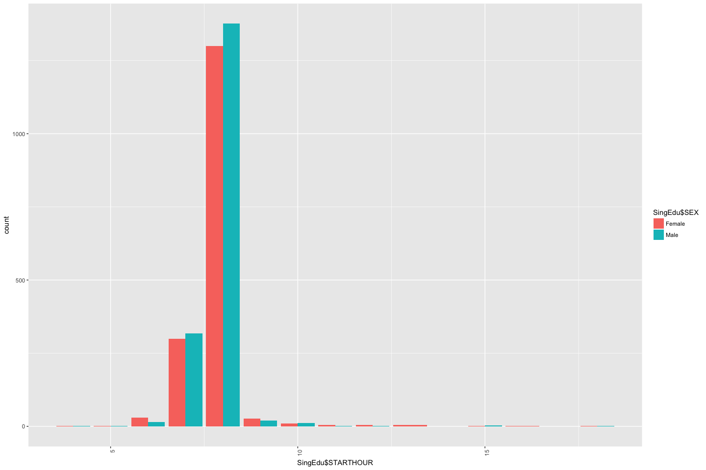<!-- -->

```r
ggplot(SingEdu, aes(x=SingEdu$STARTHOUR, fill = SingEdu$MAINACT)) + geom_bar(position="dodge") + theme(axis.text.x = element_text(angle = 90, hjust = 1))
```

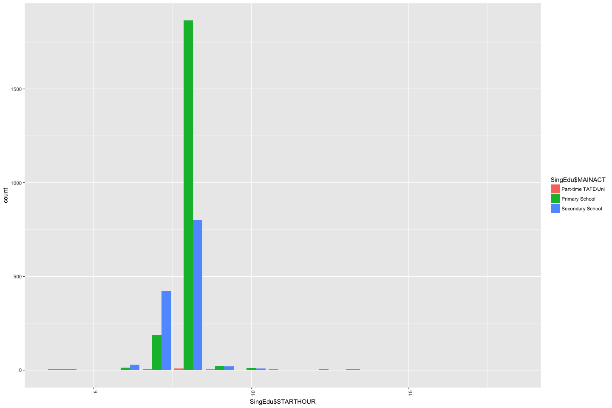<!-- -->

```r
ggplot(SingEdu, aes(x=SingEdu$STARTHOUR, fill = SingEdu$AGEGROUP)) + geom_bar(position="dodge")+xlim(5,12) + theme(axis.text.x = element_text(angle = 90, hjust = 1))
```

```
## Warning: Removed 16 rows containing non-finite values (stat_count).
```

```
## Warning: position_dodge requires non-overlapping x intervals
```

```
## Warning: Removed 1 rows containing missing values (geom_bar).
```

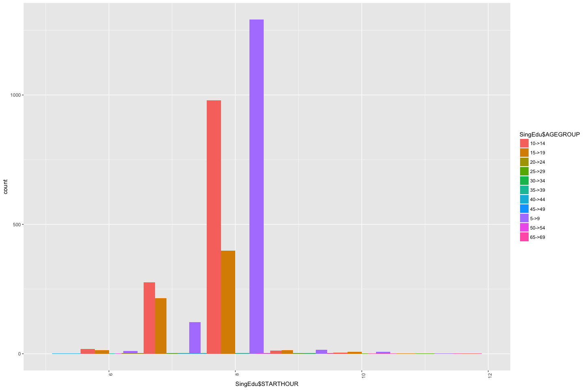<!-- -->

```r
ggplot(SingEdu, aes(x=SingEdu$MAINACT, fill = SingEdu$AGEGROUP)) + geom_bar(position="dodge") + theme(axis.text.x = element_text(angle = 90, hjust = 1))
```

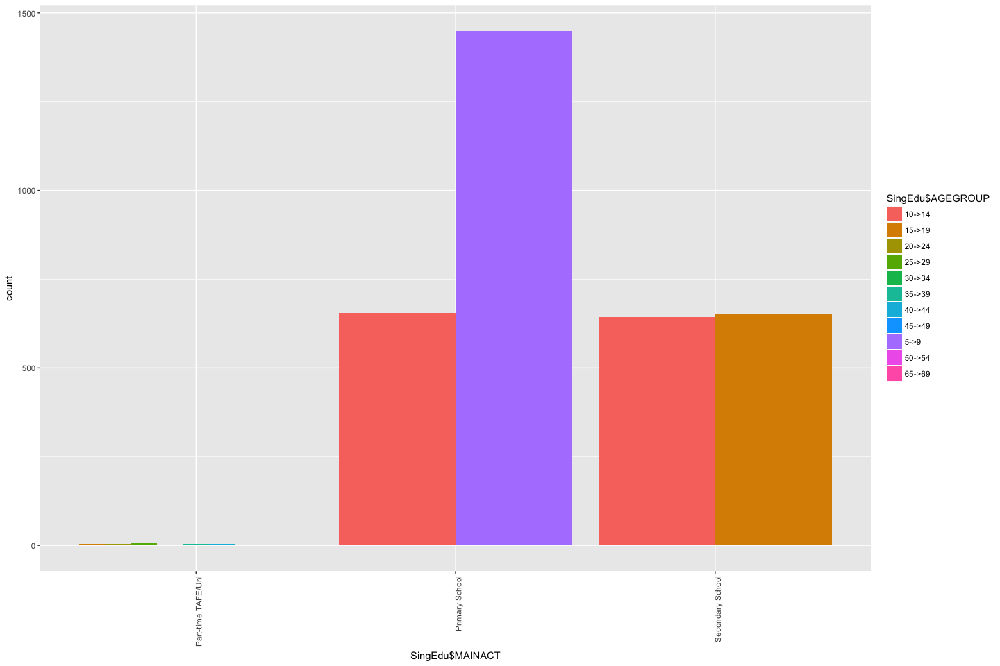<!-- -->

```r
ggplot(SingEdu, aes(x = SingEdu$AGEGROUP, y = SingEdu$STARTIME, fill = SingEdu$SEX)) + geom_boxplot() + theme(axis.text.x = element_text(angle = 90, hjust = 1))
```

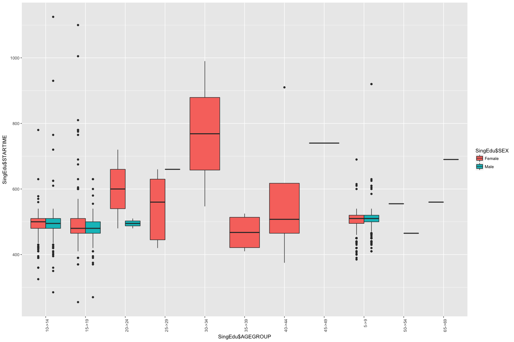<!-- -->

```r
ggplot(SingEdu, aes(x=SingEdu$DEPHOUR, fill = SingEdu$SEX)) + geom_bar(position="dodge") + theme(axis.text.x = element_text(angle = 90, hjust = 1))
```

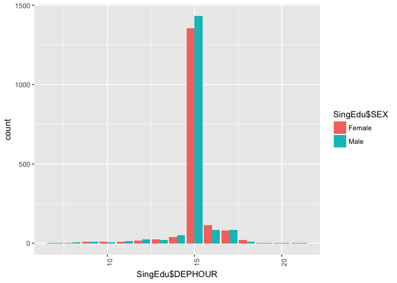<!-- -->

```r
ggplot(SingEdu, aes(x=SingEdu$DEPHOUR, fill = SingEdu$MAINACT)) + geom_bar(position="dodge") + theme(axis.text.x = element_text(angle = 90, hjust = 1))
```

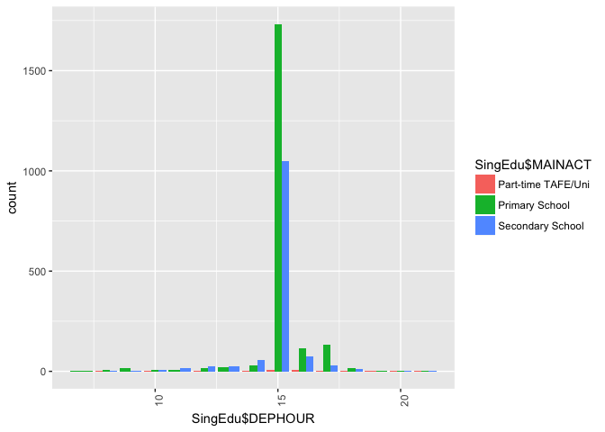<!-- -->

```r
ggplot(SingEdu, aes(x=SingEdu$DEPHOUR, fill = SingEdu$AGEGROUP)) + geom_bar(position="dodge") + theme(axis.text.x = element_text(angle = 90, hjust = 1))
```

```
## Warning: position_dodge requires non-overlapping x intervals
```

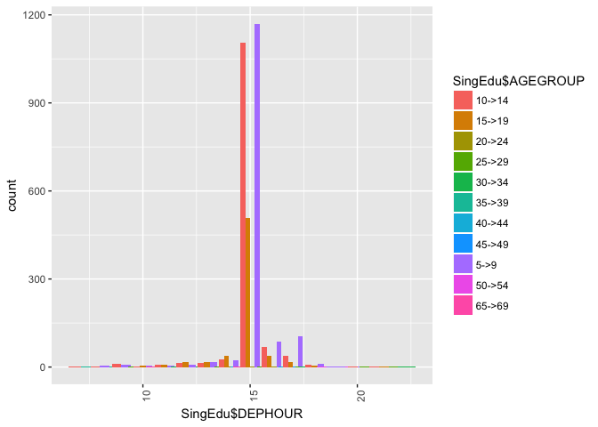<!-- -->


```r
ggplot(SingEdu, aes(x=SingEdu$DIST_GRP, fill = SingEdu$SEX)) + geom_bar(position="dodge") + theme(axis.text.x = element_text(angle = 90, hjust = 1))
```

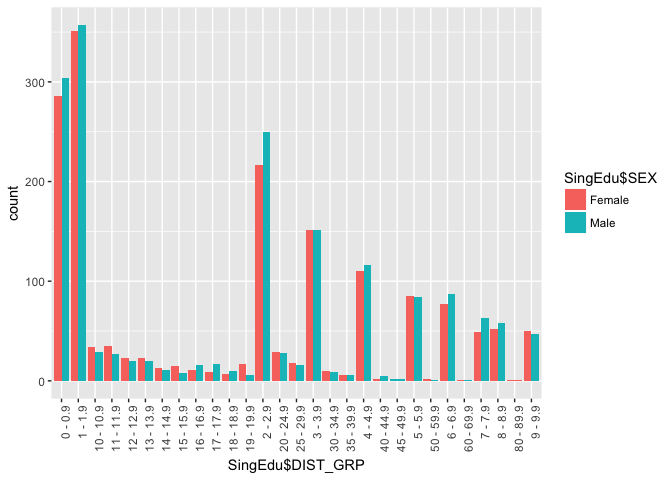<!-- -->

```r
ggplot(SingEdu, aes(x=SingEdu$DIST_GRP, fill = SingEdu$MAINACT)) + geom_bar(position="dodge") + theme(axis.text.x = element_text(angle = 90, hjust = 1))
```

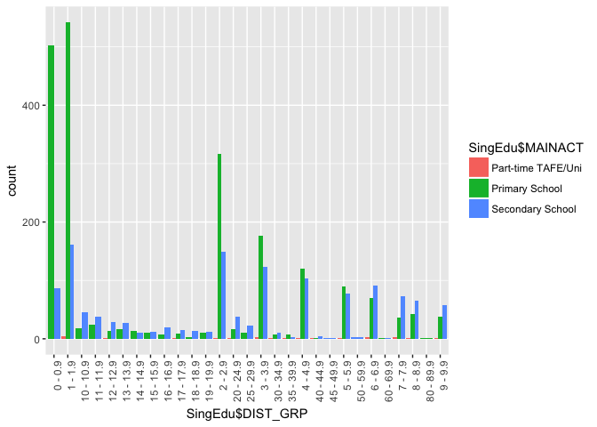<!-- -->

```r
ggplot(SingEdu, aes(x=SingEdu$DIST_GRP, fill = SingEdu$AGEGROUP)) + geom_bar(position="dodge") + theme(axis.text.x = element_text(angle = 90, hjust = 1))
```

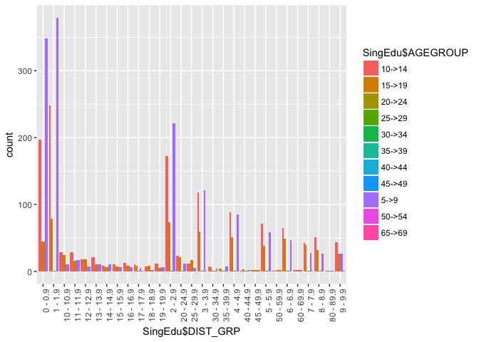<!-- -->


