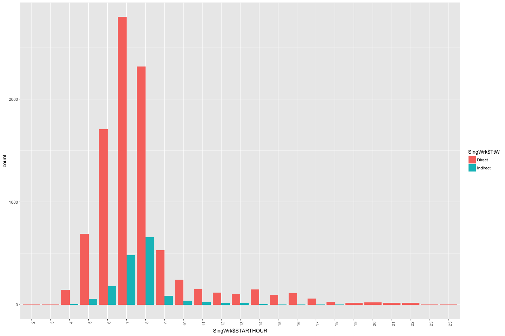
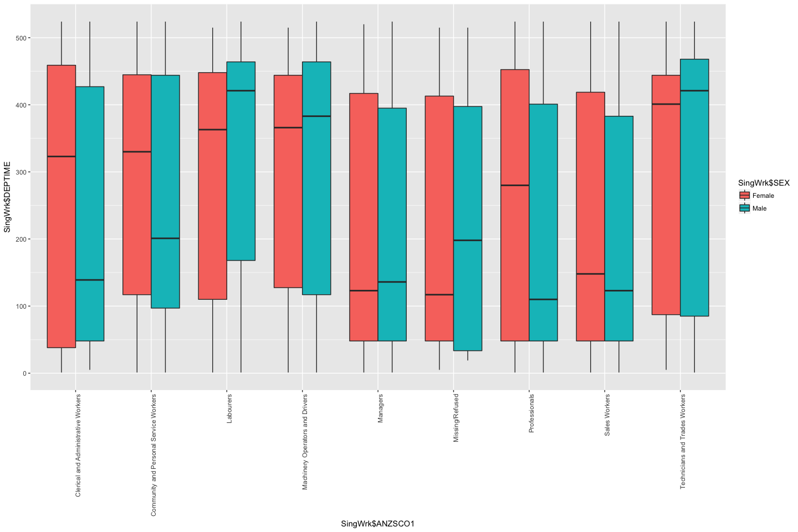

```r
library(ggplot2)
Person <- read.csv("../data/vista/2018-05-23-vista-2013-16/VISTA_2012_16_v1_SA1_CSV/P_VISTA12_16_SA1_V1.csv")
Work <- read.csv("../data/vista/2018-05-23-vista-2013-16/VISTA_2012_16_v1_SA1_CSV/JTW_VISTA12_16_SA1_V1.csv")
Person <- Person[,c(1,8,9,10,11,16,17,18,19,25,27,24,23)]
```


```r
Person <- Person[Person$PERSID %in% Work$PERSID, ]
SingWrkPerson <- subset(as.data.frame(table(Work$PERSID)), as.data.frame(table(Work$PERSID))$Freq == 1)
SingWrk <- Work[Work$PERSID %in% SingWrkPerson$Var1,]
SingWrkPerson <- Person[Person$PERSID %in% SingWrkPerson$Var1,]
SingWrk <- cbind(SingWrk,SingWrkPerson)
disp <- SingWrk[, c(1,4,7,9,10,11,12,14,16,17,19,20,21,22,23,32,41,77,79,80,83,108:119)]
```


```r
Person <- Person[Person$PERSID %in% Work$PERSID, ]
MultWrkPerson <- subset(as.data.frame(table(Work$PERSID)), as.data.frame(table(Work$PERSID))$Freq > 1)
MultWrk <- Work[Work$PERSID %in% MultWrkPerson$Var1,]
MultWrkPerson <- Person[Person$PERSID %in% MultWrkPerson$Var1,]
```
Lot of random data here. Some babies and children are said to go their own wordplace, but are not in the work force. Let us only talk about people in the workforce now. 

```r
SingWrk <- (SingWrk[SingWrk$ANYWORK != "No"|SingWrk$ANZSCO1!="Not in Work Force",])
table(SingWrk$PURP1)
```

```
## 
##            Accompany Someone                At or Go Home 
##                           24                            1 
##                Buy Something                  Change Mode 
##                          214                            2 
##                    Education                Other Purpose 
##                           36                            6 
##            Personal Business Pick-up or Deliver Something 
##                           65                           62 
##  Pick-up or Drop-off Someone                 Recreational 
##                          925                           72 
##                       Social                 Work Related 
##                          179                         9343
```

```r
SingWrk$TtW[SingWrk$PURP1 == "Work Related"]<- "Direct"
SingWrk$TtW[SingWrk$PURP1 != "Work Related"]<- "Indirect"
pub <- subset(SingWrk[(SingWrk$JTWMODE != "Vehicle Driver"& SingWrk$JTWMODE != "Vehicle Passenger" & SingWrk$JTWMODE!= "Walking"),])
priv <- subset(SingWrk[(SingWrk$JTWMODE == "Vehicle Driver"|SingWrk$JTWMODE == "Vehicle Passenger" | SingWrk$JTWMODE== "Walking"),])
```


```r
ggplot(SingWrk, aes(x=SingWrk$TRAVDOW, fill = SingWrk$SEX)) + geom_bar(position="dodge") + theme(axis.text.x = element_text(angle = 90, hjust = 1))
```

<!-- -->

```r
ggplot(SingWrk, aes(x=SingWrk$TRAVDOW, fill = SingWrk$TtW)) + geom_bar(position="dodge") + theme(axis.text.x = element_text(angle = 90, hjust = 1))
```

<!-- -->

```r
SingWrk$STARTHOUR <- as.factor(SingWrk$STARTHOUR)
ggplot(SingWrk, aes(x=SingWrk$TRAVDOW, fill = SingWrk$STARTHOUR)) + geom_bar(position="dodge") + theme(axis.text.x = element_text(angle = 90, hjust = 1))
```

<!-- -->

```r
table(SingWrk$STARTHOUR)
```

```
## 
##    2    3    4    5    6    7    8    9   10   11   12   13   14   15   16 
##    1    1  154  747 1889 3283 2974  617  284  177  133  122  154  101  114 
##   17   18   19   20   21   22   23   25 
##   63   32   18   23   19   20    2    1
```

```r
table(SingWrk$SEX, SingWrk$TtW)
```

```
##         
##          Direct Indirect
##   Female   4048      891
##   Male     5295      695
```

```r
ggplot(SingWrk, aes(x=SingWrk$STARTHOUR, fill = SingWrk$SEX)) + geom_bar(position="dodge") + theme(axis.text.x = element_text(angle = 90, hjust = 1))
```

<!-- -->

```r
ggplot(SingWrk, aes(x=SingWrk$STARTHOUR, fill = SingWrk$TtW)) + geom_bar(position="dodge") + theme(axis.text.x = element_text(angle = 90, hjust = 1))
```

<!-- -->

```r
ggplot(SingWrk, aes(x=SingWrk$JTWMODE, fill = SingWrk$TtW)) + geom_bar(position="dodge") + theme(axis.text.x = element_text(angle = 90, hjust = 1))
```

<!-- -->

```r
ggplot(SingWrk, aes(x=SingWrk$ANZSCO1, fill = SingWrk$SEX)) + geom_bar(position="dodge") + theme(axis.text.x = element_text(angle = 90, hjust = 1))
```

<!-- -->

```r
ggplot(SingWrk, aes(x=SingWrk$ANZSCO1, fill = SingWrk$STARTHOUR)) + geom_bar(position="dodge") + theme(axis.text.x = element_text(angle = 90, hjust = 1))
```

<!-- -->

```r
ggplot(pub, aes(x=pub$ANZSCO1, fill = pub$JTWMODE)) + geom_bar(position="dodge") + theme(axis.text.x = element_text(angle = 90, hjust = 1))
```

<!-- -->

```r
ggplot(pub, aes(x=pub$TRAVDOW, fill = pub$JTWMODE)) + geom_bar(position="dodge") + theme(axis.text.x = element_text(angle = 90, hjust = 1))
```

<!-- -->

```r
ggplot(priv, aes(x=priv$ANZSCO1, fill = priv$JTWMODE)) + geom_bar(position="dodge") + theme(axis.text.x = element_text(angle = 90, hjust = 1))
```

<!-- -->

```r
ggplot(priv, aes(x=priv$TRAVDOW, fill = priv$JTWMODE)) + geom_bar(position="dodge") + theme(axis.text.x = element_text(angle = 90, hjust = 1))
```

<!-- -->

```r
ggplot(SingWrk, aes(x=SingWrk$ANZSCO1, fill = SingWrk$AGEGROUP)) + geom_bar(position="dodge") + theme(axis.text.x = element_text(angle = 90, hjust = 1))
```

<!-- -->

```r
table(SingWrk$ANZSCO1, SingWrk$AGEGROUP)
```

```
##                                         
##                                          0->4 10->14 100+ 15->19 20->24
##   Clerical and Administrative Workers       0      0    0     16     89
##   Community and Personal Service Workers    0      0    0     43     97
##   Labourers                                 0      0    0     35     77
##   Machinery Operators and Drivers           0      0    0      3     21
##   Managers                                  0      0    0      5     44
##   Missing/Refused                           0      0    0      1      3
##   Not in Work Force                         0      0    0      0      0
##   Professionals                             0      0    0     18    190
##   Sales Workers                             0      0    0     73    172
##   Technicians and Trades Workers            0      0    1     26     97
##                                         
##                                          25->29 30->34 35->39 40->44
##   Clerical and Administrative Workers       137    123    104    150
##   Community and Personal Service Workers     96    103     86     89
##   Labourers                                 103    110    115    118
##   Machinery Operators and Drivers            30     29     50     55
##   Managers                                  113    168    206    228
##   Missing/Refused                             4      4      5      4
##   Not in Work Force                           0      0      0      0
##   Professionals                             436    608    520    525
##   Sales Workers                              92    101     72     87
##   Technicians and Trades Workers            127    130    128    123
##                                         
##                                          45->49 5->9 50->54 55->59 60->64
##   Clerical and Administrative Workers       142    0    210    135    112
##   Community and Personal Service Workers    100    0     88     72     49
##   Labourers                                 105    0    131     97     66
##   Machinery Operators and Drivers            54    0     80     64     56
##   Managers                                  227    0    238    138     93
##   Missing/Refused                             6    0      6      2      0
##   Not in Work Force                           0    0      0      0      0
##   Professionals                             426    0    449    357    187
##   Sales Workers                              91    0     98     74     53
##   Technicians and Trades Workers            117    0    110    101     60
##                                         
##                                          65->69 70->74 75->79 80->84
##   Clerical and Administrative Workers        33      7      0      1
##   Community and Personal Service Workers     18      4      2      1
##   Labourers                                  22     12      0      0
##   Machinery Operators and Drivers            18      3      0      0
##   Managers                                   31      8      3      3
##   Missing/Refused                             1      0      0      0
##   Not in Work Force                           0      0      0      0
##   Professionals                              85     21      0      2
##   Sales Workers                              28     11      0      0
##   Technicians and Trades Workers             18      5      3      1
##                                         
##                                          85->89 90->94 95->99
##   Clerical and Administrative Workers         0      0      0
##   Community and Personal Service Workers      0      0      0
##   Labourers                                   1      0      0
##   Machinery Operators and Drivers             1      0      0
##   Managers                                    0      0      0
##   Missing/Refused                             0      0      0
##   Not in Work Force                           0      0      0
##   Professionals                               1      0      0
##   Sales Workers                               1      0      0
##   Technicians and Trades Workers              0      0      0
```

```r
tab2<-table(SingWrk$ANZSCO1, SingWrk$JTWMODE)
prop.table(tab2,1)
```

```
##                                         
##                                               Bicycle   Motorcycle
##   Clerical and Administrative Workers    0.0190627482 0.0007942812
##   Community and Personal Service Workers 0.0306603774 0.0094339623
##   Labourers                              0.0110887097 0.0040322581
##   Machinery Operators and Drivers        0.0107758621 0.0064655172
##   Managers                               0.0186046512 0.0086378738
##   Missing/Refused                        0.0277777778 0.0000000000
##   Not in Work Force                                               
##   Professionals                          0.0358169935 0.0044444444
##   Sales Workers                          0.0136411333 0.0020986359
##   Technicians and Trades Workers         0.0171919771 0.0076408787
##                                         
##                                                 Other   Public Bus
##   Clerical and Administrative Workers    0.0000000000 0.0095313741
##   Community and Personal Service Workers 0.0011792453 0.0106132075
##   Labourers                              0.0010080645 0.0131048387
##   Machinery Operators and Drivers        0.0000000000 0.0086206897
##   Managers                               0.0000000000 0.0073089701
##   Missing/Refused                        0.0000000000 0.0277777778
##   Not in Work Force                                               
##   Professionals                          0.0002614379 0.0117647059
##   Sales Workers                          0.0000000000 0.0220356768
##   Technicians and Trades Workers         0.0000000000 0.0076408787
##                                         
##                                                  Taxi        Train
##   Clerical and Administrative Workers    0.0007942812 0.1945988880
##   Community and Personal Service Workers 0.0058962264 0.1226415094
##   Labourers                              0.0030241935 0.0675403226
##   Machinery Operators and Drivers        0.0021551724 0.0193965517
##   Managers                               0.0006644518 0.1249169435
##   Missing/Refused                        0.0000000000 0.1666666667
##   Not in Work Force                                               
##   Professionals                          0.0013071895 0.1850980392
##   Sales Workers                          0.0000000000 0.0786988458
##   Technicians and Trades Workers         0.0019102197 0.0678127985
##                                         
##                                                  Tram Vehicle Driver
##   Clerical and Administrative Workers    0.0270055600   0.6854646545
##   Community and Personal Service Workers 0.0365566038   0.6863207547
##   Labourers                              0.0120967742   0.7923387097
##   Machinery Operators and Drivers        0.0021551724   0.9181034483
##   Managers                               0.0265780731   0.7714285714
##   Missing/Refused                        0.0000000000   0.7222222222
##   Not in Work Force                                                 
##   Professionals                          0.0279738562   0.6742483660
##   Sales Workers                          0.0104931794   0.7869884575
##   Technicians and Trades Workers         0.0114613181   0.8299904489
##                                         
##                                          Vehicle Passenger      Walking
##   Clerical and Administrative Workers         0.0452740270 0.0174741859
##   Community and Personal Service Workers      0.0589622642 0.0377358491
##   Labourers                                   0.0745967742 0.0211693548
##   Machinery Operators and Drivers             0.0301724138 0.0021551724
##   Managers                                    0.0305647841 0.0112956811
##   Missing/Refused                             0.0555555556 0.0000000000
##   Not in Work Force                                                    
##   Professionals                               0.0342483660 0.0248366013
##   Sales Workers                               0.0598111228 0.0262329486
##   Technicians and Trades Workers              0.0458452722 0.0105062082
```


df


```r
ggplot(SingWrk, aes(x = SingWrk$TRAVDOW, y = SingWrk$STARTIME, fill = SingWrk$SEX)) + geom_boxplot() + theme(axis.text.x = element_text(angle = 90, hjust = 1))
```

<!-- -->

```r
ggplot(SingWrk, aes(x = SingWrk$AGEGROUP, y = SingWrk$STARTIME, fill = SingWrk$SEX)) + geom_boxplot() + theme(axis.text.x = element_text(angle = 90, hjust = 1))
```

<!-- -->

```r
ggplot(SingWrk, aes(x = SingWrk$AGEGROUP, y = SingWrk$STARTIME, fill = SingWrk$TtW )) + geom_boxplot() + theme(axis.text.x = element_text(angle = 90, hjust = 1))
```

<!-- -->

```r
ggplot(SingWrk, aes(x = SingWrk$ANZSCO1, y = SingWrk$STARTIME, fill = SingWrk$SEX )) + geom_boxplot() + theme(axis.text.x = element_text(angle = 90, hjust = 1))
```

<!-- -->
Do same for Depature time, and duration

Public/Private division. Find distributions.

Relationship/TravelPeriod, Type of Work also factors. 


```r
SingWrk$DEPTIME <- as.integer(SingWrk$DEPTIME)
SingWrk$DEPHOUR <- as.integer(SingWrk$DEPHOUR)


ggplot(SingWrk, aes(x = SingWrk$TRAVDOW, y = SingWrk$DEPTIME, fill = SingWrk$SEX)) + geom_boxplot() + theme(axis.text.x = element_text(angle = 90, hjust = 1))
```

<!-- -->

```r
ggplot(SingWrk, aes(x = SingWrk$AGEGROUP, y = SingWrk$DEPTIME, fill = SingWrk$SEX)) + geom_boxplot() + theme(axis.text.x = element_text(angle = 90, hjust = 1))
```

<!-- -->

```r
ggplot(SingWrk, aes(x = SingWrk$AGEGROUP, y = SingWrk$DEPTIME, fill = SingWrk$TtW )) + geom_boxplot() + theme(axis.text.x = element_text(angle = 90, hjust = 1))
```

<!-- -->

```r
ggplot(SingWrk, aes(x = SingWrk$ANZSCO1, y = SingWrk$DEPTIME, fill = SingWrk$SEX )) + geom_boxplot() + theme(axis.text.x = element_text(angle = 90, hjust = 1))
```

<!-- -->

```r
ggplot(SingWrk, aes(x = SingWrk$TRAVDOW, y = SingWrk$DEPHOUR, fill = SingWrk$SEX)) + geom_boxplot() + theme(axis.text.x = element_text(angle = 90, hjust = 1))
```

<!-- -->

```r
ggplot(SingWrk, aes(x = SingWrk$AGEGROUP, y = SingWrk$DEPHOUR, fill = SingWrk$SEX)) + geom_boxplot() + theme(axis.text.x = element_text(angle = 90, hjust = 1))
```

<!-- -->

```r
ggplot(SingWrk, aes(x = SingWrk$ANZSCO1, y = SingWrk$DEPHOUR, fill = SingWrk$SEX )) + geom_boxplot() + theme(axis.text.x = element_text(angle = 90, hjust = 1))
```

<!-- -->


```r
SingWrk$workDuration <- as.integer(SingWrk$workDuration)
ggplot(SingWrk, aes(x = SingWrk$TRAVDOW, y = SingWrk$workDuration, fill = SingWrk$SEX)) + geom_boxplot() + theme(axis.text.x = element_text(angle = 90, hjust = 1))
```

<!-- -->

```r
ggplot(SingWrk, aes(x = SingWrk$AGEGROUP, y = SingWrk$workDuration, fill = SingWrk$SEX)) + geom_boxplot() + theme(axis.text.x = element_text(angle = 90, hjust = 1))
```

<!-- -->

```r
ggplot(SingWrk, aes(x = SingWrk$ANZSCO1, y = SingWrk$workDuration, fill = SingWrk$SEX )) + geom_boxplot() + theme(axis.text.x = element_text(angle = 90, hjust = 1))
```

<!-- -->
