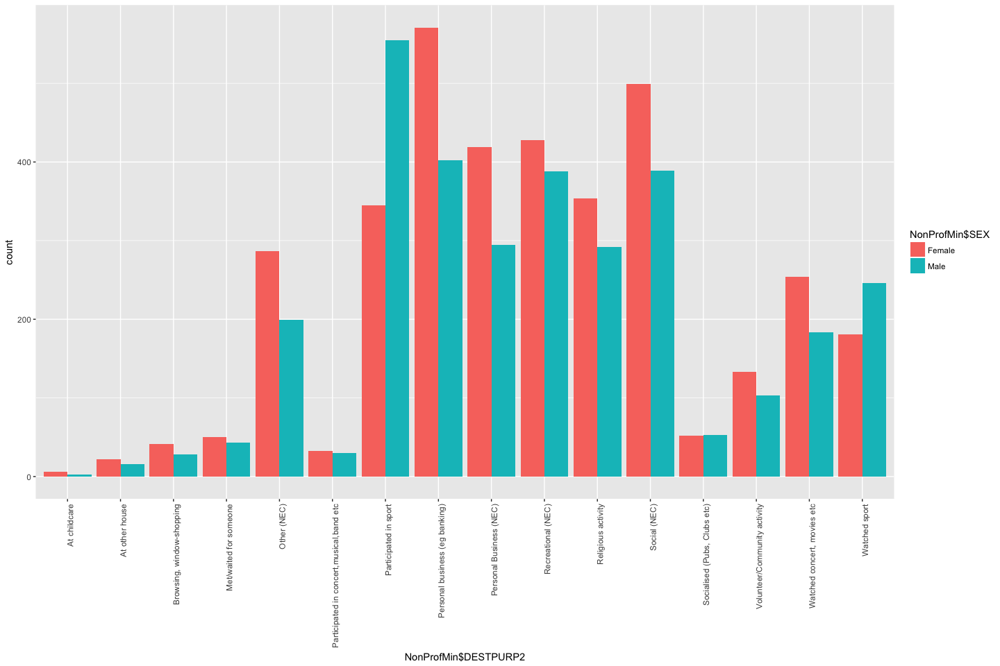
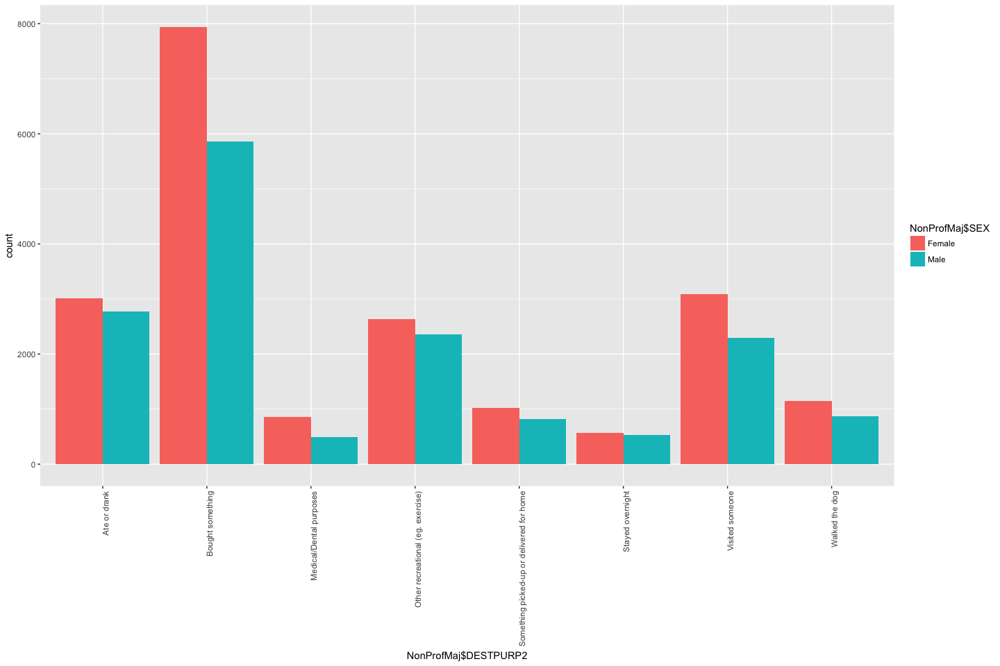
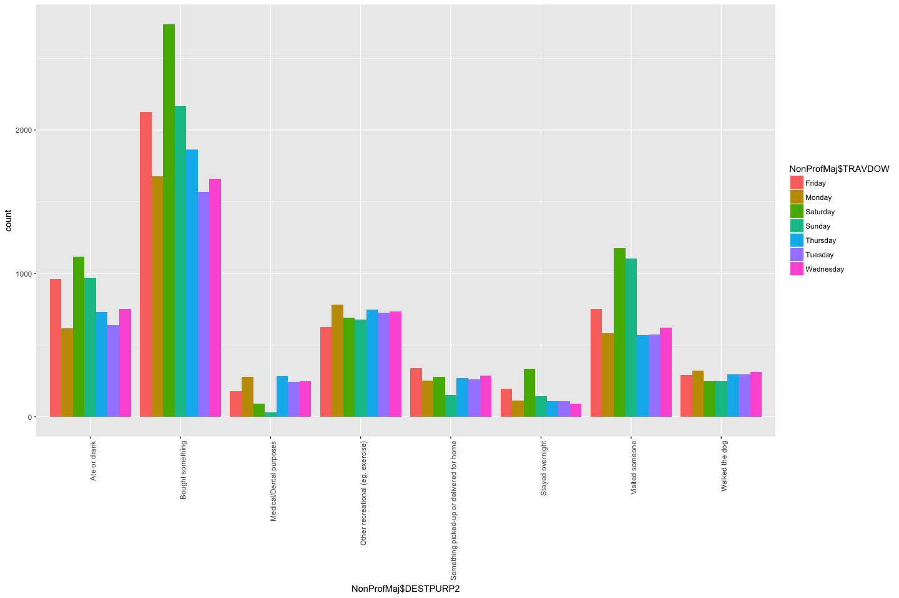
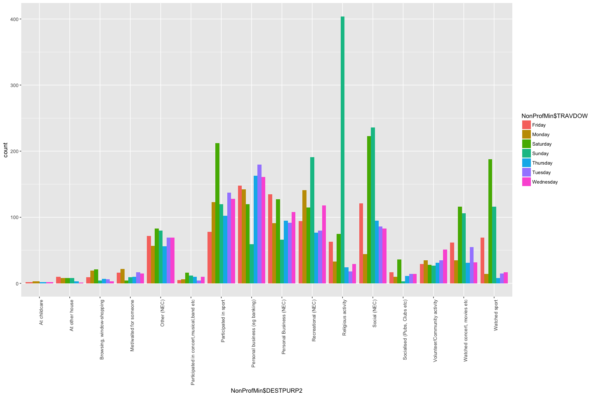
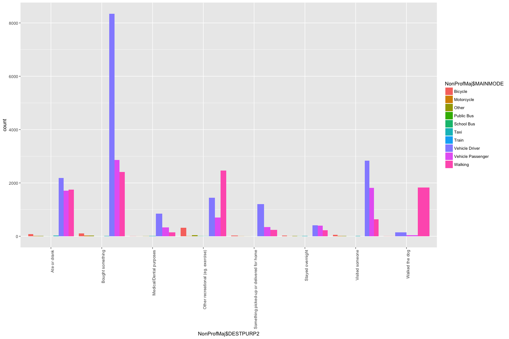
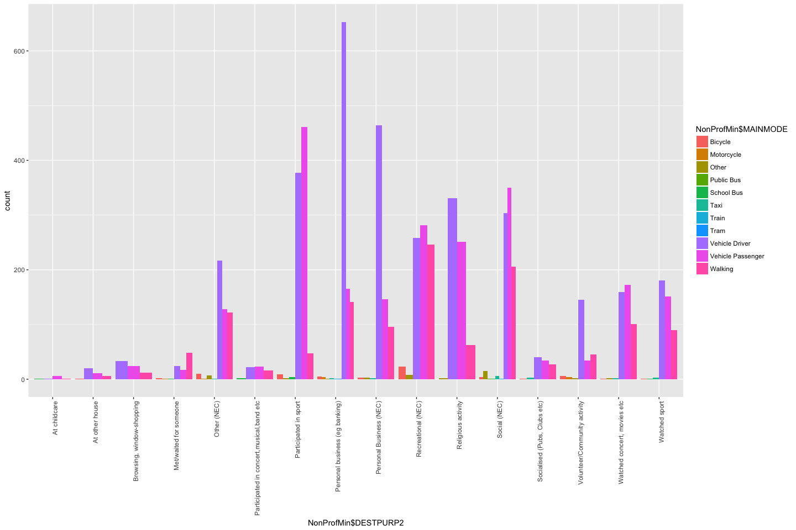

```r
Trips <- read.csv("../data/vista/2018-05-23-vista-2013-16/VISTA_2012_16_v1_SA1_CSV/T_VISTA12_16_SA1_V1.csv")
Stops <- read.csv("../data/vista/2018-05-23-vista-2013-16/VISTA_2012_16_v1_SA1_CSV/S_VISTA12_16_SA1_V1.csv")
Peraon <- read.csv("../data/vista/2018-05-23-vista-2013-16/VISTA_2012_16_v1_SA1_CSV/P_VISTA12_16_SA1_V1.csv")
```


```r
library(ggplot2)
table(Stops$DESTPURP1)
```

```
## 
##            Accompany Someone                Buy Something 
##                         4173                        13870 
##                  Change Mode                    Education 
##                        21139                         4962 
##                      Go Home                   Not Stated 
##                        50451                            2 
##                Other Purpose            Personal Business 
##                          486                         7163 
## Pick-up or Deliver Something  Pick-up or Drop-off Someone 
##                         1841                         9331 
##                 Recreational                       Social 
##                         6773                        13031 
##                 Work Related 
##                        16476
```

```r
NonProf <- subset(Stops, Stops$DESTPURP1 == "Other Purpose" | Stops$DESTPURP1 == "Personal Business" | Stops$DESTPURP1 == "Pick-up or Deliver Something" | Stops$DESTPURP1 == "Recreational" | Stops$DESTPURP1 == "Social" | Stops$DESTPURP1 == "Buy Something")
NonProf <- NonProf[!table(NonProf$DESTPURP2)[NonProf$DESTPURP2]<2,]
NonProf$DESTPURP2 <- as.factor(as.character(NonProf$DESTPURP2))
NonProf <- NonProf[, c(10,52,53,59,60,64,68,70,23)]
table(NonProf$DESTPURP2)
```

```
## 
##                              At childcare 
##                                         9 
##                            At other house 
##                                        38 
##                              Ate or drank 
##                                      5787 
##                          Bought something 
##                                     13801 
##                 Browsing, window-shopping 
##                                        69 
##                   Medical/Dental purposes 
##                                      1352 
##                    Met/waited for someone 
##                                        93 
##                               Other (NEC) 
##                                       486 
##         Other recreational (eg. exercise) 
##                                      4988 
##  Participated in concert,musical,band etc 
##                                        63 
##                     Participated in sport 
##                                       900 
##            Personal business (eg banking) 
##                                       973 
##                   Personal Business (NEC) 
##                                       714 
##                        Recreational (NEC) 
##                                       816 
##                        Religious activity 
##                                       646 
##                              Social (NEC) 
##                                       888 
##              Socialised (Pubs, Clubs etc) 
##                                       105 
## Something picked-up or delivered for home 
##                                      1841 
##                          Stayed overnight 
##                                      1098 
##                           Visited someone 
##                                      5381 
##              Volunteer/Community activity 
##                                       236 
##                            Walked the dog 
##                                      2015 
##               Watched concert, movies etc 
##                                       437 
##                             Watched sport 
##                                       427
```

```r
NonProfMaj <- NonProf[!table(NonProf$DESTPURP2)[NonProf$DESTPURP2]<1000,]
NonProfMin <- NonProf[!table(NonProf$DESTPURP2)[NonProf$DESTPURP2]>1000,]
```


```r
ggplot(NonProfMin, aes(x=NonProfMin$DESTPURP2, fill = NonProfMin$SEX,)) + geom_bar(position="dodge") + theme(axis.text.x = element_text(angle = 90, hjust = 1))
```

<!-- -->

```r
ggplot(NonProfMaj, aes(x=NonProfMaj$DESTPURP2, fill = NonProfMaj$SEX,)) + geom_bar(position="dodge") + theme(axis.text.x = element_text(angle = 90, hjust = 1))
```

<!-- -->

```r
ggplot(NonProfMaj, aes(x=NonProfMaj$DESTPURP2, fill = NonProfMaj$TRAVDOW,)) + geom_bar(position="dodge") + theme(axis.text.x = element_text(angle = 90, hjust = 1))
```

<!-- -->

```r
ggplot(NonProfMin, aes(x=NonProfMin$DESTPURP2, fill = NonProfMin$TRAVDOW,)) + geom_bar(position="dodge") + theme(axis.text.x = element_text(angle = 90, hjust = 1))
```

<!-- -->

```r
ggplot(NonProfMaj, aes(x=NonProfMaj$DESTPURP2, fill = NonProfMaj$MAINMODE,)) + geom_bar(position="dodge") + theme(axis.text.x = element_text(angle = 90, hjust = 1))
```

<!-- -->

```r
ggplot(NonProfMin, aes(x=NonProfMin$DESTPURP2, fill = NonProfMin$MAINMODE,)) + geom_bar(position="dodge") + theme(axis.text.x = element_text(angle = 90, hjust = 1))
```

<!-- -->

