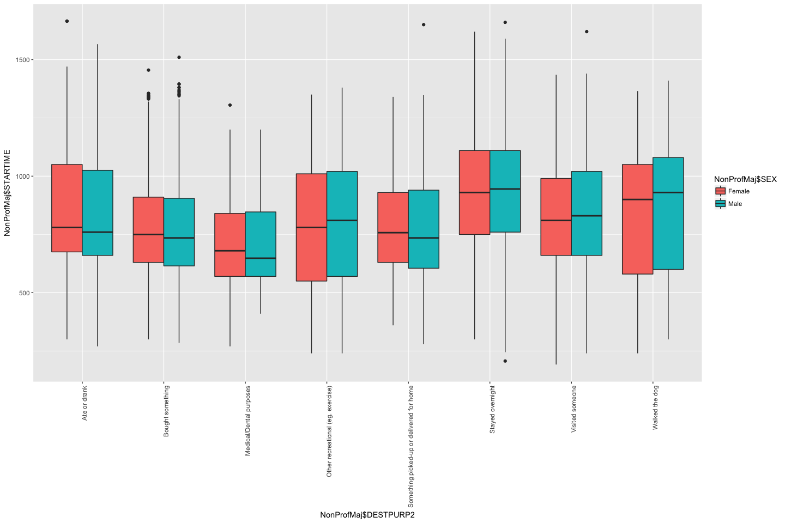

```r
Trips <- read.csv("../data/vista/2018-05-23-vista-2013-16/VISTA_2012_16_v1_SA1_CSV/T_VISTA12_16_SA1_V1.csv")
Stops <- read.csv("../data/vista/2018-05-23-vista-2013-16/VISTA_2012_16_v1_SA1_CSV/S_VISTA12_16_SA1_V1.csv")
Person <- read.csv("../data/vista/2018-05-23-vista-2013-16/VISTA_2012_16_v1_SA1_CSV/P_VISTA12_16_SA1_V1.csv")
```


```r
library(ggplot2)
table(Stops$DESTPURP1)
```

```
## 
##            Accompany Someone                Buy Something 
##                         4173                        13870 
##                  Change Mode                    Education 
##                        21139                         4962 
##                      Go Home                   Not Stated 
##                        50451                            2 
##                Other Purpose            Personal Business 
##                          486                         7163 
## Pick-up or Deliver Something  Pick-up or Drop-off Someone 
##                         1841                         9331 
##                 Recreational                       Social 
##                         6773                        13031 
##                 Work Related 
##                        16476
```

```r
NonProf <- subset(Stops, Stops$DESTPURP1 == "Other Purpose" | Stops$DESTPURP1 == "Personal Business" | Stops$DESTPURP1 == "Pick-up or Deliver Something" | Stops$DESTPURP1 == "Recreational" | Stops$DESTPURP1 == "Social" | Stops$DESTPURP1 == "Buy Something")
NonProf <- NonProf[!table(NonProf$DESTPURP2)[NonProf$DESTPURP2]<2,]
NonProf$DESTPURP2 <- as.factor(as.character(NonProf$DESTPURP2))
# NonProf <- NonProf[, c(10,52,53,59,60,64,68,69,70,23,95)]
table(NonProf$DESTPURP2)
```

```
## 
##                              At childcare 
##                                         9 
##                            At other house 
##                                        38 
##                              Ate or drank 
##                                      5787 
##                          Bought something 
##                                     13801 
##                 Browsing, window-shopping 
##                                        69 
##                   Medical/Dental purposes 
##                                      1352 
##                    Met/waited for someone 
##                                        93 
##                               Other (NEC) 
##                                       486 
##         Other recreational (eg. exercise) 
##                                      4988 
##  Participated in concert,musical,band etc 
##                                        63 
##                     Participated in sport 
##                                       900 
##            Personal business (eg banking) 
##                                       973 
##                   Personal Business (NEC) 
##                                       714 
##                        Recreational (NEC) 
##                                       816 
##                        Religious activity 
##                                       646 
##                              Social (NEC) 
##                                       888 
##              Socialised (Pubs, Clubs etc) 
##                                       105 
## Something picked-up or delivered for home 
##                                      1841 
##                          Stayed overnight 
##                                      1098 
##                           Visited someone 
##                                      5381 
##              Volunteer/Community activity 
##                                       236 
##                            Walked the dog 
##                                      2015 
##               Watched concert, movies etc 
##                                       437 
##                             Watched sport 
##                                       427
```

```r
NonProfMaj <- NonProf[!table(NonProf$DESTPURP2)[NonProf$DESTPURP2]<1000,]
NonProfMin <- NonProf[!table(NonProf$DESTPURP2)[NonProf$DESTPURP2]>1000,]
NonProfMaj$DESTPURP2 <- as.factor(as.character(NonProfMaj$DESTPURP2))
NonProfMin$DESTPURP2 <- as.factor(as.character(NonProfMin$DESTPURP2))
```


```r
table(Trips$DESTPURP1)
```

```
## 
##            Accompany Someone                At or Go Home 
##                         4173                        50451 
##                Buy Something                  Change Mode 
##                        13870                          125 
##                    Education                   Not Stated 
##                         4962                            2 
##                Other Purpose            Personal Business 
##                          486                         7163 
## Pick-up or Deliver Something  Pick-up or Drop-off Someone 
##                         1841                         9331 
##                 Recreational                       Social 
##                         6773                        13031 
##                 Work Related 
##                        16476
```

```r
NonProf <- subset(Trips, Trips$DESTPURP1 == "Other Purpose" | Trips$DESTPURP1 == "Personal Business" | Trips$DESTPURP1 == "Pick-up or Deliver Something" | Trips$DESTPURP1 == "Recreational" | Trips$DESTPURP1 == "Social" | Trips$DESTPURP1 == "Buy Something")
NonProf <- NonProf[!table(NonProf$DESTPURP2)[NonProf$DESTPURP2]<2,]
NonProf$DESTPURP2 <- as.factor(as.character(NonProf$DESTPURP2))
table(NonProf$DESTPURP2)
```

```
## 
##                              At childcare 
##                                         9 
##                            At other house 
##                                        38 
##                              Ate or drank 
##                                      5787 
##                          Bought something 
##                                     13801 
##                 Browsing, window-shopping 
##                                        69 
##                   Medical/Dental purposes 
##                                      1352 
##                    Met/waited for someone 
##                                        93 
##                               Other (NEC) 
##                                       486 
##         Other recreational (eg. exercise) 
##                                      4988 
##  Participated in concert,musical,band etc 
##                                        63 
##                     Participated in sport 
##                                       900 
##            Personal business (eg banking) 
##                                       973 
##                   Personal Business (NEC) 
##                                       714 
##                        Recreational (NEC) 
##                                       816 
##                        Religious activity 
##                                       646 
##                              Social (NEC) 
##                                       888 
##              Socialised (Pubs, Clubs etc) 
##                                       105 
## Something picked-up or delivered for home 
##                                      1841 
##                          Stayed overnight 
##                                      1098 
##                           Visited someone 
##                                      5381 
##              Volunteer/Community activity 
##                                       236 
##                            Walked the dog 
##                                      2015 
##               Watched concert, movies etc 
##                                       437 
##                             Watched sport 
##                                       427
```

```r
NonProfMajT <- NonProf[!table(NonProf$DESTPURP2)[NonProf$DESTPURP2]<1000,]
NonProfMinT <- NonProf[!table(NonProf$DESTPURP2)[NonProf$DESTPURP2]>1000,]
```


```r
ggplot(NonProfMin, aes(x=NonProfMin$DESTPURP2, fill = NonProfMin$SEX)) + geom_bar(position="dodge") + theme(axis.text.x = element_text(angle = 90, hjust = 1))
```

<!-- -->

```r
ggplot(NonProfMaj, aes(x=NonProfMaj$DESTPURP2, fill = NonProfMaj$SEX)) + geom_bar(position="dodge") + theme(axis.text.x = element_text(angle = 90, hjust = 1))
```

<!-- -->

```r
ggplot(NonProfMaj, aes(x=NonProfMaj$DESTPURP2, fill = NonProfMaj$TRAVDOW)) + geom_bar(position="dodge") + theme(axis.text.x = element_text(angle = 90, hjust = 1))
```

<!-- -->

```r
ggplot(NonProfMin, aes(x=NonProfMin$DESTPURP2, fill = NonProfMin$TRAVDOW)) + geom_bar(position="dodge") + theme(axis.text.x = element_text(angle = 90, hjust = 1))
```

<!-- -->

```r
ggplot(NonProfMaj, aes(x=NonProfMaj$DESTPURP2, fill = NonProfMaj$MAINMODE)) + geom_bar(position="dodge") + theme(axis.text.x = element_text(angle = 90, hjust = 1))
```

<!-- -->

```r
ggplot(NonProfMin, aes(x=NonProfMin$DESTPURP2, fill = NonProfMin$MAINMODE)) + geom_bar(position="dodge") + theme(axis.text.x = element_text(angle = 90, hjust = 1))
```

<!-- -->

```r
ggplot(NonProfMaj, aes(x=NonProfMaj$DESTPURP2, fill = NonProfMaj$AGEGROUP)) + geom_bar(position="dodge") + theme(axis.text.x = element_text(angle = 90, hjust = 1))
```

<!-- -->

```r
ggplot(NonProfMin, aes(x=NonProfMin$DESTPURP2, fill = NonProfMin$AGEGROUP)) + geom_bar(position="dodge") + theme(axis.text.x = element_text(angle = 90, hjust = 1))
```

<!-- -->

```r
pubmaj <- subset(NonProfMaj[(NonProfMaj$MAINMODE != "Vehicle Driver"& NonProfMaj$MAINMODE != "Vehicle Passenger" & NonProfMaj$MAINMODE!= "Walking"),])
ggplot(pubmaj, aes(x=pubmaj$DESTPURP2, fill = pubmaj$MAINMODE)) + geom_bar(position="dodge") + theme(axis.text.x = element_text(angle = 90, hjust = 1))
```

<!-- -->

```r
pubmin <- subset(NonProfMin[(NonProfMin$MAINMODE != "Vehicle Driver"& NonProfMin$MAINMODE != "Vehicle Passenger" & NonProfMin$MAINMODE!= "Walking"),])
ggplot(pubmin, aes(x=pubmin$DESTPURP2, fill = pubmin$MAINMODE)) + geom_bar(position="dodge") + theme(axis.text.x = element_text(angle = 90, hjust = 1))
```

<!-- -->

```r
# NonProfMajTab <- as.data.frame(table(NonProfMaj$DESTPURP2, NonProfMaj$SEX, NonProfMaj$Isweekend))
# #For Average Day
# as.integer(NonProfMajTab$Freq)
# NonProfMajTab$Freq[NonProfMajTab$Var3 == "Weekend"] <- (NonProfMajTab$Freq/2)
```
There is a major issue in all Mode type plots we have made. When we consider MainMode, it may not be the actualy major mode he has taken. For example, the reason trams have totally disappeared in these plots is because all trams are used as a Change Mode purpose. Before and after a tram station, there is some walking/driving to get from and to locations. We need to find the 'Main' mode of transport used. We will need to somehow focus on Trips and Stops together for the same. 


```r
ggplot(NonProfMajT, aes(x=NonProfMajT$DESTPURP2, fill = NonProfMajT$LINKMODE)) + geom_bar(position="dodge") + theme(axis.text.x = element_text(angle = 90, hjust = 1))
```

<!-- -->

```r
ggplot(NonProfMinT, aes(x=NonProfMinT$DESTPURP2, fill = NonProfMinT$LINKMODE)) + geom_bar(position="dodge") + theme(axis.text.x = element_text(angle = 90, hjust = 1))
```

<!-- -->

```r
pubmajT <- subset(NonProfMajT[(NonProfMajT$LINKMODE != "Vehicle Driver"& NonProfMajT$LINKMODE != "Vehicle Passenger" & NonProfMajT$LINKMODE!= "Walking"),])
ggplot(pubmajT, aes(x=pubmajT$DESTPURP2, fill = pubmajT$LINKMODE)) + geom_bar(position="dodge") + theme(axis.text.x = element_text(angle = 90, hjust = 1))
```

<!-- -->

```r
pubminT <- subset(NonProfMinT[(NonProfMinT$LINKMODE != "Vehicle Driver"& NonProfMinT$LINKMODE != "Vehicle Passenger" & NonProfMinT$LINKMODE!= "Walking"),])
ggplot(pubminT, aes(x=pubminT$DESTPURP2, fill = pubminT$LINKMODE)) + geom_bar(position="dodge") + theme(axis.text.x = element_text(angle = 90, hjust = 1))
```

<!-- -->


```r
ggplot(NonProfMaj, aes(x=NonProfMaj$DESTPURP2 ,y=NonProfMaj$STARTIME, fill = NonProfMaj$SEX)) + geom_boxplot() + theme(axis.text.x = element_text(angle = 90, hjust = 1))
```

<!-- -->

```r
NonProfMaj$DURATION <- as.numeric(as.character(NonProfMaj$DURATION))
```

```
## Warning: NAs introduced by coercion
```

```r
ggplot(NonProfMaj, aes(x=NonProfMaj$DESTPURP2 ,y=NonProfMaj$DURATION, fill = NonProfMaj$SEX)) + geom_boxplot() + theme(axis.text.x = element_text(angle = 90, hjust = 1))
```

```
## Warning: Removed 458 rows containing non-finite values (stat_boxplot).
```

<!-- -->

```r
ggplot(NonProfMaj, aes(x=NonProfMaj$DESTPURP2 ,y=NonProfMaj$VISTADIST, fill = NonProfMaj$SEX)) + geom_boxplot() + theme(axis.text.x = element_text(angle = 90, hjust = 1))
```

<!-- -->

