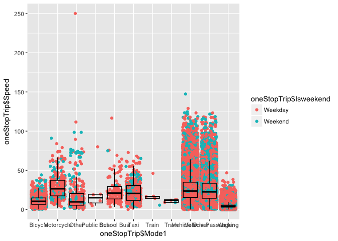
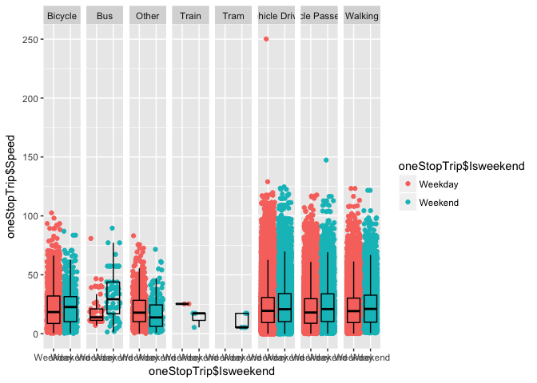

Here we have a few things. 
a) What does speed of travel depend on 
b) Nightworkers

Today, let's examine the various activities done


```r
Trips <- read.csv("../data/vista/2018-05-23-vista-2013-16/VISTA_2012_16_v1_SA1_CSV/T_VISTA12_16_SA1_V1.csv")
Stops <- read.csv("../data/vista/2018-05-23-vista-2013-16/VISTA_2012_16_v1_SA1_CSV/S_VISTA12_16_SA1_V1.csv")
table(Trips$STOPS)
```

```
## 
##      1      2      3      4      5      6      7      8      9 
## 119324   1451   5610   1164    892    188     45      7      3
```

Analysing trips separately for now


```r
oneStopTrip <- subset(Trips, Trips$STOP == 1)
oneStopTrip$Speed = (oneStopTrip$Dist1/oneStopTrip$Time1)*60
twoStopTrip <- subset(Trips, Trips$STOP == 1)
twoStopTrip$Speed = (twoStopTrip$Dist1/twoStopTrip$Time1)*60
threeStopTrip <- subset(Trips, Trips$STOP == 1)
threeStopTrip$Speed = (threeStopTrip$Dist1/threeStopTrip$Time1)*60
```


```r
library(ggplot2)
Scatterplot<-ggplot(oneStopTrip, aes(oneStopTrip$TRAVDOW, oneStopTrip$Speed, colour=oneStopTrip$TRAVDOW))+geom_point(position="jitter")+facet_grid(~oneStopTrip$Mode1)+geom_boxplot(alpha=0, colour="black")
Scatterplot
```

```
## Warning: Removed 3 rows containing non-finite values (stat_boxplot).
```

```
## Warning: Removed 3 rows containing missing values (geom_point).
```

<!-- -->
We see that day that does not matter much as the plot is very similar

```r
Scatterplot<-ggplot(oneStopTrip, aes(oneStopTrip$TRAVELPERIOD, oneStopTrip$Speed, colour=oneStopTrip$TRAVELPERIOD))+geom_point(position="jitter")+facet_grid(~oneStopTrip$Mode1)+geom_boxplot(alpha=0, colour="black")
Scatterplot
```

```
## Warning: Removed 3 rows containing non-finite values (stat_boxplot).
```

```
## Warning: Removed 3 rows containing missing values (geom_point).
```

<!-- -->


```r
Scatterplot<-ggplot(twoStopTrip, aes(twoStopTrip$TRAVELPERIOD, twoStopTrip$Speed, colour=twoStopTrip$TRAVELPERIOD))+geom_point(position="jitter")+facet_grid(~twoStopTrip$Mode1)+geom_boxplot(alpha=0, colour="black")
Scatterplot
```

```
## Warning: Removed 3 rows containing non-finite values (stat_boxplot).
```

```
## Warning: Removed 3 rows containing missing values (geom_point).
```

<!-- -->


```r
Scatterplot<-ggplot(threeStopTrip, aes(threeStopTrip$TRAVELPERIOD, threeStopTrip$Speed, colour=threeStopTrip$TRAVELPERIOD))+geom_point(position="jitter")+facet_grid(~threeStopTrip$Mode1)+geom_boxplot(alpha=0, colour="black")
Scatterplot
```

```
## Warning: Removed 3 rows containing non-finite values (stat_boxplot).
```

```
## Warning: Removed 3 rows containing missing values (geom_point).
```

<!-- -->


```r
Person <- read.csv("../data/vista/2018-05-23-vista-2013-16/VISTA_2012_16_v1_SA1_CSV/P_VISTA12_16_SA1_V1.csv")
Person$AgeGroup[Person$AGE < 21] <- "Child"
Person$AgeGroup[Person$AGE > 21] <- "Adult"
Person$AgeGroup[Person$AGE < 5] <- "Baby"

table (oneStopTrip$ORIGPLACE1)
```

```
## 
##                                         Accommodation 
##                          3                      54814 
##            Natural Feature                 Not Stated 
##                       2601                          0 
##                      Other         Place of Education 
##                       1940                      10682 
## Place of Personal Business         Recreational Place 
##                       4457                       6651 
##                      Shops               Social Place 
##                      15919                       6675 
##          Transport Feature                  Workplace 
##                       1199                      14383
```

```r
nightwork <- subset(oneStopTrip, oneStopTrip$ORIGPLACE1 == "Workplace")
```


```r
nightperson <- Person[Person$PERSID %in% nightwork$PERSID, ]
nightnonwork <- subset(nightperson, nightperson$ANYWORK == "No")
nightactivities_nonwork <- Trips[Trips$PERSID %in% nightnonwork$PERSID,]
```


c) Activities


```r
StopsFiltered <- Stops[, -c(6,7,9,12,14,15,17,16,18,21,23,25,27:50,61)]
StopsFiltered <- StopsFiltered[, -c(48:57,29,42:44)]
table(StopsFiltered$DESTPURP1)
```

```
## 
##            Accompany Someone                Buy Something 
##                         4173                        13870 
##                  Change Mode                    Education 
##                        21139                         4962 
##                      Go Home                   Not Stated 
##                        50451                            2 
##                Other Purpose            Personal Business 
##                          486                         7163 
## Pick-up or Deliver Something  Pick-up or Drop-off Someone 
##                         1841                         9331 
##                 Recreational                       Social 
##                         6773                        13031 
##                 Work Related 
##                        16476
```

```r
StopsFiltered$AVESPEED <- as.numeric(as.character(StopsFiltered$AVESPEED))
```

```
## Warning: NAs introduced by coercion
```

```r
StopsFiltered$DURATION <- as.numeric(as.character(StopsFiltered$DURATION))
```

```
## Warning: NAs introduced by coercion
```

```r
ActivityAnalysis <- StopsFiltered[, c(6,7,12, 23, 24, 28)]
ActivityAnalysis <- aggregate(. ~ ActivityAnalysis$DESTPURP1 + ActivityAnalysis$TRAVMONTH + ActivityAnalysis$TRAVDOW + ActivityAnalysis$MAINMODE, data = ActivityAnalysis, FUN = mean, na.rm = TRUE)
ActivityAnalysis <- ActivityAnalysis[, -c(5,6,7,9)]
ActivityAnalysis <- ActivityAnalysis[order(ActivityAnalysis$`ActivityAnalysis$TRAVMONTH`, ActivityAnalysis$`ActivityAnalysis$TRAVDOW`, ActivityAnalysis$`ActivityAnalysis$MAINMODE`),]
```


```r
ActivityAnalysisTab <- StopsFiltered[, c(6,7,12, 23, 24, 28)]
ActivityAnalysisTab <- as.data.frame(table(ActivityAnalysisTab$DESTPURP1, ActivityAnalysisTab$MAINMODE))
ActivityAnalysisTab <- ActivityAnalysisTab[order(ActivityAnalysisTab$Var1, -ActivityAnalysisTab$Freq),]
```

Other puprose, Recreational and Social are three categories which 
