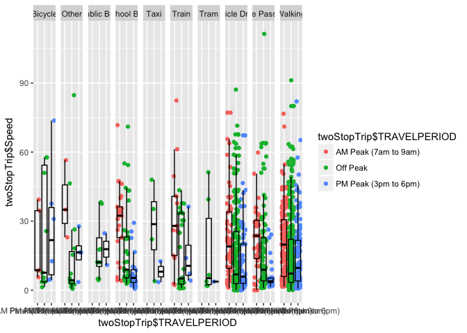
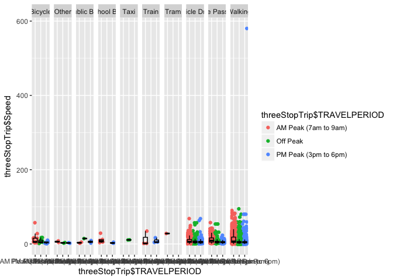

Here we have a few things. 
a) What does speed of travel depend on 
b) Nightworkers

Today, let's examine the various activities done


```r
Trips <- read.csv("../data/vista/2018-05-23-vista-2013-16/VISTA_2012_16_v1_SA1_CSV/T_VISTA12_16_SA1_V1.csv")
Stops <- read.csv("../data/vista/2018-05-23-vista-2013-16/VISTA_2012_16_v1_SA1_CSV/S_VISTA12_16_SA1_V1.csv")
table(Trips$STOPS)
```

```
## 
##      1      2      3      4      5      6      7      8      9 
## 119324   1451   5610   1164    892    188     45      7      3
```

```r
Stops$Isweekend <- ifelse(Stops$TRAVDOW == "Sunday" | Stops$TRAVDOW == "Saturday", "Weekend", "Weekday")
Trips$Isweekend <- ifelse(Trips$TRAVDOW == "Sunday" | Trips$TRAVDOW == "Saturday", "Weekend", "Weekday")
```

Analysing trips separately for now


```r
oneStopTrip <- subset(Trips, Trips$STOP == 1)
oneStopTrip$Speed = (oneStopTrip$Dist1/oneStopTrip$Time1)*60
twoStopTrip <- subset(Trips, Trips$STOP == 2)
twoStopTrip$Speed = (twoStopTrip$Dist1/twoStopTrip$Time1)*60
threeStopTrip <- subset(Trips, Trips$STOP == 3)
threeStopTrip$Speed = (threeStopTrip$Dist1/threeStopTrip$Time1)*60
```


```r
library(ggplot2)
library(ggthemes)


Scatterplot<-ggplot(oneStopTrip, aes(oneStopTrip$Mode1, oneStopTrip$Speed, colour=oneStopTrip$Isweekend))+geom_point(position="jitter")+geom_boxplot(alpha=0, colour="black")
Scatterplot
```

```
## Warning: Removed 3 rows containing non-finite values (stat_boxplot).
```

```
## Warning: Removed 3 rows containing missing values (geom_point).
```

<!-- -->


```r
library(ggplot2)
Scatterplot<-ggplot(oneStopTrip, aes(oneStopTrip$Isweekend, oneStopTrip$Speed , colour=oneStopTrip$Isweekend))+geom_point(position="jitter")+facet_grid(~oneStopTrip$Mode_Group)+geom_boxplot(alpha=0, colour="black")
Scatterplot
```

```
## Warning: Removed 3 rows containing non-finite values (stat_boxplot).
```

```
## Warning: Removed 3 rows containing missing values (geom_point).
```

<!-- -->
We see that day that does not matter much as the plot is very similar

```r
Scatterplot<-ggplot(oneStopTrip, aes(oneStopTrip$TRAVELPERIOD, oneStopTrip$Speed, colour=oneStopTrip$TRAVELPERIOD))+geom_point(position="jitter")+facet_grid(~oneStopTrip$Mode1)+geom_boxplot(alpha=0, colour="black")
Scatterplot
```

```
## Warning: Removed 3 rows containing non-finite values (stat_boxplot).
```

```
## Warning: Removed 3 rows containing missing values (geom_point).
```

<!-- -->


```r
Scatterplot<-ggplot(twoStopTrip, aes(twoStopTrip$TRAVELPERIOD, twoStopTrip$Speed, colour=twoStopTrip$TRAVELPERIOD))+geom_point(position="jitter")+facet_grid(~twoStopTrip$Mode1)+geom_boxplot(alpha=0, colour="black")
Scatterplot
```

<!-- -->


```r
Scatterplot<-ggplot(threeStopTrip, aes(threeStopTrip$TRAVELPERIOD, threeStopTrip$Speed, colour=threeStopTrip$TRAVELPERIOD))+geom_point(position="jitter")+facet_grid(~threeStopTrip$Mode1)+geom_boxplot(alpha=0, colour="black")
Scatterplot
```

<!-- -->


```r
Person <- read.csv("../data/vista/2018-05-23-vista-2013-16/VISTA_2012_16_v1_SA1_CSV/P_VISTA12_16_SA1_V1.csv")
Person$AgeGroup[Person$AGE < 21] <- "Child"
Person$AgeGroup[Person$AGE > 21] <- "Adult"
Person$AgeGroup[Person$AGE < 5] <- "Baby"

table (oneStopTrip$ORIGPLACE1)
```

```
## 
##                                         Accommodation 
##                          3                      54814 
##            Natural Feature                 Not Stated 
##                       2601                          0 
##                      Other         Place of Education 
##                       1940                      10682 
## Place of Personal Business         Recreational Place 
##                       4457                       6651 
##                      Shops               Social Place 
##                      15919                       6675 
##          Transport Feature                  Workplace 
##                       1199                      14383
```

```r
nightwork <- subset(oneStopTrip, oneStopTrip$ORIGPLACE1 == "Workplace")
```

There's something wrong

```r
nightperson <- Person[Person$PERSID %in% nightwork$PERSID, ]
nightnonwork <- subset(nightperson, nightperson$ANYWORK == "No")
nightactivities_nonwork <- Trips[Trips$PERSID %in% nightnonwork$PERSID,]
```


c) Activities


```r
StopsFiltered <- Stops[, -c(6,7,9,15,17,16,18,25,27:50,61)]
StopsFiltered <- StopsFiltered[, -c(52:61,33,43:48)]
table(StopsFiltered$DESTPURP1)
```

```
## 
##            Accompany Someone                Buy Something 
##                         4173                        13870 
##                  Change Mode                    Education 
##                        21139                         4962 
##                      Go Home                   Not Stated 
##                        50451                            2 
##                Other Purpose            Personal Business 
##                          486                         7163 
## Pick-up or Deliver Something  Pick-up or Drop-off Someone 
##                         1841                         9331 
##                 Recreational                       Social 
##                         6773                        13031 
##                 Work Related 
##                        16476
```

```r
StopsFiltered$AVESPEED <- as.numeric(as.character(StopsFiltered$AVESPEED))
```

```
## Warning: NAs introduced by coercion
```

```r
StopsFiltered$DURATION <- as.numeric(as.character(StopsFiltered$DURATION))
```

```
## Warning: NAs introduced by coercion
```

```r
ActivityAnalysis <- StopsFiltered[, c(6,7,13, 15, 27, 28, 32)]
ActivityAnalysis <- aggregate(. ~ ActivityAnalysis$DESTPURP1 + ActivityAnalysis$TRAVMONTH + ActivityAnalysis$TRAVDOW + ActivityAnalysis$MAINMODE, data = ActivityAnalysis, FUN = mean, na.rm = TRUE)
ActivityAnalysis <- ActivityAnalysis[, -c(5,6,7,9)]
ActivityAnalysis <- ActivityAnalysis[order(ActivityAnalysis$`ActivityAnalysis$TRAVMONTH`, ActivityAnalysis$`ActivityAnalysis$TRAVDOW`, ActivityAnalysis$`ActivityAnalysis$MAINMODE`),]
```


```r
# ActivityAnalysisTab <- StopsFiltered[, c(6,7,12, 23, 24, 28)]
# ActivityAnalysisTab <- as.data.frame(table(ActivityAnalysisTab$DESTPURP1, ActivityAnalysisTab$MAINMODE))
# ActivityAnalysisTab <- ActivityAnalysisTab[order(ActivityAnalysisTab$Var1, -ActivityAnalysisTab$Freq),]
```

Other puprose, Recreational and Social are three categories which 


Finding distribution of activities based on days


```r
ActivityAnalysisDay <- as.data.frame(table(StopsFiltered$DESTPURP1,StopsFiltered$MAINMODE,StopsFiltered$TRAVDOW))
ActivityAnalysisDay <- ActivityAnalysisDay[order(ActivityAnalysisDay$Var1,ActivityAnalysisDay$Var2,ActivityAnalysisDay$Var3),]
ActivityAnalysisDay <- subset(ActivityAnalysisDay[ActivityAnalysisDay$Freq>90,])
table(StopsFiltered$MAINMODE)
```

```
## 
##           Bicycle        Motorcycle             Other        Public Bus 
##              2228               292               401              2325 
##        School Bus              Taxi             Train              Tram 
##               615               407              5699              2203 
##    Vehicle Driver Vehicle Passenger           Walking 
##             68151             31246             36131
```


```r
par(mfrow = c(1,2))

table(StopsFiltered$MAINMODE, StopsFiltered$Isweekend)
```

```
##                    
##                     Weekday Weekend
##   Bicycle              1728     500
##   Motorcycle            231      61
##   Other                 297     104
##   Public Bus           2028     297
##   School Bus            613       2
##   Taxi                  294     113
##   Train                5115     584
##   Tram                 1945     258
##   Vehicle Driver      53386   14765
##   Vehicle Passenger   21296    9950
##   Walking             29564    6567
```

```r
Wkdpriv <- subset(StopsFiltered, StopsFiltered$Isweekend == "Weekday")
Wkdpriv <- subset(Wkdpriv[(Wkdpriv$MAINMODE == "Vehicle Driver"| Wkdpriv$MAINMODE == "Vehicle Passenger"| Wkdpriv$MAINMODE== "Walking"),])
Wkdpriv <- as.data.frame(table(Wkdpriv$MAINMODE))
Wkdpriv <- subset(Wkdpriv[Wkdpriv$Freq>0,])
cols <- rainbow(nrow(Wkdpriv));
pie(Wkdpriv$Freq, labels = paste0(round(100*Wkdpriv$Freq /sum(Wkdpriv$Freq),2),Wkdpriv$Var1), col = cols, main = "Weekday Private");

table(StopsFiltered$MAINMODE, StopsFiltered$Isweekend)
```

```
##                    
##                     Weekday Weekend
##   Bicycle              1728     500
##   Motorcycle            231      61
##   Other                 297     104
##   Public Bus           2028     297
##   School Bus            613       2
##   Taxi                  294     113
##   Train                5115     584
##   Tram                 1945     258
##   Vehicle Driver      53386   14765
##   Vehicle Passenger   21296    9950
##   Walking             29564    6567
```

```r
Wkepriv <- subset(StopsFiltered, StopsFiltered$Isweekend == "Weekend")
Wkepriv <- subset(Wkepriv, (Wkepriv$MAINMODE == "Vehicle Driver"| Wkepriv$MAINMODE == "Vehicle Passenger"| Wkepriv$MAINMODE== "Walking"))
Wkepriv <- as.data.frame(table(Wkepriv$MAINMODE))
Wkepriv <- subset(Wkepriv[Wkepriv$Freq>0,])
cols <- rainbow(nrow(Wkepriv));
pie(Wkepriv$Freq, labels = paste0(round(100*Wkepriv$Freq/sum(Wkepriv$Freq),2),Wkepriv$Var1), col = cols, main = "Weekend Private");
```

<!-- -->

```r
#Public transport

par(mfrow = c(1,2))

table(StopsFiltered$MAINMODE, StopsFiltered$Isweekend)
```

```
##                    
##                     Weekday Weekend
##   Bicycle              1728     500
##   Motorcycle            231      61
##   Other                 297     104
##   Public Bus           2028     297
##   School Bus            613       2
##   Taxi                  294     113
##   Train                5115     584
##   Tram                 1945     258
##   Vehicle Driver      53386   14765
##   Vehicle Passenger   21296    9950
##   Walking             29564    6567
```

```r
Wkdpub <- subset(StopsFiltered, StopsFiltered$Isweekend == "Weekday")
Wkdpub <- subset(Wkdpub[(Wkdpub$MAINMODE != "Vehicle Driver"& Wkdpub$MAINMODE != "Vehicle Passenger" & Wkdpub$MAINMODE!= "Walking"),])
Wkdpub <- as.data.frame(table(Wkdpub$MAINMODE))
Wkdpub <- subset(Wkdpub[Wkdpub$Freq>0,])
cols <- rainbow(nrow(Wkdpub));
pie(Wkdpub$Freq, labels = paste0(round(100*Wkdpub$Freq /sum(Wkdpub$Freq),2),Wkdpub$Var1), col = cols, main = "Weekday Public");

table(StopsFiltered$MAINMODE, StopsFiltered$Isweekend)
```

```
##                    
##                     Weekday Weekend
##   Bicycle              1728     500
##   Motorcycle            231      61
##   Other                 297     104
##   Public Bus           2028     297
##   School Bus            613       2
##   Taxi                  294     113
##   Train                5115     584
##   Tram                 1945     258
##   Vehicle Driver      53386   14765
##   Vehicle Passenger   21296    9950
##   Walking             29564    6567
```

```r
Wkepub <- subset(StopsFiltered, StopsFiltered$Isweekend == "Weekend")
Wkepub <- subset(Wkepub, (Wkepub$MAINMODE != "Vehicle Driver"& Wkepub$MAINMODE != "Vehicle Passenger"& Wkepub$MAINMODE!= "Walking"))
Wkepub <- as.data.frame(table(Wkepub$MAINMODE))
Wkepub <- subset(Wkepub[Wkepub$Freq>0,])
cols <- rainbow(nrow(Wkepub));
pie(Wkepub$Freq, labels = paste0(round(100*Wkepub$Freq/sum(Wkepub$Freq),2),Wkepub$Var1), col = cols, main = "Weekend Public") 
```

<!-- -->

```r
# par(mfrow = c(1,3))
# table(StopsFiltered$MAINMODE, StopsFiltered$Isweekend)
# Wkdpriv <- subset(StopsFiltered, StopsFiltered$Isweekend == "Weekday")
# Wkdpriv <- subset(Wkdpriv[(Wkdpriv$MAINMODE == "Vehicle Driver"| Wkdpriv$MAINMODE == "Vehicle Passenger"| Wkdpriv$MAINMODE== "Walking"),])
# Wkdpriv <- as.data.frame(table(Wkdpriv$MAINMODE))
# percentlabels<- round(100*Wkdpriv$Freq /sum(Wkdpriv$Freq), 1)
# percentlabels <- paste(percentlabels, Wkdpriv$Var1)
# pielabels<- paste(percentlabels, "%", sep="")
# pie(Wkdpriv$Freq, labels = pielabels, col = rainbow(length(pielabels)))
# 
# table(StopsFiltered$MAINMODE, StopsFiltered$Isweekend)
# Wkepriv <- subset(StopsFiltered, StopsFiltered$Isweekend == "Weekend")
# Wkepriv <- subset(Wkepriv, (Wkepriv$MAINMODE == "Vehicle Driver"| Wkepriv$MAINMODE == "Vehicle Passenger"| Wkepriv$MAINMODE== "Walking"))
# Wkepriv <- as.data.frame(table(Wkepriv$MAINMODE))
# percentlabels<- round(100*Wkepriv$Freq /sum(Wkepriv$Freq), 1)
# percentlabels <- paste(percentlabels, Wkepriv$Var1)
# pielabels<- paste(percentlabels, "%", sep="")
# pie(Wkepriv$Freq, labels = pielabels, col = rainbow(length(pielabels)))
# plot.new()
# legend("left",legend=pielabels, fill=grey.colors(3), box.lty=0, title="Mode")
# 
# par(mfrow = c(1,2))
# 
# table(StopsFiltered$MAINMODE, StopsFiltered$Isweekend)
# Wkdpriv <- subset(StopsFiltered, StopsFiltered$Isweekend == "Weekday")
# Wkdpriv <- subset(Wkdpub, (Wkdpub$MAINMODE == "Vehicle Driver"| Wkdpub$MAINMODE == "Vehicle Passenger"| Wkdpub$MAINMODE== "Walking"))Wkdpriv <- as.data.frame(table(Wkdpriv$MAINMODE))
# Wkdpriv$Freq = Wkdpriv$Freq
# percentlabels<- round(100*Wkdpriv$Freq /sum(Wkdpriv$Freq), 1)
# percentlabels <- paste(percentlabels, Wkdpriv$Var1)
# pielabels<- paste(percentlabels, "%", sep="")
# pie(Wkdpriv$Freq, labels = pielabels, col = rainbow(length(pielabels)))
# 
# table(StopsFiltered$MAINMODE, StopsFiltered$Isweekend)
# Wkepriv <- subset(StopsFiltered, StopsFiltered$Isweekend == "Weekend")
# Wkepriv <- subset(Wkepub, (Wkepub$MAINMODE == "Vehicle Driver"| Wkepub$MAINMODE == "Vehicle Passenger"| Wkepub$MAINMODE== "Walking"))
# Wkepriv <- as.data.frame(table(Wkepriv$MAINMODE))
# Wkepriv$Freq = Wkepriv$Freq
# percentlabels<- round(100*Wkepriv$Freq /sum(Wkepriv$Freq), 1)
# percentlabels <- paste(percentlabels, Wkepriv$Var1)
# pielabels<- paste(percentlabels, "%", sep="")
# pie(Wkepriv$Freq, labels = pielabels, col = rainbow(length(pielabels)))
```


```r
library(cowplot)
```

```
## Warning: package 'cowplot' was built under R version 3.4.3
```

```
## 
## Attaching package: 'cowplot'
```

```
## The following object is masked from 'package:ggthemes':
## 
##     theme_map
```

```
## The following object is masked from 'package:ggplot2':
## 
##     ggsave
```

```r
priv <- subset(StopsFiltered[(StopsFiltered$MAINMODE == "Vehicle Driver"| StopsFiltered$MAINMODE == "Vehicle Passenger"| StopsFiltered$MAINMODE== "Walking"),])
g1 <- ggplot(priv, aes(priv$MAINMODE)) + geom_bar(aes(fill = priv$TRAVDOW))

pub <- subset(StopsFiltered[(StopsFiltered$MAINMODE != "Vehicle Driver"& StopsFiltered$MAINMODE != "Vehicle Passenger" & StopsFiltered$MAINMODE!= "Walking"),])
g2 <- ggplot(pub, aes(pub$MAINMODE)) + geom_bar(aes(fill = pub$TRAVDOW))
g1
```

<!-- -->

```r
g2
```

<!-- -->

```r
# plot_grid(g1, g2, labels=c(priv$MAINMODE), ncol = 2, nrow = 1)
```


Subsetting based on purpose of destination 


```r
Profession <- subset(Stops[(Stops$DESTPURP1 == 'Education' | Stops$DESTPURP1 == 'Personal Business' | Stops$DESTPURP1 == 'Work Related'),])
OtherPerson <- subset(Stops[(Stops$DESTPURP1 == 'Accompany Someone'| Stops$DESTPURP1 == 'Pick-up or Drop-off Someone'),])
NonWork <- subset(Stops[(Stops$DESTPURP1 == 'Recreational'|Stops$DESTPURP1 == 'Social' | Stops$DESTPURP1 == 'Other Purpose' | Stops$DESTPURP1 == 'Buy Something'| Stops$DESTPURP1 == 'Pick-up or Deliver Something'),])
BackHome <- subset(StopsFiltered, StopsFiltered$DESTPURP1 == "Go Home") 
LeaveHome <- subset(Stops[Stops$ORIGPURP1 == "At Home",])
```

Analysing Leaving and returning homes


```r
FirstTripHome <- subset(StopsFiltered, StopsFiltered$STOPNO == 1&StopsFiltered$ORIGPURP1 == "At Home")
LastTripHome <- subset(BackHome, BackHome$MORESTOPS == "No")
FirstTripNotHome <- subset(StopsFiltered, StopsFiltered$STOPNO == 1&StopsFiltered$ORIGPURP1 != "At Home")
NightWork <- subset(FirstTripNotHome, FirstTripNotHome$ORIGPURP1==""&FirstTripNotHome$Isweekend == "Weekday")
```


```r
#First Trip
table(FirstTripHome$STARTHOUR)
```

```
## 
##               1              10              11              12 
##               0            3635            2638            1407 
##              13              14              15              16 
##            1109             835             640             556 
##              17              18              19               2 
##             378             302             129               0 
##              20              21              22              23 
##              59              22              11               0 
##              24              25              26              27 
##               0               0               0               0 
##              28               3               4               5 
##               0               0             218             999 
##               6               7               8               9 
##            2664            5468            9523            3988 
## Missing/Refused 
##               0
```

```r
FirstTripHome$STARTHOUR <- as.numeric(as.character(FirstTripHome$STARTHOUR))
ggplot(FirstTripHome, aes(x=FirstTripHome$AGEGROUP,y=FirstTripHome$STARTIME, fill = FirstTripHome$SEX)) + geom_boxplot() + theme(axis.text.x = element_text(angle = 90, hjust = 1))
```

<!-- -->

```r
ggplot(FirstTripHome, aes(x=FirstTripHome$MAINMODE,y=FirstTripHome$STARTIME, fill = FirstTripHome$SEX)) + geom_boxplot() + theme(axis.text.x = element_text(angle = 90, hjust = 1))
```

<!-- -->

```r
prop.table(table(FirstTripHome$MAINMODE))
```

```
## 
##           Bicycle        Motorcycle             Other        Public Bus 
##      1.920130e-02      2.371244e-03      2.284491e-03      0.000000e+00 
##        School Bus              Taxi             Train              Tram 
##      4.915994e-04      2.139903e-03      5.783523e-05      2.891761e-05 
##    Vehicle Driver Vehicle Passenger           Walking 
##      5.225702e-01      2.659842e-01      1.848703e-01
```

```r
prop.table(table(Stops$MAINMODE))
```

```
## 
##           Bicycle        Motorcycle             Other        Public Bus 
##       0.014883298       0.001950594       0.002678727       0.015531270 
##        School Bus              Taxi             Train              Tram 
##       0.004108271       0.002718807       0.038069981       0.014716295 
##    Vehicle Driver Vehicle Passenger           Walking 
##       0.455256583       0.208726903       0.241359270
```

```r
ggplot(FirstTripHome, aes(x=FirstTripHome$MAINMODE,y=FirstTripHome$STARTIME, fill = FirstTripHome$SEX)) + geom_boxplot() + theme(axis.text.x = element_text(angle = 90, hjust = 1))
```

<!-- -->
The mainmode used here isn't characteristic of the actual mode being used. This is because a majority of the trips have more than one mode. So we need to find the main mode.


FIRST TRIP

```r
MergeTrips <- Trips[, c(1,31)]
MergeTrips <- MergeTrips[MergeTrips$TRIPID %in% FirstTripHome$TRIPID, ]
FirstTripHome <- cbind(MergeTrips,FirstTripHome)
FirstTripHome <- FirstTripHome[, -c(1)]
ggplot(FirstTripHome, aes(x=FirstTripHome$LINKMODE ,y=FirstTripHome$STARTIME, fill = FirstTripHome$SEX)) + geom_boxplot() + theme(axis.text.x = element_text(angle = 90, hjust = 1))
```

<!-- -->

BY AGE

```r
ggplot(FirstTripHome, aes(x=FirstTripHome$LINKMODE ,y=FirstTripHome$STARTIME, fill = FirstTripHome$SEX)) + geom_boxplot() + theme(axis.text.x = element_text(angle = 90, hjust = 1))
```

<!-- -->


Last trip

```r
#Last Trip
table(LastTripHome$STARTHOUR)
```

```
## 
##               1              10              11              12 
##              57             861            1430            1601 
##              13              14              15              16 
##            1514            1924            5577            4431 
##              17              18              19               2 
##            5365            3665            2264              34 
##              20              21              22              23 
##            1836            1497            1124             610 
##              24              25              26              27 
##              61              23              17               9 
##              28               3               4               5 
##               2              11               5              16 
##               6               7               8               9 
##              57             113             246             405 
## Missing/Refused 
##               0
```

```r
LastTripHome$STARTHOUR <- as.numeric(as.character(LastTripHome$STARTHOUR))
MergeTrips <- Trips[, c(1,31)]
MergeTrips <- MergeTrips[MergeTrips$TRIPID %in% LastTripHome$TRIPID, ]
LastTripHome <- cbind(MergeTrips,LastTripHome)
ggplot(LastTripHome, aes(x=LastTripHome$AGEGROUP,y=LastTripHome$ARRTIME, fill = LastTripHome$SEX)) + geom_boxplot() + theme(axis.text.x = element_text(angle = 90, hjust = 1))
```

<!-- -->

```r
ggplot(LastTripHome, aes(x=LastTripHome$MAINMODE,y=LastTripHome$ARRTIME, fill = LastTripHome$SEX)) + geom_boxplot() + theme(axis.text.x = element_text(angle = 90, hjust = 1))
```

<!-- -->


```r
SubstantialTrip <- subset(Stops, (Stops$ARRTIME-Stops$STARTIME>15))
prop.table(table(Stops$MAINMODE))
```

```
## 
##           Bicycle        Motorcycle             Other        Public Bus 
##       0.014883298       0.001950594       0.002678727       0.015531270 
##        School Bus              Taxi             Train              Tram 
##       0.004108271       0.002718807       0.038069981       0.014716295 
##    Vehicle Driver Vehicle Passenger           Walking 
##       0.455256583       0.208726903       0.241359270
```

```r
prop.table(table(SubstantialTrip$MAINMODE))
```

```
## 
##           Bicycle        Motorcycle             Other        Public Bus 
##       0.020209160       0.003117467       0.003534337       0.016584199 
##        School Bus              Taxi             Train              Tram 
##       0.008210538       0.004114331       0.072952350       0.014971091 
##    Vehicle Driver Vehicle Passenger           Walking 
##       0.529353126       0.201130988       0.125822413
```


```r
bycity <- as.data.frame(table(FirstTripHome$DESTLGA))
bycity <- subset(bycity, bycity$Freq > 500)
citywise <- FirstTripHome[FirstTripHome$DESTLGA %in% bycity$Var1,]
ggplot(citywise, aes(x=citywise$DESTLGA,y=citywise$STARTIME,fill = citywise$SEX)) + geom_boxplot() + theme(axis.text.x = element_text(angle = 90, hjust = 1))
```

<!-- -->

```r
ggplot(citywise, aes(x=citywise$DESTLGA,y=citywise$STARTHOUR,fill = citywise$SEX)) + geom_boxplot() + theme(axis.text.x = element_text(angle = 90, hjust = 1))
```

<!-- -->


```r
bycity <- as.data.frame(table(LastTripHome$DESTLGA))
bycity <- subset(bycity, bycity$Freq > 500)
citywise <- LastTripHome[LastTripHome$DESTLGA %in% bycity$Var1,]
ggplot(citywise, aes(x=citywise$DESTLGA,y=citywise$STARTIME,fill = citywise$SEX)) + geom_boxplot() + theme(axis.text.x = element_text(angle = 90, hjust = 1))
```

<!-- -->

```r
ggplot(citywise, aes(x=citywise$DESTLGA,y=citywise$STARTHOUR,fill = citywise$SEX)) + geom_boxplot() + theme(axis.text.x = element_text(angle = 90, hjust = 1))
```

<!-- -->

